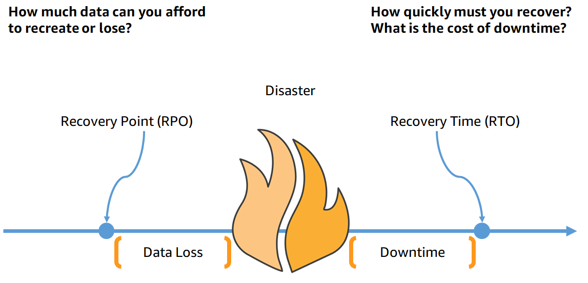
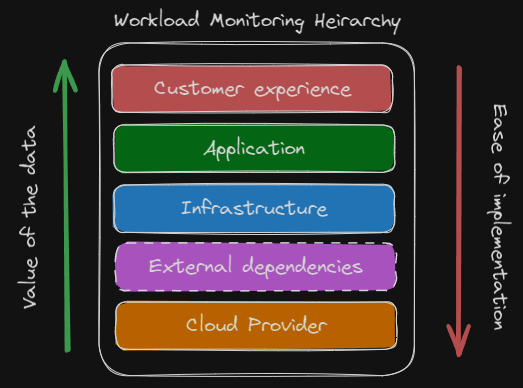
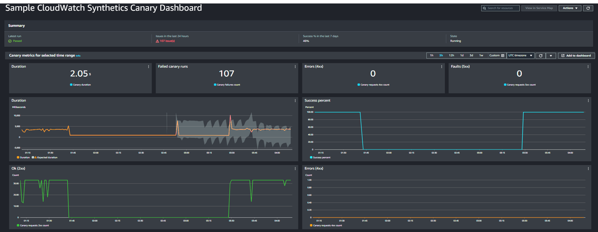
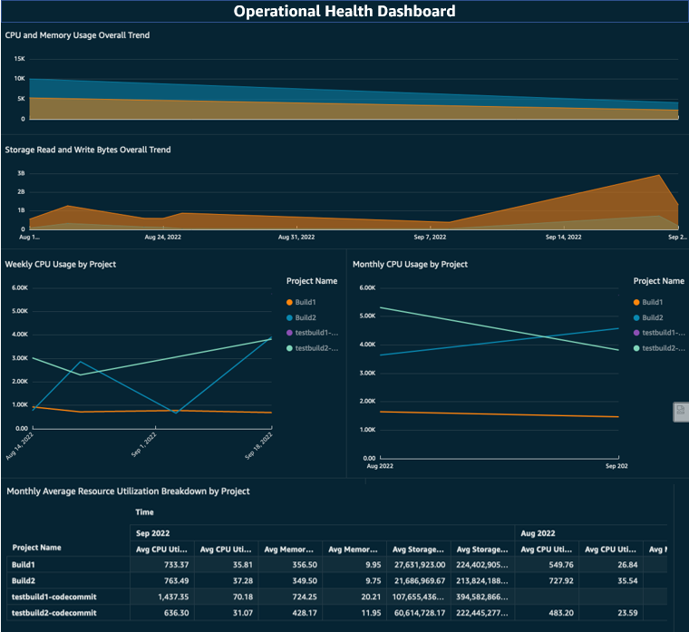
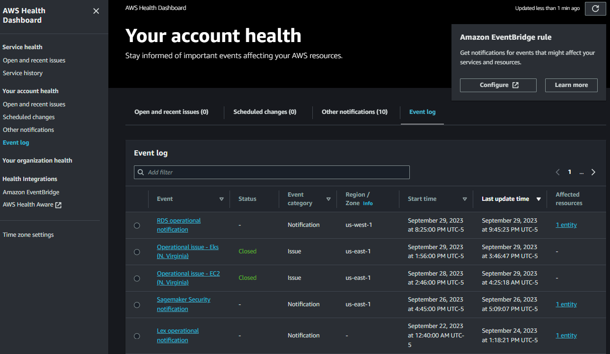
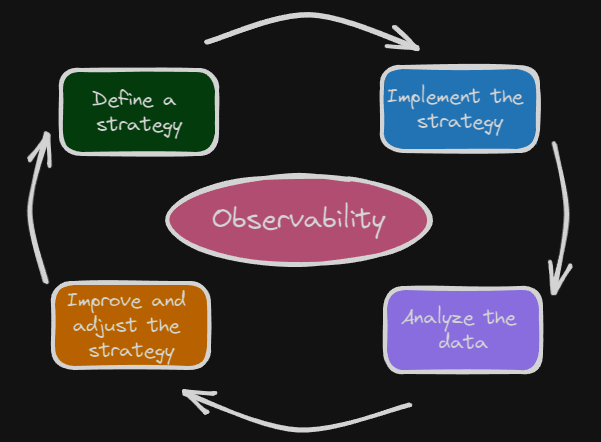

|ToC|
|---|

It's 4:25pm on a Friday afternoon, you're a software engineer, and just minutes before you shut down for the weekend, you get a call saying that a customer can’t complete their order on your website. Immediately, following a groan of despair, you start investigating the issue and ask around if there are any issues with your system, but you're having trouble understanding if this is a platform-wide issue or something isolated to one customer. Soon you find out that parts of your order processing service are impaired and multiple customers are impacted - but not all. Questions start to come down from management about what exactly is impacted, what is the level of impact, how much longer the remaining infrastructure can sustain the increased load, and finally, whether the disaster recovery plan should be engaged.

Building resilient systems is a high priority for business and technology teams intent on delivering a positive customer experience. Designing these systems requires the collaboration of many teams, a data-driven decision-making process, appropriate technology support, and a centralized observability strategy across the organization. In this blog, I'll start by defining key terms. Then we'll walk through the different phases in building an observability strategy from the initial planning to ongoing continuous improvement activities. Throughout the blog, I'll share guidance and best practices that you can use to build your own observability strategy for resilience. While we'll cover general concepts applicable to workloads running anywhere, we will focus primarily on workloads running in the AWS cloud.

## Definitions to Know

Let's start by aligning on definitions for terms we'll use throughout this blog: metrics, monitoring, observability, and resilience. [**Metrics**](https://docs.aws.amazon.com/AmazonCloudWatch/latest/monitoring/working_with_metrics.html?sc_channel=el&sc_campaign=resiliencewave&sc_geo=mult&sc_country=mult&sc_outcome=acq&sc_content=building-an-observability-strategy-for-resilience) are data about the performance of your systems. **Monitoring** is the systematic collection of metrics. **Observability**, as defined in modern control system theory, is the ability to determine the internal states of the system by observing its output. **Resilience** is the ability of an application to resist or recover from certain types of faults or load spikes, and remain functional from the customer perspective. Monitoring enables observability, which enables resilience, which enables us to achieve our ultimate goal: providing the best experience possible for our customers.

## Establishing Resilience Objectives, SLIs, and Establishing a Baseline

Before planning any journey, it's important to know where you're starting and where you're going. Things are no different here. To establish where we're going, we need to start with well-defined resilience objectives. Resilience objectives can be broken down into two distinct categories: [high availability (HA) and disaster recovery (DR)](https://docs.aws.amazon.com/whitepapers/latest/disaster-recovery-workloads-on-aws/high-availability-is-not-disaster-recovery.html?sc_channel=el&sc_campaign=resiliencewave&sc_geo=mult&sc_country=mult&sc_outcome=acq&sc_content=building-an-observability-strategy-for-resilience). HA targets, typically referred to as service level objectives, or SLOs, are set as a percentage value and provide users with information on what to expect from the service. For example, the [availability design goal for the Amazon CloudWatch Metrics service](https://docs.aws.amazon.com/wellarchitected/latest/reliability-pillar/appendix-a-designed-for-availability-for-select-aws-services.html?sc_channel=el&sc_campaign=resiliencewave&sc_geo=mult&sc_country=mult&sc_outcome=acq&sc_content=building-an-observability-strategy-for-resilience) is 99.99%, meaning the service team builds CloudWatch Metrics so that users can access and use it sucessfully 99.99% of the time.

$$ Availability = \frac{\text{Successfully Processed Units of Work}}{\text{Total Valid Units of Work Received}} $$

[DR objectives](https://docs.aws.amazon.com/whitepapers/latest/disaster-recovery-workloads-on-aws/business-continuity-plan-bcp.html#recovery-objectives-rto-and-rpo?sc_channel=el&sc_campaign=resiliencewave&sc_geo=mult&sc_country=mult&sc_outcome=acq&sc_content=building-an-observability-strategy-for-resilience) are commonly measured in terms of recovery point objective (RPO) and recovery time objective (RTO), or simply, "how much data can you lose?" and "how long can your service be disrupted?" Establishing these requires collaboration between technology and business teams and a discussion on the tradeoffs between complexity, cost, and resources required to meet the objectives. Defining these goals should happen on a case-by-case basis, but workloads can be tiered by criticality so that general resilience and observability guidelines can be applied to similar workloads. These tiers provide a scaling mechanism for your observability strategy. Though defining objectives upfront can be time-consuming and challenging, once they are in place, all teams will have common target to work toward. 

To understand where you are starting from, begin preparing yourself with information on the state of your workload. Gather details about the current workload architecture, performance benchmarks, availability, monitoring and alerting in place, and finally, the duration and cause of past incidents. This information will allow you to have a data-driven conversation with the business when establishing objectives and provide important context on the level of effort required to reach the agreed upon goals. 

In addition to capturing what you are already doing, you also want to establish the key indicators you will use to identify the health of your system, often referred to as service level indicators or SLIs. It is important to select not only the right SLIs based on the things your users expect from the system, but also the right amount of these. For example, if your application's primary purpose is storing data for customers, use indicators of durability or successful data uploads. On the other hand, if you've got a system that presents data to customers in real-time, page load times and error rates might be better indicators of system health. Choosing too few SLIs puts you at risk of leaving large parts of the system unexamined, while selecting too many can create unnecessary noise leading to alarm fatigue and distractions from the most critical SLIs.

Next, select a mix of lagging and leading indicators for your service. Lagging indicators assess the current or past state, while leading indicators can be used to predict the future state. Lagging indicators, like average request duration and number of errors users see, often assess the user experience and are necessary so that you always have a pulse on what your customers are experiencing. Leading indicators, like CPU utilization and request counts, are things that can cause downstream impacts to your lagging indicators. Monitoring these indicators should provide advanced warning of impending user issues. Lagging indicators allow you to take action early on to prevent or minimize the potential disruption to users. Start by identifying the lagging indicators you want to track, then work backwards to the leading indicators that will eventually impact the lagging ones.

Our observability strategy now includes resilience objectives (where we want to go), baseline information about our workload (where we're starting from), and SLIs we'll be tracking (the trail markers along our path).

## Monitoring Workloads

Now that we know where we are and where we want to go, we need to plan our route by establishing the monitoring needed to help us meet our objectives. In this section we'll discuss metrics to monitor starting from the customer experience at the highest level, operational health in the middle, and going to external dependencies and cloud provider health at the lower levels.

Most systems have several personas and teams involved, each accountable for their own function and concerned with metrics that represent what they are responsible for. This often results in each group focusing exclusively on their own domain, which can lead to losing sight of the bigger picture and the one thing that all groups are ultimately accountable for: the customer experience. So, let's start by monitoring metrics that measure and track the customer experience. Here, we want the monitoring we implement to help answer questions like, "Are users able to log in?", "How fast are user orders being processed?", and "How many more requests per minute can we support?"

Whether your customers are humans or other services, measuring the following four metrics is a good starting point: latency, traffic, errors, and service capacity. Two ways to observe these metrics are with direct monitoring and synthetic monitoring. Direct monitoring uses "live" customer data from the production instance of the workload. Synthetic monitoring uses data produced by custom scripts and automation to simulate the path a user would take through your application. Direct monitoring should always be implemented to provide an understanding of what current users are experiencing at any point in time and to help us understand the level of impact of any disruptions to our service. 

Since synthetic monitoring is under your control, it is an effective way to receive a consistent stream of data points, which is particularly useful when collecting data in non-production environments or when user activity is sporadic. Where possible, both should be instrumented and monitored. [Cloudwatch Synthetics](https://docs.aws.amazon.com/AmazonCloudWatch/latest/monitoring/CloudWatch_Synthetics_Canaries.html?sc_channel=el&sc_campaign=resiliencewave&sc_geo=mult&sc_country=mult&sc_outcome=acq&sc_content=building-an-observability-strategy-for-resilience) provides a managed service that allows you a quick and easy way to setup configurable scripts, called canaries, that run on a schedule to monitor your endpoints and APIs. [Cloudwatch canaries natively publish the following metrics](https://docs.aws.amazon.com/AmazonCloudWatch/latest/monitoring/CloudWatch_Synthetics_Canaries_metrics.html?sc_channel=el&sc_campaign=resiliencewave&sc_geo=mult&sc_country=mult&sc_outcome=acq&sc_content=building-an-observability-strategy-for-resilience), which can be monitored to determine the current state of the user experience: success percent, duration of requests, and number of errors returned by the workload.

The customer experience metrics provide the top layer of monitoring for our system. Now we move down to establishing the operational health metrics we want to monitor at the infrastructure and application level layers. Operational health metrics can provide early warning signs of issues with our workload that may result in future negative impacts to the customer experience. Since we know what customer experience metrics we're monitoring, individual teams can work backwards from those to the operational health metrics they need to monitor by asking, "What are the things in my control that affect those top-level metrics?"

To help guide those teams, there will be some standard metrics you can safely recommend that most workloads implement, and others that will be specific to that workload. Metrics commonly applicable to most workloads include: utilization, capacity, throughput, and latency. An observability strategy should direct teams to focus on outcomes and the types of questions they should be able to answer versus what exactly what they need to monitor. For example, we may want teams to always have some amount of system capacity in reserve and be able to answer, "What is the current load on the system and what is available capacity?" If our approach involved setting hard requirements, like "monitor and alert on CPU utilization over 85%," this may not apply to workloads that use a serverless architecture.

Instead, we can recommend that system capacity should stay 15% higher than system load. This allows teams across the organization to monitor their systems and respond in a similar way even though their underlying application architecture or infrastructure looks different. Using the SLOs and other customer experience indicators as targets to work backwards from, you can use this same approach to setting the strategic guidelines for all other operational health metrics we need to monitor.

Now that we've reached the bottom levels, we'll discuss monitoring the things we don't always have direct control over but are still a part of our workload, external dependencies, and the underlying cloud services. External dependencies are the services, infrastructure, or data outside of your workload or outside of your control that your system depends on. This could include things like API calls to a SaaS partner for data, networking infrastructure managed by a third-party that connects your cloud and on-premises applications, and other internal services operated by different teams within the company. Whether internal or external, it is your responsibility to own dependencies that are a part of the overall service you provide, and therefore own the need to have the right observability into them as well. 

Information you need from those services will be the same types of metrics you define at the customer experience layer for your own service. Think: latency, errors and error rates, capacity, and availability of that service. For workloads running in AWS, you will want to know as soon as possible about any issues with AWS services your workload uses. Disruptions to these services directly impact your operational health metrics, which we know impacts the customer experience. To track this information in AWS, you can utilize [AWS Health](https://docs.aws.amazon.com/health/latest/ug/what-is-aws-health.html?sc_channel=el&sc_campaign=resiliencewave&sc_geo=mult&sc_country=mult&sc_outcome=acq&sc_content=building-an-observability-strategy-for-resilience) to be updated when there are upcoming or scheduled changes or when there are any AWS service availability issues. Using the AWS Health API or the AWS Health Dashboard, pictured below, you can see events specific to your AWS accounts. Understanding these events, the AWS services your workload uses, and how your workload is deployed across regions and availability zones can help you answer questions like, "What is affecting our workload availability?", "Is the issue effecting all our users or just a few?" or "Will redirecting traffic help mitigate the issue?"

## Continuous Improvement for Observability

Observability is not a one-time activity but rather a journey that exists from the first launch of your workload until it's decommissioning. Proper testing can allow you to iterate upon and improve your observability. Build into your observability strategy regular reviews of the plan for each workload. During these sessions, review the effectiveness of your current alerts and monitoring, feedback from all teams involved on opportunities for improvement, and things that are working well that others can learn from. These [operational reviews](https://docs.aws.amazon.com/wellarchitected/latest/devops-guidance/o.cm.8-hold-operational-review-meetings-for-data-transparency.html?sc_channel=el&sc_campaign=resiliencewave&sc_geo=mult&sc_country=mult&sc_outcome=acq&sc_content=building-an-observability-strategy-for-resilience) will help you prepare as much as possible for all the scenarios the team can think of. But it's impossible to conceive of every possible scenario, which means that your workload will experience conditions previously unaccounted for.

Even if you were to take all the information above and implement it perfectly, with time, your workload would experience drops in availability, service disruptions, and the occasional unhappy customer. As Werner Vogels, Amazon CTO says, "Everything fails, all the time." What's important is to learn from every incident, good or bad, and continue to improve the reliability of your workload as well as your observability strategy. Incidents can provide a unique opportunity to improve by allowing you to implement additional monitoring or metrics that will cover blind spots that previous planning and testing missed. Treat these events as learning opportunities and spend enough time during [post-incident retrospectives](https://docs.aws.amazon.com/wellarchitected/latest/devops-guidance/o.cm.3-conduct-post-incident-analysis-for-continuous-improvement.html?sc_channel=el&sc_campaign=resiliencewave&sc_geo=mult&sc_country=mult&sc_outcome=acq&sc_content=building-an-observability-strategy-for-resilience) to shore up any gaps in the current strategy that could cause the exact same issue from reoccurring while ideating as a team on additional improvements that would cover similar or related issues.

## Conclusion

Now picture the same scenario that we started with - the problems emerging on a Friday afternoon - but this time we have the appropriate observability measures in place. Starting at 2:00 pm, you get warnings of increased error rates on your order processing applications. Support engineers swarm to investigate and resolve this issue while customer service prepares potential communications for customers. Senior management is alerted early that there’s an ongoing issue but that 90% of customers are without impact, and the ones impacted are only receiving intermittent errors. Leadership is now closely monitoring this indicator to see if it reaches a critical point and the failover plan needs to be executed. 

Thankfully, you’ve caught the problem early and identified an underlying infrastructure failure. The troublesome infrastructure has been replaced and error rates on requests drop to a healthy level by 3:15 pm. The customer impact was minimized and your teams get to go home on time and enjoy the weekend!

Due to having a well-defined observability strategy, you were able to ask questions about your system and get the answers and data you needed to make critical decisions. You were aware in near real-time of the status of your service and what customers were experiencing, and finally able to quickly identify the cause of the problem and mitigate the impact. Following the event, you also have data needed to complete a retrospective of the incident, perform a root-cause analysis and build your correction of error plan to avoid this from happening again.

## Additional Resources

Resilience is such a broad topic that there's no way we could cover everything in this blog alone. Be sure to check out the posts below for more information on resilience, observability, DevOps, and some real-world examples of these being implemented.

* [How Amazon Does DevOps in Real Life](/posts/how-amazon-does-devops-in-real-life)
* [DevOps Essentials: An essential guide for learning about DevOps and its core concepts](/concepts/devops-essentials)
* [When Should I Fail Over? Using Observability to Answer Critical Questions in the War Room](/posts/when-should-i-failover)
* [Four Things Everyone Should Know About Resilience](/concepts/should-know-resilience)
