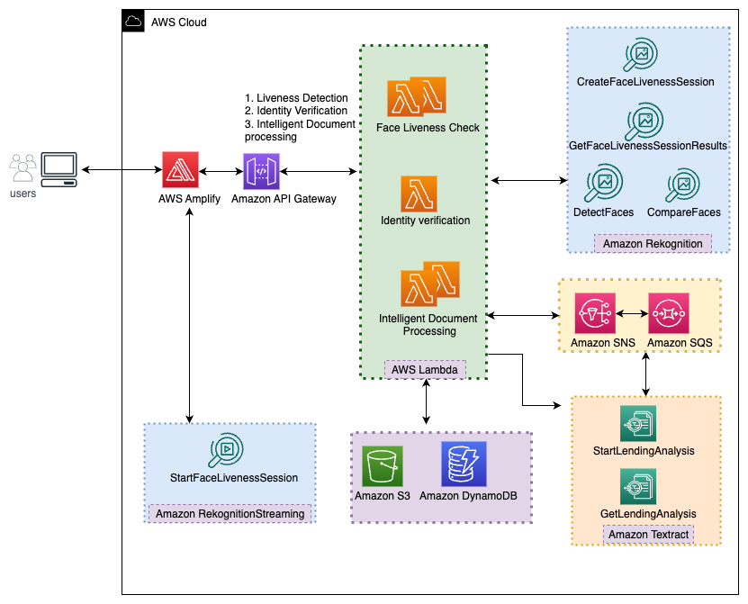
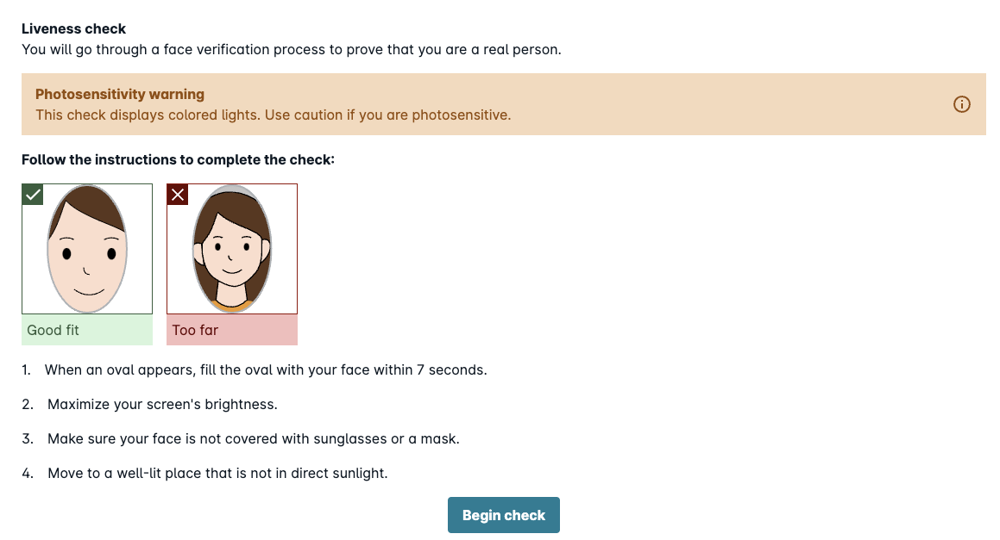
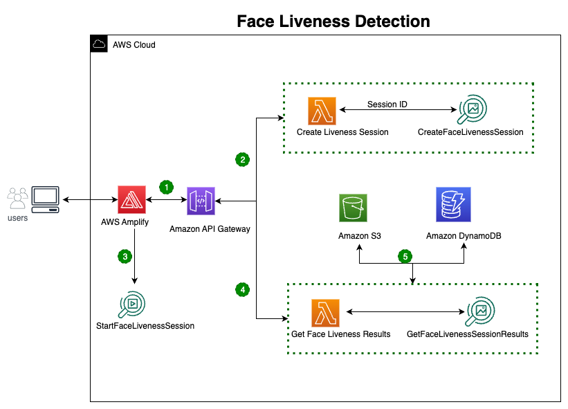
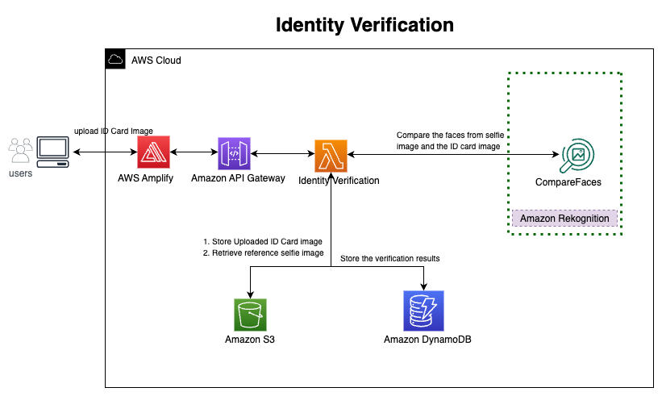
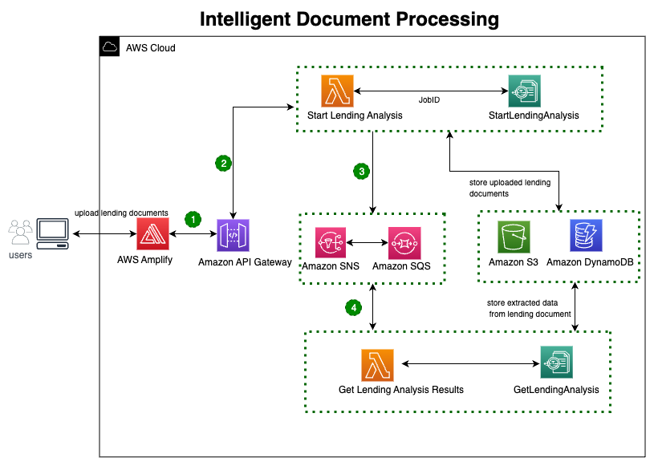

Financial organizations are under increasing pressure to quickly and accurately process information, especially for high-risk interactions that are being migrated online. Traditional methods of identity verification and data extraction pose challenges. Those methods are manual, expensive, error-prone, and difficult to scale. This not only leads to tedious processes, but also results in disappointing customer experiences.

In the finance industry, the impact of fraud, errors, and liability caused by manual data processing can be disruptive. Organizations must find a balance between delivering the best customer experience while ensuring compliance and maintaining the integrity of their business. This calls for a solution that verifies users' identities, accurately classifies and extracts data, all while keeping customers’ data - and organizations - safe.

We will focus on a specific use case in the finance industry: mortgage application processing, which often involves manual identity and document verification revisions that can be a daunting task for any organization. To enhance customer experience, prevent fraudulent activities, and provide faster and secure services, lenders can leverage Machine Learning (ML) solutions for identity, verification, and document processing. ML-powered document processing enables efficient and accurate processing of diverse document types, extracting critical business data, and delivering value to both customers and organizations.

Below, we'll discuss a solution for identity verification and intelligent document processing using [**Amazon Rekognition**](https://aws.amazon.com/rekognition?sc_channel=el&sc_campaign=genaiwave&sc_geo=mult&sc_country=mult&sc_outcome=acq&sc_content=create-idv-idp-machine-learning-solution) and [**Amazon Textract**](https://aws.amazon.com/textract/?sc_channel=el&sc_campaign=genaiwave&sc_geo=mult&sc_country=mult&sc_outcome=acq&sc_content=create-idv-idp-machine-learning-solution). By adopting this solution, financial organizations can transform their mortgage application processes, making them faster, more secure, and ultimately providing a better experience for their customers.

Amazon Rekognition offers pre-trained computer vision (CV) capabilities to extract information and insights from your images and videos. In this solution, we are using the [**Amazon Rekognition Face Liveness**](https://aws.amazon.com/rekognition/face-liveness/?sc_channel=el&sc_campaign=genaiwave&sc_geo=mult&sc_country=mult&sc_outcome=acq&sc_content=create-idv-idp-machine-learning-solution) feature to ensure only real users, not bad actors using spoofs, can initiate the mortgage application.

Amazon Textract enables customers to take advantage of industry-leading machine learning technology to quickly and accurately process data from any scanned document or image. In this solution, we are using the [**Analyze Lending**](https://aws.amazon.com/textract/analyze-lending/?sc_channel=el&sc_campaign=genaiwave&sc_geo=mult&sc_country=mult&sc_outcome=acq&sc_content=create-idv-idp-machine-learning-solution) feature for classifying and processing of mortgage documents.

The key capabilities of this solution are shown in the following diagram, using a sample process flow for mortgage application processing. Key capabilities of this solution are:
- Liveness Detection
- Identity Verification
- Intelligent Document Processing

### Solution Overview

The following reference architecture shows how you can use Amazon Rekognition and Amazon Textract along with other AWS services, to implement identity verification and intelligent document processing.

The overall architecture is explained below and each of the key capabilities (Liveness Detection, Identity Verification, Intelligent Document Processing) will be explained in detailed in further sections of this blog.
1. User initiates a mortgage application through the front-end application hosted within the [**AWS Amplify**](https://docs.aws.amazon.com/amplify?sc_channel=el&sc_campaign=genaiwave&sc_geo=mult&sc_country=mult&sc_outcome=acq&sc_content=create-idv-idp-machine-learning-solution). Amplify is an end-to-end solution that enables front-end web developers to build and deploy secure, scalable full stack applications.
2. The application invokes [**Amazon API Gateway**](https://docs.aws.amazon.com/apigateway/?sc_channel=el&sc_campaign=genaiwave&sc_geo=mult&sc_country=mult&sc_outcome=acq&sc_content=create-idv-idp-machine-learning-solution) to route the request to the appropriate [**Amazon Lambda function**](https://docs.aws.amazon.com/lambda/?sc_channel=el&sc_campaign=genaiwave&sc_geo=mult&sc_country=mult&sc_outcome=acq&sc_content=create-idv-idp-machine-learning-solution) based on the user activity. For the mortgage use case, we have defined three major activities: liveness detection, identity verification, intelligent document processing. Each of these activities are implemented using one or more Lambda functions.
3. Lambda functions invoke the appropriate ML service APIs (Amazon Rekognition, Amazon Rekognition Streaming, Amazon Textract) to fulfill the user-initiated activity.
4. Lambda functions interact with [**Amazon S3**](https://docs.aws.amazon.com/s3/?sc_channel=el&sc_campaign=genaiwave&sc_geo=mult&sc_country=mult&sc_outcome=acq&sc_content=create-idv-idp-machine-learning-solution) to store the images (Face images, ID card image) and documents provided by the user as part of the mortgage application process. [**Amazon DynamoDB**](https://docs.aws.amazon.com/dynamodb/?sc_channel=el&sc_campaign=genaiwave&sc_geo=mult&sc_country=mult&sc_outcome=acq&sc_content=create-idv-idp-machine-learning-solution) keeps the URL for face images stored in the S3 bucket, identity verification status, the extracted information from the ID card and mortgage documents.

## Liveness Detection

In this solution, liveness detection is implemented using the [**Amazon Rekognition Face Liveness**](https://aws.amazon.com/rekognition/face-liveness/?sc_channel=el&sc_campaign=genaiwave&sc_geo=mult&sc_country=mult&sc_outcome=acq&sc_content=create-idv-idp-machine-learning-solution) feature. This feature helps to verify that a user going through facial verification is physically present in front of the camera. It detects spoof attacks presented to a camera or trying to bypass a camera. This is accomplished through requesting the user to follow a series of prompts to take a short video selfie.

The following picture depicts a sample FaceLivenessDetector screen.

 

[**Amplify UI FaceLivenessDetector**](https://ui.docs.amplify.aws/react/connected-components/liveness) provides a UI component for Amazon Rekognition Face Liveness, which can be implemented using AWS Amplify SDK. This UI component enables users to initiate face liveness check. FaceLivenessDetector UI component provides an initial screen with instructions and when the user initiates the process, displays the Face Liveness User challenge - FaceMovementAndLightChallenge. FaceMovementAndLightChallenge includes a sequence of colored lights and challenges the user to fit a face in an oval on the user’s screen, within given time.
           
There are 3 APIs involved in this solution. The APIs are:
- [**CreateFaceLivenessSession**](https://docs.aws.amazon.com/rekognition/latest/APIReference/API_CreateFaceLivenessSession.html?sc_channel=el&sc_campaign=genaiwave&sc_geo=mult&sc_country=mult&sc_outcome=acq&sc_content=create-idv-idp-machine-learning-solution) API initiates the face liveness session, when a request is received from UI and returns a unique session ID. This session ID is used when streaming Face Liveness video and also used to get results for a Face Liveness session.
- [**StartFaceLivenessSession**](https://docs.aws.amazon.com/rekognition/latest/APIReference/API_rekognitionstreaming_StartFaceLivenessSession.html?sc_channel=el&sc_campaign=genaiwave&sc_geo=mult&sc_country=mult&sc_outcome=acq&sc_content=create-idv-idp-machine-learning-solution) API starts a Face Liveness video stream from FaceLivenessDetector UI component for a specific session ID and streams it to the Amazon Rekognition streaming service to begin the Face Liveness Detection process. StartFaceLivenessSession API takes in the challenge ID and session ID along with the selfie video and processes the streamed video in real-time, stores the results. Once this process is completed, the API send signal to FaceLivenessDetector UI Component to end the streaming process.
- [**GetFaceLivenessSessionResults**](https://docs.aws.amazon.com/rekognition/latest/APIReference/API_GetFaceLivenessSessionResults.html?sc_channel=el&sc_campaign=genaiwave&sc_geo=mult&sc_country=mult&sc_outcome=acq&sc_content=create-idv-idp-machine-learning-solution) API is used to get the results for a specific session. This API returns the corresponding Face Liveness confidence score, a reference image that includes a face bounding box, and a maximum of four audit images that also contain face bounding boxes. The reference image is of high resolution and can be used for identity verification. It is recommended to regularly run human reviews on audit images to ensure that the spoof attacks are mitigated.

The following diagram shows the components involved in Liveness Detection.

 

The sequence of steps in Liveness Detection is explained below: 
1. User initiates the face liveness check in the UI application deployed in AWS Amplify.
2. API Gateway routes the request to the Create Liveness Session Lambda function. The Lambda function invokes the Amazon Rekognition Face Liveness API -  [**CreateFaceLivenessSession**](https://docs.aws.amazon.com/rekognition/latest/APIReference/API_CreateFaceLivenessSession.html?sc_channel=el&sc_campaign=genaiwave&sc_geo=mult&sc_country=mult&sc_outcome=acq&sc_content=create-idv-idp-machine-learning-solution) to create an unique session ID. With this session ID, UI renders the FaceLivenessDetector Amplify component.
3. The FaceLivenessDetector component connects to the Amazon Rekognition streaming service, renders an oval on the user’s screen, and displays a sequence of colored lights. FaceLivenessDetector records and streams video in real-time to the Amazon Rekognition streaming service using the [**StartFaceLivenessSession**](https://docs.aws.amazon.com/rekognition/latest/APIReference/API_rekognitionstreaming_StartFaceLivenessSession.html?sc_channel=el&sc_campaign=genaiwave&sc_geo=mult&sc_country=mult&sc_outcome=acq&sc_content=create-idv-idp-machine-learning-solution) API. StartFaceLivenessSession API processes the streamed video in real-time, stores the results and send signals to Amplify Component to end the streaming process.
4. UI invokes Get Liveness Results Lambda function through API Gateway, to get the results for the specific session. Lambda function, in turn invokes [**GetFaceLivenessSessionResults**](https://docs.aws.amazon.com/rekognition/latest/APIReference/API_GetFaceLivenessSessionResults.html?sc_channel=el&sc_campaign=genaiwave&sc_geo=mult&sc_country=mult&sc_outcome=acq&sc_content=create-idv-idp-machine-learning-solution) API to retrieve the results for the specific session ID. API returns the corresponding Face Liveness confidence score, a reference image that includes a face bounding box, and audit images that also contain face bounding boxes. Based on the confidence score, the Lambda function takes the success or failure flow and returns an appropriate message to the UI.
5. Reference image and Audit images are stored in Amazon S3 and the Face Liveness results are stored in Amazon DynamoDB.

The Face Liveness confidence score provides the confidence that the person taking the check is live. It is recommended to choose a high confidence score threshold for highly sensitive use cases like mortgage processing. As with any probability-based system, Face Liveness cannot guarantee perfect results. It is recommended to use it with other factors to make a risk-based decision about the personal identity of users. In this solution, we are combining the Face Liveness check along with the identity verification against the user provided identity document. Optionally you can also add a human review using [**Amazon Augumented AI**](https://docs.aws.amazon.com/sagemaker/latest/dg/a2i-getting-started.html) and any further validation if needed, before taking a decision on the mortgage application.

You can optionally add a face validation process right after completing Face Liveness check, if your business use case requires the specific facial features or expressions like pose, eyes open, mouth open, and eyeglasses worn to determine picture quality. This can be implemented by invoking Amazon Rekognition [**DetectFaces**](https://docs.aws.amazon.com/rekognition/latest/APIReference/API_DetectFaces.html?sc_channel=el&sc_campaign=genaiwave&sc_geo=mult&sc_country=mult&sc_outcome=acq&sc_content=create-idv-idp-machine-learning-solution) API.

## Identity Verification

User identity verification helps to verify that the face captured from the Face Liveness check is matching the face image extracted from the identity document image provided by the user.

The following diagram illustrates the components involved in identity verification.

 

Once the user completes the Face Liveness check successfully, they can start the identity verification process by uploading the user's ID card in a valid image format. User selfie images captured during Liveness Detection step can be used as a source image for the identity verification. The user is required to upload an identity card in a valid image format and it is used as target image for the identity verification.
 
Amazon Rekognition [**CompareFaces**](https://docs.aws.amazon.com/rekognition/latest/dg/faces-comparefaces.html?sc_channel=el&sc_campaign=genaiwave&sc_geo=mult&sc_country=mult&sc_outcome=acq&sc_content=create-idv-idp-machine-learning-solution) API is used to compare the face in the source image with each face in the target image uploaded by the user (ID Card). SimilarityThreshold is one of the request parameters for CompareFaces API, which can be used to specify the minimum level of confidence required for the face match to be successful. Set the SimilarityThreshold to a high value to get the face matches with high accuracy.

CompareFaces API returns an array of matched faces as [**FaceMatches**](https://docs.aws.amazon.com/rekognition/latest/APIReference/API_CompareFaces.html#API_CompareFaces_ResponseSyntax?sc_channel=el&sc_campaign=genaiwave&sc_geo=mult&sc_country=mult&sc_outcome=acq&sc_content=create-idv-idp-machine-learning-solution), which contains the bounding box, the confidence level, and the similarity score for the faces. The confidence level indicates that the bounding box contains a face or not.

Lambda function can be used to implement the logic to decide the success or failure of the identity verification process based on the CompareFaces API response. You can implement any additional validation or human review as per your business requirements. The results can be stored in the DynamoDB which can help in any related business requirements.

### Intelligent Document Processing
Mortgage processing involves classifying and extracting key data from a range of document types. In this solution, Amazon Textract [**Analyze Lending**](https://aws.amazon.com/textract/analyze-lending/?sc_channel=el&sc_campaign=genaiwave&sc_geo=mult&sc_country=mult&sc_outcome=acq&sc_content=create-idv-idp-machine-learning-solution) API is used to automatically extract, classify, and validate information from a variety of mortgage document types with high speed and accuracy while reducing human error.
Analyze Lending API receives a loan document and then splits it into pages, classifying them according to the type of document. The document pages are then automatically routed to Amazon Textract text processing operations for accurate data extraction and analysis. Refer to the link to see the list of documents that Analyze Lending can support.

API used in this solution are:
- Amazon Textract [**StartLendingAnalysis API**](https://docs.aws.amazon.com/en_us/textract/latest/dg/API_StartLendingAnalysis.html?sc_channel=el&sc_campaign=genaiwave&sc_geo=mult&sc_country=mult&sc_outcome=acq&sc_content=create-idv-idp-machine-learning-solution)
- Amazon Textract [**GetLendingAnalysis API**](https://docs.aws.amazon.com/textract/latest/dg/API_GetLendingAnalysis.html?sc_channel=el&sc_campaign=genaiwave&sc_geo=mult&sc_country=mult&sc_outcome=acq&sc_content=create-idv-idp-machine-learning-solution)

The following diagram shows the components involved in Intelligent Document Processing.

 

The sequence of steps in Intelligent Document Processing is explained below: 
1. User uploads multi-page lending documents containing different categories of documents.
2. API Gateway routes the request to one of the Lambda functions – Start Lending Analysis Lambda function. The Lambda function stores the uploaded document in the S3 bucket and invokes the Amazon Textract [**StratLendingAnalysis**](https://docs.aws.amazon.com/en_us/textract/latest/dg/API_StartLendingAnalysis.html?sc_channel=el&sc_campaign=genaiwave&sc_geo=mult&sc_country=mult&sc_outcome=acq&sc_content=create-idv-idp-machine-learning-solution) API to initiate the classification and analysis of an input document. Input for this API includes the lending document S3 URL and [**AWS Simple Notification Service (SNS)**](https://docs.aws.amazon.com/sns/?sc_channel=el&sc_campaign=genaiwave&sc_geo=mult&sc_country=mult&sc_outcome=acq&sc_content=create-idv-idp-machine-learning-solution) Topic as NotificationChannel. StartLendingAnalysis API returns a job identifier (JobID) that is used to get the results. JobID can be stored in Amazon DynamoDB for easy retrieval in next steps.
3. StartLendingAnalysis is an asynchronous service. When the text analysis is completed, Amazon Textract publishes a completion status to the Amazon SNS topic that you specify in NotificationChannel, which in turn sends the message to the [**AWS Simple Queue Service (SQS)**](https://docs.aws.amazon.com/sqs/?sc_channel=el&sc_campaign=genaiwave&sc_geo=mult&sc_country=mult&sc_outcome=acq&sc_content=create-idv-idp-machine-learning-solution) Queue subscribed to the SNS topic. 
4. Get Lending Analysis Results Lambda function gets the completion status from the Amazon SQS queue for the specific JobID returned from StartLendingAnalysis API. If the status value in the message is SUCCEEDED, the Lambda function invokes [**GetLendingAnalysis**](https://docs.aws.amazon.com/textract/latest/dg/API_GetLendingAnalysis.html?sc_channel=el&sc_campaign=genaiwave&sc_geo=mult&sc_country=mult&sc_outcome=acq&sc_content=create-idv-idp-machine-learning-solution) API with the JobID to get [**Analyse Lending response object**](https://docs.aws.amazon.com/textract/latest/dg/lending-response-objects.html#lending-document-types?sc_channel=el&sc_campaign=genaiwave&sc_geo=mult&sc_country=mult&sc_outcome=acq&sc_content=create-idv-idp-machine-learning-solution)in JSON Format.

The JSON response object includes information about the document classification type for a page, the page number, and the fields extracted by Analyze Lending as key-value pairs and signatures. You can implement business logic in the Lambda function to extract the required information from the response object. Optionally you can enrich the documents by detecting and redacting PII entities using [**Amazon Comprehend**](https://aws.amazon.com/comprehend/?nc2=h_ql_prod_ml_comp?sc_channel=el&sc_campaign=genaiwave&sc_geo=mult&sc_country=mult&sc_outcome=acq&sc_content=create-idv-idp-machine-learning-solution).

Extracted lending fields from the Analyze Lending response can be stored in Amazon DynamoDB to enable automated decision on the mortgage application and if needed, you can add a human review process based on the compliance requirements. It is important to follow the [**Amazon DynamoDB security best practices**](https://docs.aws.amazon.com/amazondynamodb/latest/developerguide/best-practices-security-preventative.html?sc_channel=el&sc_campaign=genaiwave&sc_geo=mult&sc_country=mult&sc_outcome=acq&sc_content=create-idv-idp-machine-learning-solution) when storing the sensitive and confidential data in DynamoDB.

## Conclusion

In this blog, we dived into an AI solution for Identity Verification and Intelligent Document Processing, powered by Amazon Rekognition and Amazon Textract. This approach offers a highly scalable and cost-effective serverless architecture that leverages the power of identity verification and intelligent document processing with AWS AI to automate the end-to-end mortgage application journey. This automation not only boosts business process efficiency, but also ensures exceptional accuracy, leading to reduced loan processing costs. This solution provides the flexibility to rapidly scale in response to changing demands and to streamline financial operations that improve turnaround times and deliver a seamless experience to your customers. By embracing automation and leveraging advanced technologies, the mortgage industry can unlock new levels of efficiency, cost savings, and scalability, paving the way for future success. 

If you want to try your hands into implementing this solution, or read more about identity verification and Intelligent Document Processing, have a look at the following resources:
- [**https://aws.amazon.com/machine-learning/ml-use-cases**](https://aws.amazon.com/machine-learning/ml-use-cases?sc_channel=el&sc_campaign=genaiwave&sc_geo=mult&sc_country=mult&sc_outcome=acq&sc_content=create-idv-idp-machine-learning-solution)
- [**https://aws.amazon.com/solutions/ai-ml/intelligent-document-processing**](https://aws.amazon.com/solutions/ai-ml/intelligent-document-processing?sc_channel=el&sc_campaign=genaiwave&sc_geo=mult&sc_country=mult&sc_outcome=acq&sc_content=create-idv-idp-machine-learning-solution)
- [**https://aws.amazon.com/solutions/ai-ml/identity-verification**](https://aws.amazon.com/solutions/ai-ml/identity-verification?sc_channel=el&sc_campaign=genaiwave&sc_geo=mult&sc_country=mult&sc_outcome=acq&sc_content=create-idv-idp-machine-learning-solution)

