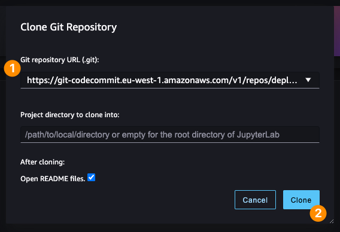
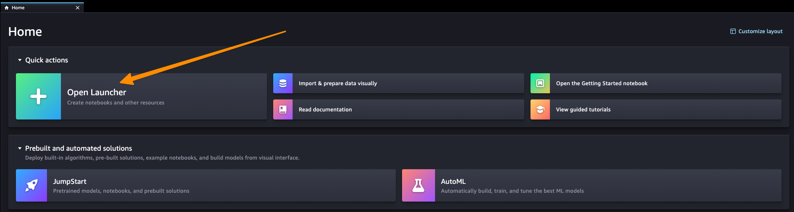
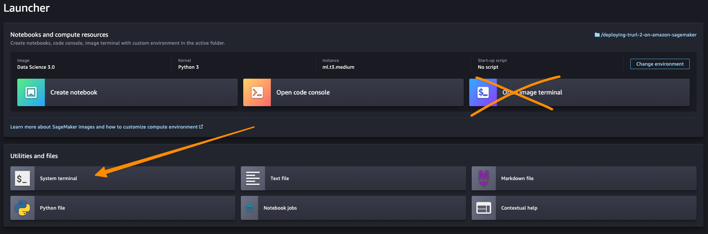
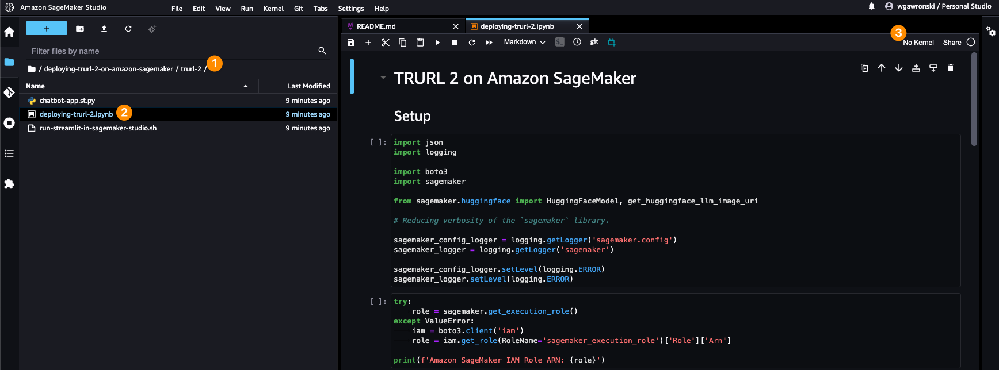
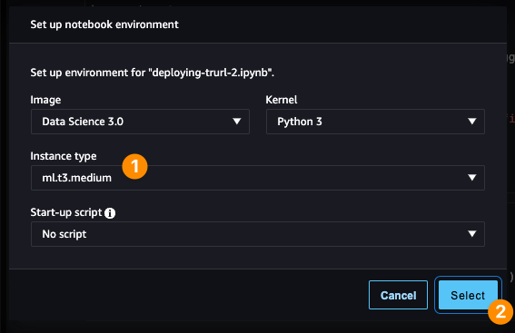
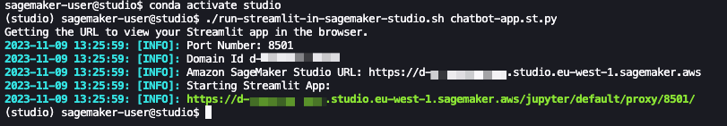

| ToC |
|-----|

Picture this: you have a brilliant idea for a product needing a conversational user interface - or a chatbot. As a builder, you know that *Large Language Models (LLMs)* can help you tackle such challenges effectively. There is only one caveat: your idea requires that conversations should happen in **your local language**.

In the technology world, we live in an English-centric landscape. If our products fit that definition or are built to be operated by tech-savvy people, it's easy to forget that other languages are needed. At the same time, technology should - and is - helping us to battle such challenges and gaps. There are models available already on the market that provide multilingual capabilities. So, how hard or easy would it be to cover a non-English language requirement? Let's give it a try.

I may be biased, but an obvious choice for me is... the Polish language (as I live in Poland). It's a choice in the middle, in terms of popularity. Depending on the source, this language is around 25-30th place worldwide with a total population estimated around 44-45 million people. The goal of this article, then, is to explore *how challenging* it will be to build a chatbot that will communicate using my native language.

## Hey Computer, Talk to Me... *But in Polish!*

For most people with experience with *Amazon Web Services* and technology, TRURL 2* is the least familiar term in the title above - so allow me to start here. 

Designing and training an entirely new *LLM* specialized in our language of choice would be beyond my skills. This is an extensive research project, nowadays done by sizeable teams. Luckily, you can explore available options with me - and a perfect place would be a vibrant *AI community* called [Hugging Face](https://huggingface.co). If you never heard about it, the best explanation (or rather a mental model) is that *Hugging Face* is like *GitHub but for machine learning models*. Across the sea of available models, you can find there one called [TRURL 2](https://huggingface.co/Voicelab#models), which is a fine-tuned version of [LLaMA 2](https://ai.meta.com/llama/#inside-the-model). According to the authors, it is trained on over 1.7B tokens (970k conversational Polish and English samples) with a significant context of 4096 tokens. To be precise, *TRURL 2* is not a single model but a collection of fine-tuned generative text models with 7 billion and 13 billion parameters, optimized for dialogue use cases. You can read more about this model in the official [blog post](https://voicelab.ai/trurl-is-here) published after the model's release, prepared by the authors. 

Speaking about the authors, the model was created by a Polish company called [Voicelab.AI](https://voicelab.ai). They are based in [Gdańsk](https://en.wikipedia.org/wiki/Gda%C5%84sk) and specialise in developing solutions related to *[Conversational Intelligence](https://voicelab.ai/conversational-intelligence)* and *[Cognitive Automation](https://voicelab.ai/cognitive-automation)*. It looks like this is exactly what we needed! But before we move to the practical part, it is worth answering two questions. 

First question: what is *LLaMA 2*? I am almost sure that even if you are entirely new to generative AI space, you have already heard that name, but if you have not - [LLaMA 2](https://ai.meta.com/resources/models-and-libraries/llama/) is a family of *Large Language Models (LLMs)* developed by [Meta](https://ai.meta.com). This collection of pre-trained and fine-tuned models ranges from 7 billion to 70 billion parameters. As the name suggests, it is a 2nd iteration, and those models are trained on 2 trillion tokens and have double the context length of [LLaMA 1](https://ai.meta.com/blog/large-language-model-llama-meta-ai).

Last but not least, is there any reason for this very peculiar name? What or who is *Trurl*? Even that word may look like a set of arbitrary letters together. *Trurl* is one of the characters in the novel written by a famous Polish science-fiction writer, [Stanislaw Lem](https://en.wikipedia.org/wiki/Stanis%C5%82aw_Lem). In the ["Cyberiad"](https://en.wikipedia.org/wiki/The_Cyberiad), *Trurl* according to the author of the book is a robotic engineer, *a constructor* with almost godlike abilities. In one of the stories, he creates a machine called "*Elektrybałt*", which by description resembles today’s [GPT](https://en.wikipedia.org/wiki/Generative_pre-trained_transformer) solutions. You can see that this particular name is not a coincidence.

## Prerequisites and Setup

Let's dive into the practice! To document properly the exploration and development process, I have prepared a *GitHub* repository with a complete example, which is available here: https://github.com/build-on-aws/deploying-trurl-2-on-amazon-sagemaker 

To successfully execute all steps in the given repository, you need to have the following prerequisites:

- Pre-installed tools:
    - Most recent *AWS CLI*.
    - *AWS CDK* in version 2.104.0 or higher.
    - Python 3.10 or higher.
    - Node.js v21.x or higher.
- Configured profile in the installed *AWS CLI* with credentials for your *AWS IAM* user account.

## How to Use the Repository

First, we need to configure the local environment - and here are the steps:

```shell
# Do those in the repository root after checking out.
# Ideally, you should do them in a single terminal session.

# Node.js v21 is not yet supported inside JSII, but it works for that example - so "shush", please.
$ export JSII_SILENCE_WARNING_UNTESTED_NODE_VERSION=true

$ make
$ source ./.env/bin/activate

$ cd ../infrastructure
$ npm install

# Or `export AWS_PROFILE=<YOUR_PROFILE_FROM_AWS_CLI>`
$ export AWS_DEFAULT_PROFILE=<YOUR_PROFILE_FROM_AWS_CLI>
$ export AWS_USERNAME=<YOUR_IAM_USERNAME>

$ cdk bootstrap
$ npm run package
$ npm run deploy-shared-infrastructure

# Answer a few AWS CDK CLI wizard questions and wait for completion.

# Now, you can push code from this repository to the created AWS CodeCommit git repository remote.
#
# Here you can find an official guide on how to configure your local `git` for AWS CodeCommit:
#   https://docs.aws.amazon.com/codecommit/latest/userguide/setting-up.html

$ git remote add aws <HTTPS_REPOSITORY_URL_PRESENT_IN_THE_CDK_OUTPUTS_FROM_PREVIOUS_COMMAND>
$ git push aws main

$ npm run deploy

# Again, answer a few AWS CDK CLI wizard questions and wait for completion.
```

Provided *infrastructure as code* written in *AWS Cloud Development Kit (CDK)* creates for us *AWS IAM* roles, a dedicated *Amazon VPC*, *Amazon S3* bucket for temporary data, *AWS CodeCommit* code repository, and *Amazon SageMaker Studio* that we will use as our main place for exploration.

Now you can go to the newly created *Amazon SageMaker Studio* domain and open the studio prepared for the provided username.




After the studio successfully starts, in the next step, you should clone the *AWS CodeCommit* repository via the *user interface* of *SageMaker Studio*.

Then we need to install all project dependencies, and it would be great to enable the *Amazon CodeWhisperer* extension in your *SageMaker Studio* domain. If you would like to do that in the future on your own, [here you can find the exact steps](https://docs.aws.amazon.com/codewhisperer/latest/userguide/sagemaker-setup.html?sc_channel=el&sc_campaign=genaiwave&sc_geo=mult&sc_country=mult&sc_outcome=acq&sc_content=building-a-polish-language-speaking-chatbot). In our case, steps up to the 4th point are automated by the provided *infrastructure as code* solution. You should open the *Launcher tab* to execute the last two steps.




Then, in the *System terminal* (not the *Image terminal* - see the difference in the image above), run the following scripts:

```shell
# Those steps should be invoked in the *System terminal* inside *Amazon SageMaker Studio*:

$ cd deploying-trurl-2-on-amazon-sagemaker
$ ./install-amazon-code-whisperer-in-sagemaker-studio.sh
$ ./install-project-dependencies-in-sagemaker-studio.sh
```

Force refresh the browser tab with *SageMaker Studio*, and you are ready to proceed. Now it's time to follow the steps inside the notebook available in the `trurl-2` directory and explore the capabilities of the *TRURL 2* model that you will deploy from the *SageMaker Studio* notebook as an *Amazon SageMaker Endpoint* and *CodeWhisperer* will be our AI-powered coding companion throughout the process.

### Exploration via *Jupyter Lab 3.0* in *Amazon SageMaker Studio*

Now it's time to deploy the model as a *SageMaker Endpoint* and explore the possibilities. But first you need to locate and open the notebook.



After opening it for the first time, a new dialog window will appear, asking you to configure *kernel* (the environment executing our code inside the notebook). Please configure it according to the screenshot below. If that window did not appear, or you've closed it by accident, you can always find it in the opened tab with a notebook under the third icon on the screenshot above.



Now, you should be able to follow instructions inside the notebook by executing each cell with code one after another (via the toolbar or keyboard shortcut: `CTRL/CMD + ENTER`). Remember that before executing the clean-up section and invoking the cell with `predictor.delete_endpoint()`, you should *stop*, as we will need the running endpoint for the next section. 

The exploration aims to deploy an *Amazon SageMaker Endpoint* with a *TRURL 2* model with 7B parameters and play with that in various use cases. You do that to learn how to call *SageMaker API*, understand the nuances of prompt engineering, or tweak model parameters. Everything before you move to developing an actual *chatbot*.  

### Developing a Prototype Chatbot Application With *Streamlit*

We want to use the deployed *Amazon SageMaker Endpoint* with the *TRURL 2* model to develop a simple *chatbot* application that will play in a game of *20 questions* with us. You can find an example of an application developed using *Streamlit* that can be invoked locally (assuming you have configured *AWS* credentials properly for the account) or inside *Amazon SageMaker Studio*.

*Streamlit* is a *Python* library that allows you to write shareable web applications without any front‑end experience required. It is the simplest way to prepare a user interface for our *chatbot*, and then expose that to a broader audience (e.g., to perform a user-based quality evaluation).


To run it locally, you need to invoke the following commands:

```shell
# If you use the previously used terminal session, you can skip this line:
$ source ./.env/bin/activate

$ cd trurl-2
$ streamlit run chatbot-app.st.py
```

If you would like to run that on the *Amazon SageMaker Studio*, you need to open *System terminal* as previously and start it a bit differently:

```shell
$ conda activate studio
$ cd deploying-trurl-2-on-amazon-sagemaker/trurl-2
$ ./run-streamlit-in-sagemaker-studio.sh chatbot-app.st.py
```

Then, open the URL marked with a green color, as in the screenshot below:



Remember that no matter how you choose to run it, to communicate with the chatbot, you must pass the name of *Amazon SageMaker Endpoint* in the text field inside the left-hand sidebar. How can you find that? You can either look it up in the *[Amazon SageMaker Endpoints tab](https://eu-west-1.console.aws.amazon.com/sagemaker/home#/endpoints)* (keep in mind it is neither *URL*, nor *ARN* - **only the name**) or refer to the provided `endpoint_name` value inside *Jupyter* notebook when you invoked `huggingface_model.deploy(...)` operation.

If you are interested in a detailed explanation of how we can run *Streamlit* inside *Amazon SageMaker Studio*, have a look at [this post](https://aws.amazon.com/blogs/machine-learning/build-streamlit-apps-in-amazon-sagemaker-studio?sc_channel=el&sc_campaign=genaiwave&sc_geo=mult&sc_country=mult&sc_outcome=acq&sc_content=building-a-polish-language-speaking-chatbot) from the official *AWS* blog.

In terms of application code, you can review the whole implementation inside the attached [GitHub repository](https://github.com/build-on-aws/deploying-trurl-2-on-amazon-sagemaker), available [in a single *Python* file](https://github.com/build-on-aws/deploying-trurl-2-on-amazon-sagemaker/blob/main/trurl-2/chatbot-app.st.py). The main logic of the chatbot interaction is in between [the lines 111-125](https://github.com/build-on-aws/deploying-trurl-2-on-amazon-sagemaker/blob/main/trurl-2/chatbot-app.st.py#L111-L125), where we define how the conversation flow looks like:

```python
if st.session_state.messages[-1]["role"] != "assistant":
    with st.chat_message("assistant"):
        with st.spinner("Thinking..."):
            response = talk_with_trurl2(predictor, st.session_state.messages)
            placeholder = st.empty()
            full_response = ''

            for item in response:
                full_response += item
                placeholder.markdown(full_response)

            placeholder.markdown(full_response)

    message = {"role": "assistant", "content": full_response}
    st.session_state.messages.append(message)
```

Then, an actual call to the model consists of two steps - building a prompt and calling the model deployed on *Amazon SageMaker*: 

```python
def talk_with_trurl2(endpoint, dict_message):
    llama2_prompt = build_llama2_prompt(dict_message)
    output = call_sagemaker_endpoint(endpoint, llama2_prompt)
    return output
```

The returned value is then wrapped as a new conversation entry, with a specific role assigned (`"assistant"`) to visualize that in the conversation flow. For those who do not speak *Polish*, the main part of the prompt sets a friendly conversational tone and asks the chatbot to play a game of 20 questions, where a player specifies the category to guess as an entry point to the conversation.  

## Conclusion

This one is pretty easy! Assuming that you have followed all the steps inside the notebook in the *SageMaker Studio*, the only thing you need to do to clean up is delete *AWS CloudFormation* stacks via *AWS CDK* (remember to close all the *applications* and *kernels* inside *Amazon SageMaker Studio* to be on the safe side). However, *Amazon SageMaker Studio* leaves a bit more resources hanging around related to the *Amazon Elastic File Storage (EFS)*, so first, you have to delete the stack with *SageMaker Studio*, invoke the clean-up script, and then delete everything else:

```shell
# Those steps should be invoked locally from the repository root:

$ export STUDIO_STACK_NAME="Environment-SageMakerStudio"
$ export EFS_ID=$(aws cloudformation describe-stacks --stack-name "${STUDIO_STACK_NAME}" --query "Stacks[0].Outputs[?OutputKey=='SharedAmazonSageMakerStudioDomainEFS'].OutputValue" --output text)
$ export DOMAIN_ID=$(aws cloudformation describe-stacks --stack-name "${STUDIO_STACK_NAME}" --query "Stacks[0].Outputs[?OutputKey=='SharedAmazonSageMakerStudioDomainId'].OutputValue" --output text)

$ (cd infrastructure && cdk destroy "${STUDIO_STACK_NAME}")

$ ./clean-up-after-sagemaker-studio.sh "${EFS_ID}" "${DOMAIN_ID}"

$ (cd infrastructure && cdk destroy --all)
```

Last but not least, I would like to provide a quick summary in terms of *project costs*. The machines we created for and inside *Jupyter Notebook* are the most significant cost factor. Those are: compute for *Amazon SageMaker Endpoint* (1x `ml.g5.2xlarge`) and compute for *kernel* that was used by *Amazon SageMaker Studio Notebook* (1x `ml.t3.medium`). Assuming that we have set up all infrastructure in `eu-west-1`, the total cost of using 8 hours of cloud resources from this code sample will be lower than $15 ([here you can find detailed calculation](https://calculator.aws/#/estimate?id=789a6cd85ffac96e8b4321cca2a9a4d53cdb5210)). Everything else you created with the *infrastructure as code* (via *AWS CDK*) has a much lower cost, especially within the discussed time constraints.   

Outside the successful delivery of our chatbot speaking Polish, I hope that through the exploration and attached sample code, I have managed to convince you that a requirement of using a non-English *LLM* should not be a showstopper, even for the less popular languages - like *Polish*. Thanks to the seamless integration between *Amazon SageMaker* and *Hugging Face* - which aggregates models provided by *ML* community members and companies worldwide - you could develop an LLM-powered chatbot application that communicates in your native language pretty quickly.

I also encourage you to dive deeper into the [provided code example](https://github.com/build-on-aws/deploying-trurl-2-on-amazon-sagemaker) to learn more about aspects not covered in detail inside this post (e.g., using *AWS CDK* to automate setting up VPC-only configuration of *Amazon SageMaker Studio* or detailed implementation of the *Streamlit* example). Also, if you have more questions, please do not hesitate to [contact me directly](https://awsmaniac.com/contact).
