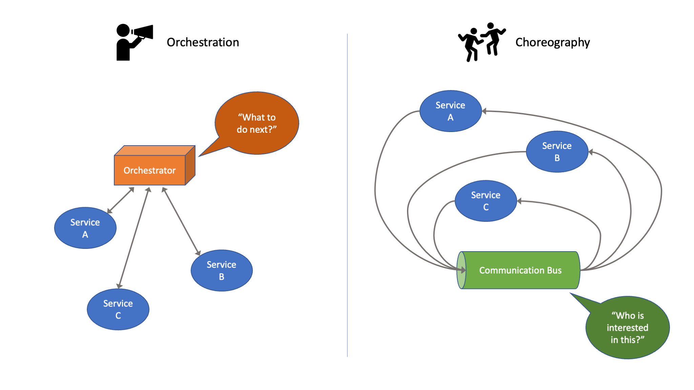

When designing a distributed application, two main architectural styles can be used: service orchestration or service choreography.

We've talked about the [differences between these architectural styles before](/posts/microservices-orchestration-choreography) but here we're going to focus on the practical implementations of them using AWS tools. Let's quickly summarize the differences.

With service orchestration, there is a central point of control, the orchestrator, that coordinates all interactions between services. This is usually implemented using a workflow with the workflow engine being the orchestrator. At every step of the process, the orchestrator asks "What to do next?"

With service choreography, each service knows what to do and how to interact with other services but there is no centralized control. For example, in an event-driven architecture, each service knows which events it can receive and which events it can emit. Communication between services usually happens through a communication bus. The responsibility of the bus is to route events to the right receivers. For this reason, when a message is published by a service, the bus asks "Who is interested in this?"

## Comparing Service Orchestration and Choreography

To compare the two architectures, let’s see what happens if we try to add a new service to an existing distributed architecture:

- To add a new service to a workflow, we need to update the workflow to use the new service in the correct way. For example, when adding a fraud detection system to an e-commerce application, we have to find the right place in the different workflows (such as the creation of a new customer or a new order) that can benefit from fraud detection. If the fraud detection service detects a possible fraud, then each workflow should follow a different path where this is managed. A change in one service has an impact on the workflows using the service.

- When adding a new service to an event-driven architecture, we need to know which events the new service is interested to, which events can be emitted by the new service, and who is interested to these events. For example, when adding a fraud detection system to an e-commerce application, we tell the bus which events the fraud detection system is interested to (such as `NewOrder` and `NewCustomer` event) and which services could be interested in its output (such as a `PossibleFraud` event). If a fraud detection can block an order, the delivery service should wait for an explicit `NoFraudDetected` event before progressing the order. A change in one service has limited impact on the existing services.

Events work best when connecting services managed by different teams. Event-driven architectures keep these services loosely coupled so that it is easier to update them without having side effects on other services. In this way, the work of one team has a more limited impact on the work of other teams, and teams are not blocked waiting for other teams to complete their part of a task.

Workflows work best to coordinate work inside a single service, managed by a single team, when strict coordination is needed. For example, using the saga pattern, workflows can replace distributed transactions.

> Starting from scratch with events can be more complex than using a workflow but adding new functionality to an event-driven architecture should be easier because of the reduced coupling.

## Implementing Service Choreography

On AWS, you can use different services to implement service choreography. For example:

- [Amazon EventBridge](https://docs.aws.amazon.com/eventbridge/index.html?sc_channel=el&sc_campaign=appswave&sc_content=event-driven-architectures-service-orchestration-vs-choreography&sc_geo=mult&sc_country=mult&sc_outcome=acq) provides a serverless event bus that by default can listen to events emitted by AWS services and can be extended to process custom events. You can create rules that look for events published on a bus and route those events to the correct destinations. When listening to events emitted by AWS services, you can use EventBridge to automate your application response to operational changes. You can use API Destinations to reduce custom code and send events to on-prem and SaaS applications, managing authentication to simplify security and throughput to not overload the application. You can archive and reply events to quickly debug your applications and recover from errors. With the schema registry, the schema is  automatically discovered from events, and you can generate code bindings for programming languages such as Java, Python, or TypeScript.

- [Amazon SNS](https://docs.aws.amazon.com/sns/latest/dg/welcome.html?sc_channel=el&sc_campaign=appswave&sc_content=event-driven-architectures-service-orchestration-vs-choreography&sc_geo=mult&sc_country=mult&sc_outcome=acq) provides Pub/Sub messaging using topics. You can use [Amazon SQS](https://docs.aws.amazon.com/AWSSimpleQueueService/latest/SQSDeveloperGuide/welcome.html?sc_channel=el&sc_campaign=appswave&sc_content=event-driven-architectures-service-orchestration-vs-choreography&sc_geo=mult&sc_country=mult&sc_outcome=acq) to subscribe queues to those topics to improve resilience and control the speed at which messages sent to these topics are consumed. You can use Pub/Sub messaging to build an event-driven architecture but it is usually more complex than when using an event bus. With SNS, you might need to create multiple topics and subscriptions (using message filtering to receive only a subset of the messages published to the topic) while, with EventBridge, you can have a single bus with multiple rules to control how event are routed to their destinations.

- In case you need strict message ordering and deduplication, you can send first in, first out (FIFO) Pub/Sub messages using [SNS FIFO](https://docs.aws.amazon.com/sns/latest/dg/sns-fifo-topics.html?sc_channel=el&sc_campaign=appswave&sc_content=event-driven-architectures-service-orchestration-vs-choreography&sc_geo=mult&sc_country=mult&sc_outcome=acq) topics and [SQS FIFO](https://docs.aws.amazon.com/AWSSimpleQueueService/latest/SQSDeveloperGuide/FIFO-queues.html?sc_channel=el&sc_campaign=appswave&sc_content=event-driven-architectures-service-orchestration-vs-choreography&sc_geo=mult&sc_country=mult&sc_outcome=acq) queues. There are scalability limits when using SNS and SQS FIFO compared to their standard implementation so check if there are ok for your use case.

- To integrate with existing and open-source solutions, you can use [Amazon MQ](https://docs.aws.amazon.com/amazon-mq/latest/developer-guide/welcome.html?sc_channel=el&sc_campaign=appswave&sc_content=event-driven-architectures-service-orchestration-vs-choreography&sc_geo=mult&sc_country=mult&sc_outcome=acq), a managed message broker service for [Apache ActiveMQ](https://activemq.apache.org) and [RabbitMQ](https://www.rabbitmq.com), or [Amazon Managed Streaming for Apache Kafka (Amazon MSK)](https://docs.aws.amazon.com/msk/latest/developerguide/what-is-msk.html?sc_channel=el&sc_campaign=appswave&sc_content=event-driven-architectures-service-orchestration-vs-choreography&sc_geo=mult&sc_country=mult&sc_outcome=acq), a fully managed, highly available [Apache Kafka](https://kafka.apache.org) service.

- To collect and process real-time data streams for analytics and machine learning, you can use [Amazon Kinesis Data Streams](https://docs.aws.amazon.com/streams/latest/dev/introduction.html?sc_channel=el&sc_campaign=appswave&sc_content=event-driven-architectures-service-orchestration-vs-choreography&sc_geo=mult&sc_country=mult&sc_outcome=acq).

- [AWS AppSync](https://docs.aws.amazon.com/appsync/latest/devguide/what-is-appsync.html?sc_channel=el&sc_campaign=appswave&sc_content=event-driven-architectures-service-orchestration-vs-choreography&sc_geo=mult&sc_country=mult&sc_outcome=acq) provides a [GraphQL](https://graphql.org) interface for the application frontend including Pub/Sub APIs that can interact with data in the backend and supports offline data synchronization, versioning, and conflict resolution.

- For IoT use cases, you can use [AWS IoT Core](https://docs.aws.amazon.com/iot/latest/developerguide/what-is-aws-iot.html?sc_channel=el&sc_campaign=appswave&sc_content=event-driven-architectures-service-orchestration-vs-choreography&sc_geo=mult&sc_country=mult&sc_outcome=acq) to use the [MQTT](https://mqtt.org) protocol to exchange messages between IoT devices, applications, and AWS services.

## Implementing Service Orchestration

On AWS, you can use different services to implement service orchestration. For example:

- With [AWS Step Functions](https://docs.aws.amazon.com/step-functions/latest/dg/welcome.html?sc_channel=el&sc_campaign=appswave&sc_content=event-driven-architectures-service-orchestration-vs-choreography&sc_geo=mult&sc_country=mult&sc_outcome=acq) you can design and run workflows using state machines. The business logic can run on any compute platform, such as [AWS Lambda](https://docs.aws.amazon.com/lambda/latest/dg/index.html?sc_channel=el&sc_campaign=appswave&sc_content=event-driven-architectures-service-orchestration-vs-choreography&sc_geo=mult&sc_country=mult&sc_outcome=acq) functions, [AWS Fargate](https://docs.aws.amazon.com/AmazonECS/latest/developerguide/index.html) containers, [Amazon EC2](https://docs.aws.amazon.com/ec2/?sc_channel=el&sc_campaign=appswave&sc_content=event-driven-architectures-service-orchestration-vs-choreography&sc_geo=mult&sc_country=mult&sc_outcome=acq) instances, and on-prem resources. Step functions handle errors, timeouts and parallel processing flow for distributed applications. You can use the Direct integration with AWS services and APIs to further reduce the custom code to write and maintain. Workflows can coordinate applications using HTTPS connections regardless of where they are hosted (EC2 instances, mobile devices, on-prem servers). By using workflows, you can keep the logic of your application separated from the actual implementation. With Express Workflows, Step Functions can handle more than 100K events per second to handle processing for use cases such as IoT and high volume data ingestion.

- You can use [Amazon Managed Workflows for Apache Airflow (MWAA)](https://docs.aws.amazon.com/mwaa/latest/userguide/what-is-mwaa.html?sc_channel=el&sc_campaign=appswave&sc_content=event-driven-architectures-service-orchestration-vs-choreography&sc_geo=mult&sc_country=mult&sc_outcome=acq) to orchestrate workflows using directed acyclic graphs (DAGs) written in Python. This is well suited to connect cloud and on-premises resources using [Apache Airflow](https://airflow.apache.org) providers or custom plugins. For example, you can connect managed workflows to many AWS resources with reduced operational efforts compared to managing your own Apache Airflow installation. Managed workflows automatically scale up when workers are busy and down when workers are no longer in use.

- To automate data flows between software as a service (SaaS) and AWS services, you can use [Amazon AppFlow](https://docs.aws.amazon.com/appflow/latest/userguide/index.html?sc_channel=el&sc_campaign=appswave&sc_content=event-driven-architectures-service-orchestration-vs-choreography&sc_geo=mult&sc_country=mult&sc_outcome=acq), a fully managed integration service to transfer data between services such as [Salesforce](https://www.salesforce.com/), [SAP](https://www.sap.com/), [Google Analytics](https://analytics.google.com/), and [Amazon Redshift](https://docs.aws.amazon.com/redshift/?sc_channel=el&sc_campaign=appswave&sc_content=event-driven-architectures-service-orchestration-vs-choreography&sc_geo=mult&sc_country=mult&sc_outcome=acq). It supports data transformations such as merging, masking, filtering, and validation. To simplify analytics, you can use data partitioning and aggregation. You can build your own connectors to securely transfer data between your custom endpoint, application, or other cloud service using the AppFlow Connector Software Development Kit (SDK).

## Conclusion

You should have a better understanding now of how orchestration and choreography differ, and the trade-offs between choosing a central point of control with an orchestrator vs designing and building each service to know how interact with other services using an event driven architecture.

If you want to dive into some practical implementations, or read more about event drive architectures, have a look at the following:

- [Automate the Provisioning of Your Apache Airflow Environments](/tutorials/automating-mwaa-environments-and-workflows)
- [Data processing with Kafka Streams - An overview of stateless operations](/tutorials/data-processing-with-kafka-streams-stateless-operations)
- [Orchestration vs. Choreography: Why using different co-ordination patterns matters to developers](/posts/microservices-orchestration-choreography)
