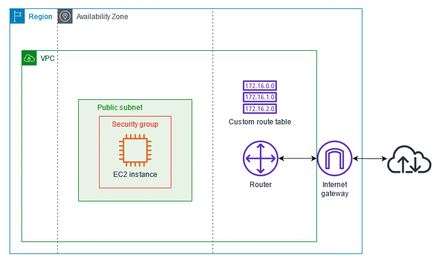
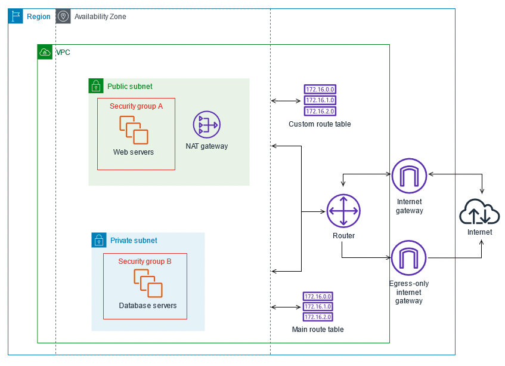
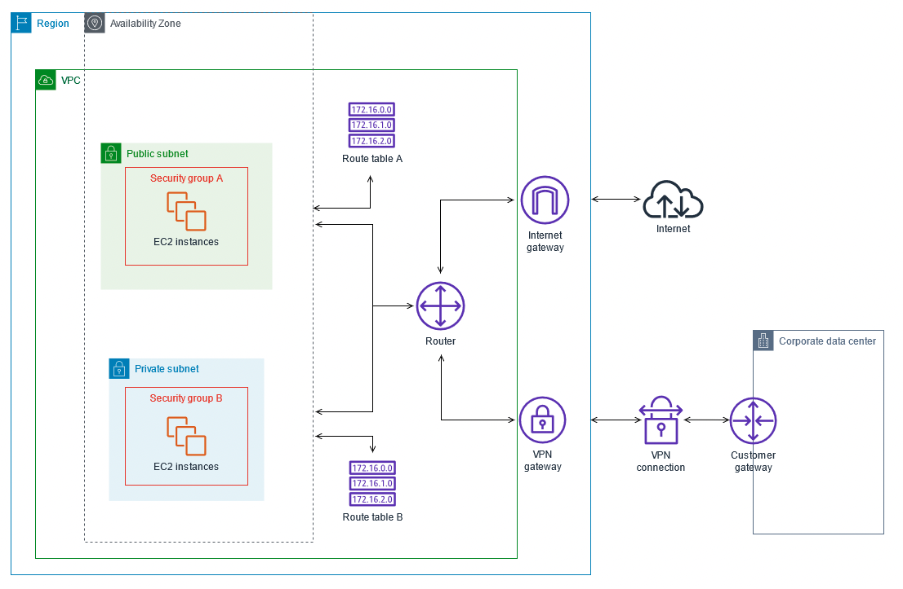
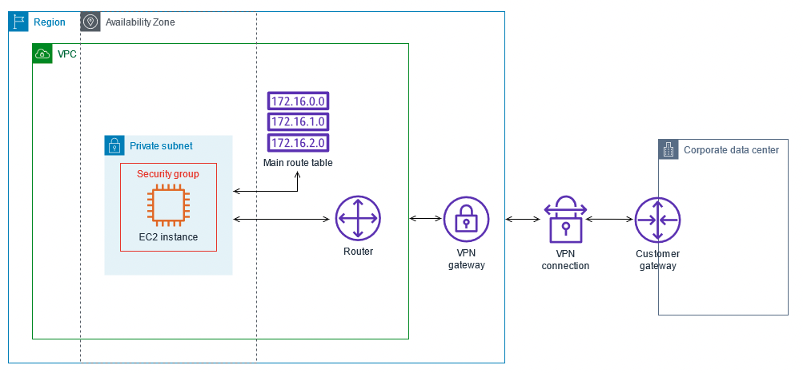

Starting your cloud networking journey can seem overwhelming. Especially if you are accustomed to the traditional on-premises way of provisioning hardware and managing and configuring networks. Having a good understanding of core networking concepts like IP addressing, TCP communication, IP routing, security, and virtualization will help you as you begin gaining familiarity with cloud networking on AWS. In the following sections, we answer common questions about cloud networking and explore best practices for building infrastructure on AWS.

## **Sections**

| ToC |
|-----|

## What is cloud networking?

Similar to traditional on-premises networking, cloud networking provides the ability to build, manage, operate, and securely connect your networks across all your cloud environments and distributed cloud and edge locations. Cloud networking allows you to architect infrastructure that is resilient and highly available, helping you to deploy your applications faster, at scale, and closer to your end users when you need it.

## Why is the location of my cloud network important?

<!-- When you open a website or use an application, data and requests need to travel from your computer or phone to a server that is hosting the website or application, and back again to you. This is usually done over a combination of different mediums, such as over Wi-Fi to your router at home, from there to your ISP by way of fiber, cable, ADSL, 5G, etc. Once it reaches the ISP, they in turn connect to a larger network. At some point, it is likely that your data travels through one of the many [undersea fiber cables](https://www.submarinecablemap.com/). The speed of light determines what the quickest speed through these cables can be, limiting the fastest possible response—the light inside the cable also reflects off the side as it travels, so the total distance traveled is longer than the cable itself. As an example, one of the cables between Japan and the US West coast is 21,000km in total length, which means light traveling at 299,792,458 m/s would take ~70ms to cross the total length of the cable, slowing down the website or application as multiple calls go back and forth. In extreme examples, the time can be much higher due to not only the distance traveled, but network congestion between points along the way, with responses taking multiple seconds to complete. -->

With the cloud, you can expand to new geographic regions and deploy globally in minutes. For example, AWS has infrastructure all over the world, so developers can deploy applications in [multiple physical locations](https://aws.amazon.com/about-aws/global-infrastructure/) with just a few clicks. By putting your applications in closer proximity to your end users, you can reduce latency and improve the user experience.
 
AWS Cloud infrastructure is built around AWS Regions and Availability Zones. A Region is a physical location in the world where we have multiple Availability Zones. An Availability Zone consists of one or more discrete data centers, each with redundant power, networking, and connectivity, housed in separate facilities. These Availability Zones offer you the ability to operate production applications and databases that are more highly available, fault tolerant, and scalable than would be possible from a single data center.

https://www.youtube.com/embed/UuRX2gK0IYw

## What is Amazon VPC?

With Amazon Virtual Private Cloud (Amazon VPC), you can provision a logically isolated section of the AWS Cloud where you can launch AWS resources in a virtual network that you define. You have complete control over your virtual networking environment, including selection of your own IP address ranges, creation of subnets, and configuration of route tables and network gateways. You can also create a hardware virtual private network (VPN) connection between your corporate data center and your VPC, allowing you to connect servers between the two as if they were on the same network.

You can easily customize the network configuration for your VPC based on your requirements. A VPC spans a whole Region, and subnets are used to specify IP address ranges inside Availability Zones inside the Region to allocate to virtual machines and other services. For example, you can create a public subnet for your web servers that has access to the internet, and place your backend systems, such as databases or application servers, in a private subnet with no internet access. You can use multiple layers of security, including security groups and network access control lists, to help control access to Amazon EC2 instances in each subnet.

The following features help you configure a VPC to provide the connectivity that your applications need:
| Feature | Description |
|---------|-------------|
|**VPCs** |A VPC is a virtual network that closely resembles a traditional network that you would operate in your own data center. After you create a VPC, you can add subnets.|
|**Subnets** |A subnet is a range of IP addresses in your VPC. A subnet must reside in a single Availability Zone. After you add subnets, you can deploy AWS resources in your VPC.|
|**IP addressing** |You can assign IPv4 addresses and IPv6 addresses to your VPCs and subnets. You can also bring your public IPv4 and IPv6 GUAs (Global Unicast Addresses) to AWS and allocate them to resources in your VPC, such as EC2 instances, NAT gateways, and Network Load Balancers.|
|**Routing** |Use route tables to determine where network traffic from your subnet or gateway is directed.|
|**Gateways and endpoints** |A gateway connects your VPC to another network. For example, use an internet gateway to connect your VPC to the internet. Use a VPC endpoint to connect to AWS services privately, without the use of an internet gateway or NAT device.|
|**Peering connections**| Use a VPC peering connection to route traffic between the resources in two VPCs.|
|**Traffic mirroring**| Copy network traffic from network interfaces and send it to security and monitoring appliances for deep packet inspection.|
|**Transit gateways**|Use a transit gateway, which acts as a central hub, to route traffic between your VPCs, VPN connections, and AWS Direct Connect connections.|
|**VPC flow logs**|A flow log captures information about the IP traffic going to and from network interfaces in your VPC.|
|**VPN connections**| Connect your VPCs to your on-premises networks using AWS Virtual Private Network (AWS VPN).|

### Getting started with Amazon VPC

Your AWS account includes a [default VPC](https://docs.aws.amazon.com/vpc/latest/userguide/default-vpc.html) in each AWS Region. Your default VPCs are configured such that you can immediately start launching and connecting to EC2 instances. For more information, see [Get started with Amazon VPC](https://docs.aws.amazon.com/vpc/latest/userguide/vpc-getting-started.html).

## How do resources in my Amazon VPC communicate?

VPCs gives you full control over your virtual networking environment, including resource placement, connectivity, and security. Get started by setting up your VPC in the AWS Management Console. Next, add resources to it such as Amazon EC2 and Amazon Relational Database Service (Amazon RDS) instances. Finally, define how your VPCs communicate with each other across accounts, Availability Zones, or Regions. As you create subnets, you must associate them with a main VPC route table. By default, this route table will only contain the local IPv4 and IPv6 CIDRs of the VPC. A subnet can only be associated with one subnet route table. A route table can have multiple subnet associations. The route tables are used to control traffic leaving the subnet. Each subnet has a VPC route table. There is no single device for a VPC. The VPC software takes care of the routing for you. You can add more specific routes to provide traffic filtering for east/west traffic. In a VPC you can use both IPv4 and IPv6 addressing. With IPv4 you select and assign a VPC CIDR (Classless Inter-Domain Routing) block from a maximum size of /16 to a minimum size of /28. You can use any public addresses you own (in select Regions). We recommend you use private RFC 1918 addresses. Once you have a CIDR, you define subnets. Subnets can be between /16 and /28 in size and are bounded by Availability Zones. Each VPC subnet must be associated with a subnet route table.

## How can I connect to my Amazon VPC?

You can connect your VPC to other networks, such as other VPCs, the internet, or your on-premises network. You can connect your Amazon VPC to:

|How to connect|Description|
|--------------|-----------|
|**The internet (via an internet gateway)**| An [internet gateway](https://docs.aws.amazon.com/vpc/latest/userguide/VPC_Internet_Gateway.html) is a horizontally scaled, redundant, and highly available VPC component that allows communication between your VPC and the internet. It supports IPv4 and IPv6 traffic and does not cause availability risks or bandwidth constraints on your network traffic. An internet gateway enables resources in your public subnets (such as EC2 instances) to connect to the internet if the resource has a public IPv4 address or an IPv6 address. Similarly, resources on the internet can initiate a connection to resources in your subnet using the public IPv4 address or IPv6 address. For example, an internet gateway enables you to connect to an EC2 instance in AWS using your local computer. An internet gateway provides a target in your VPC route tables for internet-routable traffic. For communication using IPv4, the internet gateway also performs network address translation (NAT). For communication using IPv6, NAT is not needed because IPv6 addresses are public.|
|**Your corporate data center using an [AWS Site-to-Site VPN connection](https://docs.aws.amazon.com/vpn/latest/s2svpn/VPC_VPN.html) (through a virtual private gateway)** | By default, instances that you launch into an Amazon VPC can't communicate with your own (remote) network. You can enable access to your remote network from your VPC by creating an AWS Site-to-Site VPN (Site-to-Site VPN) connection, and configuring routing to pass traffic through the connection.   **NOTE**: When connecting your VPCs to a common on-premises network, we recommend that you use non-overlapping CIDR blocks for your networks.|
|**Both the internet and your corporate data center (using both an internet gateway and a virtual private gateway)**|The VPC has an attached virtual private gateway, and your on-premises (remote) network includes a customer gateway device, which you must configure to enable the [Site-to-Site VPN connection](https://docs.aws.amazon.com/vpn/latest/s2svpn/VPC_VPN.html). You set up the routing so that any traffic from the VPC bound for your network is routed to the virtual private gateway.|
|**NAT instance**|You can use a [NAT instance](https://docs.aws.amazon.com/vpc/latest/userguide/VPC_NAT_Instance.html) to allow resources in private subnets to connect to the internet, other VPCs, or on-premises networks. These instances can communicate with services outside the VPC, but they cannot receive unsolicited connection requests.|
|**NAT gateways**| A [NAT gateway](https://docs.aws.amazon.com/vpc/latest/userguide/vpc-nat-gateway.html) is a network address translation (NAT) service. You can use a NAT gateway so that instances in a private subnet can connect to services outside your VPC but external services cannot initiate a connection with those instances. When you create a NAT gateway, you specify one of the following connectivity types:   **Public** – (Default) Instances in private subnets can connect to the internet through a public NAT gateway, but cannot receive unsolicited inbound connections from the internet. You create a public NAT gateway in a public subnet and must associate an elastic IP address with the NAT gateway at creation. You route traffic from the NAT gateway to the internet gateway for the VPC. Alternatively, you can use a public NAT gateway to connect to other VPCs or your on-premises network. In this case, you route traffic from the NAT gateway through a transit gateway or a virtual private gateway.    **Private** – Instances in private subnets can connect to other VPCs or your on-premises network through a private NAT gateway. You can route traffic from the NAT gateway through a transit gateway or a virtual private gateway. You cannot associate an elastic IP address with a private NAT gateway. You can attach an internet gateway to a VPC with a private NAT gateway, but if you route traffic from the private NAT gateway to the internet gateway, the internet gateway drops the traffic.   The NAT gateway replaces the source IP address of the instances with the IP address of the NAT gateway. For a public NAT gateway, this is the elastic IP address of the NAT gateway. For a private NAT gateway, this is the private IP address of the NAT gateway. When sending response traffic to the instances, the NAT device translates the addresses back to the original source IP address.|
|**AWS Direct Connect**| While VPN over the internet is a great option to get started, internet connectivity may not be reliable for production traffic. Because of this unreliability, many customers choose AWS Direct Connect. AWS Direct Connect is a networking service that provides an alternative to using the internet to connect to AWS. Using AWS Direct Connect, data that would have previously been transported over the internet is delivered through a private network connection between your facilities and AWS. In many circumstances, private network connections can reduce costs, increase bandwidth, and provide a more consistent network experience than internet-based connections. See the [Building a Scalable and Secure Multi-VPC AWS Network Infrastructure](https://docs.aws.amazon.com/whitepapers/latest/building-scalable-secure-multi-vpc-network-infrastructure/direct-connect.html) whitepaper to learn more.|
|**Other Amazon VPCs (via VPC peering connections)**| A VPC peering connection is a networking connection between two VPCs that enables you to route traffic between them privately. Instances in either VPC can communicate with each other as if they are within the same network. You can create a VPC peering connection between your own VPCs, with a VPC in another AWS account, or with a VPC in a different AWS Region. AWS uses the existing infrastructure of a VPC to create a VPC peering connection; it is neither a gateway nor an AWS Site-to-Site VPN connection, and does not rely on a separate piece of physical hardware. There is no single point of failure for communication or a bandwidth bottleneck. |

## Can I connect to other VPCs in different accounts?

Yes, assuming the owner of the other VPC accepts your peering connection request, you can peer to other VPCs in different accounts.

### **VPC sharing**

[Sharing VPCs](https://docs.aws.amazon.com/vpc/latest/userguide/vpc-sharing.html) is useful when network isolation between teams does not need to be strictly managed by the VPC owner, but the account-level users and permissions must be. With a shared VPC, multiple AWS accounts create their application resources (such as EC2 instances) in shared, centrally managed Amazon VPCs. In this model, the account that owns the VPC (owner) shares one or more subnets with other accounts (participants). After a subnet is shared, the participants can view, create, modify, and delete their application resources in the subnets shared with them. Participants cannot view, modify, or delete resources that belong to other participants or the VPC owner. Security between resources in shared VPCs is managed using security groups, network access control lists (NACLs), or through a firewall between the subnets.

### **AWS PrivateLink**

[AWS PrivateLink](https://docs.aws.amazon.com/vpc/latest/privatelink/what-is-privatelink.html) provides private connectivity between VPCs, AWS services, and your on-premises networks without exposing your traffic to the public internet. AWS PrivateLink makes it easy to connect services across different accounts and VPCs to significantly simplify your network architecture. This allows customers who may want to privately expose a service/application residing in one VPC (service provider) to other VPCs (consumer) within an AWS Region in a way that only consumer VPCs initiate connections to the service provider VPC. An example of this is the ability for your private applications to access service provider APIs.

### **AWS Transit Gateway**

[AWS Transit Gateway](https://docs.aws.amazon.com/vpc/latest/tgw/what-is-transit-gateway.html) enables customers to connect thousands of VPCs. You can attach all your hybrid connectivity (VPN and Direct Connect connections) to a single Transit Gateway instance, consolidating and controlling your organization's entire AWS routing configuration in one place. Transit Gateway controls how traffic is routed among all the connected spoke networks using route tables. This hub-and-spoke model simplifies management and reduces operational costs because VPCs only connect to the Transit Gateway instance to gain access to the connected networks.

### **Transit VPC solution**

[Transit VPCs](https://docs.aws.amazon.com/whitepapers/latest/aws-vpc-connectivity-options/transit-vpc-option.html) can solve some of the shortcomings of VPC peering by introducing a hub-and-spoke design for inter-VPC connectivity. In a transit VPC network, one central VPC (the hub VPC) connects with every other VPC (spoke VPC) through a VPN connection, typically by using BGP over IPsec. The central VPC contains EC2 instances running software appliances that route incoming traffic to their destinations using the VPN overlay. Transit VPC peering has the following advantages:

- Transitive routing is enabled using the overlay VPN network, allowing for a simpler hub-and-spoke design.
- When using third-party vendor software on the EC2 instance in the hub transit VPC, vendor functionality around advanced security, such as Layer-7 firewall/Intrusion Prevention System (IPS)/Intrusion Detection System (IDS), can be used. If customers are using the same software on-premises, they benefit from a unified operational/monitoring experience.
- The Transit VPC architecture enables connectivity that may be desired in some use cases. For example, you can connect an AWS GovCloud instance and Commercial Region VPC or a Transit Gateway instance to a Transit VPC and enable inter-VPC connectivity between the two Regions. Evaluate your security and compliance requirements when considering this option. For additional security, you may deploy a centralized inspection model using design patterns described later in this whitepaper.

>NOTE: Transit VPC comes with its own challenges, such as higher costs for running third-party vendor virtual appliances on Amazon EC2, based on the instance size/family; limited throughput per VPN connection (up to 1.25 Gbps per VPN tunnel); and additional configuration, management, and resiliency overhead (customers are responsible for managing the high availability and redundancy of EC2 instances running the third-party vendor virtual appliances).

## What are some security best practices for your VPC?

The following best practices are general guidelines and don’t represent a complete security solution. Because these best practices might not be appropriate or sufficient for your environment, treat them as helpful considerations rather than prescriptions.

- When you add subnets to your VPC to host your application, create them in multiple Availability Zones. An Availability Zone is one or more discrete data centers with redundant power, networking, and connectivity in an AWS Region. Using multiple Availability Zones makes your production applications highly available, fault tolerant, and scalable.
- Use network ACLs to control access to your subnets and use security groups to control traffic to EC2 instances in your subnets.
- Manage access to Amazon VPC resources and APIs using AWS Identity and Access Management (IAM) identity federation, users, and roles.
- Use Amazon CloudWatch with VPC flow logs to monitor the IP traffic going to and from network interfaces in your VPC.

For answers to frequently asked questions related to VPC security, see the Security and Filtering section in the [Amazon VPC FAQs](http://aws.amazon.com/vpc/faqs/).

## What are common VPC scenarios?

### **VPC with a single public subnet**

The configuration for this scenario includes a VPC with a single public subnet, and an internet gateway to enable communication over the internet. We recommend this configuration if you need to run a single-tier, public-facing web application, such as a blog or a simple website.

This scenario can also be optionally configured for IPv6. Instances launched into the public subnet can receive IPv6 addresses, and communicate using IPv6. 

### **VPC with public and private subnets (NAT)**

The configuration for this scenario includes a VPC with a public subnet and a private subnet. We recommend this scenario if you want to run a public-facing web application, while maintaining backend servers that aren't publicly accessible. A common example is a multi-tier website, with the web servers in a public subnet and the database servers in a private subnet. You can set up security and routing so that the web servers can communicate with the database servers.

The instances in the public subnet can send outbound traffic directly to the internet, whereas the instances in the private subnet can't. Instead, the instances in the private subnet can access the internet by using a network address translation (NAT) gateway that resides in the public subnet. The database servers can connect to the internet for software updates using the NAT gateway, but the internet cannot establish connections to the database servers.

This scenario can also be optionally configured for IPv6. Instances launched into the subnets can receive IPv6 addresses, and communicate using IPv6. Instances in the private subnet can use an egress-only internet gateway to connect to the internet over IPv6, but the internet cannot establish connections to the private instances over IPv6.

### **VPC with public and private subnets and AWS Site-to-Site VPN access**

The configuration for this scenario includes a VPC with a public subnet and a private subnet, and a virtual private gateway to enable communication with your own network over an IPsec VPN tunnel. We recommend this scenario if you want to extend your network into the cloud and also directly access the internet from your VPC. This scenario enables you to run a multi-tiered application with a scalable web frontend in a public subnet, and to house your data in a private subnet that is connected to your network by an IPsec AWS Site-to-Site VPN connection.

This scenario can also be optionally configured for IPv6. Instances launched into the subnets can receive IPv6 addresses. We do not support IPv6 communication over a Site-to-Site VPN connection on a virtual private gateway; however, instances in the VPC can communicate with each other via IPv6, and instances in the public subnet can communicate over the internet via IPv6.

### **VPC with a private subnet only and AWS Site-to-Site VPN access**

The configuration for this scenario includes a VPC with a single private subnet, and a virtual private gateway to enable communication with your own network over an IPsec VPN tunnel. There is no internet gateway to enable communication over the internet. We recommend this scenario if you want to extend your network into the cloud using AWS infrastructure without exposing your network to the internet.

This scenario can also be optionally configured for IPv6. Instances launched into the subnet can receive IPv6 addresses. We do not support IPv6 communication over an AWS Site-to-Site VPN connection on a virtual private gateway; however, instances in the VPC can communicate with each other via IPv6. 

## Next steps

You can start building on AWS right away using the [AWS Free Tier](https://aws.amazon.com/free/) and our library of [hands-on tutorials](https://aws.amazon.com/getting-started/hands-on/?getting-started-all.sort-by=item.additionalFields.sortOrder&getting-started-all.sort-order=asc&awsf.getting-started-category=*all&awsf.getting-started-level=*all&awsf.getting-started-content-type=*all) and [getting started guides](https://aws.amazon.com/vpc/getting-started/).
