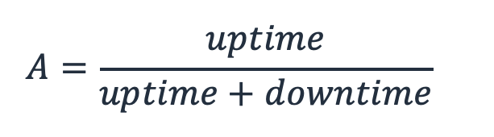
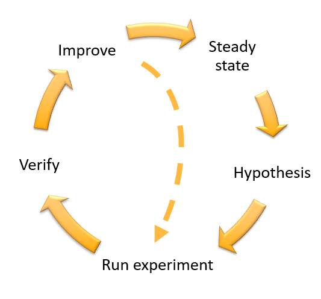

## 1. What is resilience

*Resilience is the ability of an application to resist or recover from certain types of faults or load spikes, and remain functional from the customer perspective.*
 
Anyone who has built or operated an application in production (whether in an on-prem data center or in the cloud) knows [it's a mess out there](https://twitter.com/setheliot/status/1620828116116738048). In any complex system, for example a distributed software application, there are faults, unanticipated inputs and user behaviors, and various instabilities. With the reality that this is the environment in which our applications must operate, it is best practices for resilience that will enable our applications to weather the storm. By recovering quickly, or avoiding impact altogether, our applications can continue to reliably serve the needs of our users.

## 2. How to prevent _faults_ from becoming _failures_

A *failure* is the inability of your application to perform its required function
 
A *fault* is a condition that has the potential to cause a failure in your application.

Faults can result in failures. But through application of resilience best practices, faults can be mitigated via automated or operational means to avoid failures.

### Types of faults

#### **Code and configuration**
Mistakes in code or configuration can be introduced whenever code or configuration is deployed. When teams do not address their tech debt, the risk of such faults rises.
 
#### **Infrastructure**
Servers, storage devices, and networks are all susceptible to failure. At small scale (e.g., individual hard drives), this happens all the time, but in the cloud such small scale failures are often abstracted away, so that your application never even "sees" any fault. Larger scale issues such as entire racks or widespread data center issues (like fires or power outages) can also occur. Even at larger scale, your applications can be designed to be resilient to these events (See [Resilience in the cloud](#4-how-does-the-cloud-help-you-build-resilient-applications) below). Huge scale events that impact all data centers in a geographic location are also possible, like a meteor strike that flattens multiple data centers. However events like this, of that scale, are highly unlikely.
 
#### **Data and state**
Corruption or accidental deletion of data can occur accidentally or maliciously. Errors in code or deployment can also cause data to be corrupted or deleted.
 
#### **Dependencies**
Your application depends on other systems such as AWS services and third-party dependencies, as well as DNS resolution and the internet itself. Faults, or changes in behavior, of these can impact your application.
 

### Categories of failure

When a fault occurs, it can cause the application to become unavailable. The [Resilience Analysis Framework](https://docs.aws.amazon.com/prescriptive-guidance/latest/resilience-analysis-framework/introduction.html?sc_channel=el&sc_campaign=resiliencewave&sc_geo=mult&sc_country=mult&sc_outcome=acq&sc_content=should-know-resilience) has identified five common categories of failures abbreviated as SEEMS, named for the first letter of each failure mode listed as follows:
 
#### **Shared fate**
When a fault in one component or location cascades to other components or locations. 
 
For example, a request to a server triggers a bug that causes the server to fail. That failed request is retried by the client, impacting another server in the fleet, and continuing until all servers have failed

Apply these best practices to protect your application from this failure mode:
* [Use fault isolation to  protect your workload](https://docs.aws.amazon.com/wellarchitected/latest/reliability-pillar/use-fault-isolation-to-protect-your-workload.html?sc_channel=el&sc_campaign=resiliencewave&sc_geo=mult&sc_country=mult&sc_outcome=acq&sc_content=should-know-resilience) (Well-Architected best practices)

 
#### **Excessive load**
Without sufficient capacity when high demand exhausts resources, the user will experience slow and failed responses. 
 
For example if AWS Lambda concurrency is limited to 100 in-flight requests, and if requests take 1 second each to process, then when traffic exceeds 100 requests per second, they will be throttled, which can manifest as unavailability to the end user of your application. [Concurrency limit can be calculated](https://repost.aws/knowledge-center/lambda-concurrency-limit-increase?sc_channel=el&sc_campaign=resiliencewave&sc_geo=mult&sc_country=mult&sc_outcome=acq&sc_content=should-know-resilience) like this:

> Required Lambda Concurrency = Function duration X Request rate

Apply these best practices to protect your application from this failure mode:
* [Design your workload to adapt  to changes in demand](https://docs.aws.amazon.com/wellarchitected/latest/reliability-pillar/design-your-workload-to-adapt-to-changes-in-demand.html?sc_channel=el&sc_campaign=resiliencewave&sc_geo=mult&sc_country=mult&sc_outcome=acq&sc_content=should-know-resilience) (Well-Architected best practices)

 
#### **Excessive latency**
This is when system processing or network traffic latency for your application exceeds the expected time. 
 
For example, failures in a dependency might require multiple retries  by your application when calling that dependency, which can cause perceived slowdowns to the application end user.

Apply these best practices to protect your application from this failure mode:
* [Performance architecture  selection](https://docs.aws.amazon.com/wellarchitected/latest/performance-efficiency-pillar/performance-architecture-selection.html?sc_channel=el&sc_campaign=resiliencewave&sc_geo=mult&sc_country=mult&sc_outcome=acq&sc_content=should-know-resilience) (Well-Architected best practices)
* [Using trade-offs to improve  performance](https://docs.aws.amazon.com/wellarchitected/latest/performance-efficiency-pillar/using-trade-offs-to-improve-performance.html?sc_channel=el&sc_campaign=resiliencewave&sc_geo=mult&sc_country=mult&sc_outcome=acq&sc_content=should-know-resilience) (Well-Architected best practices)

 
#### **Misconfiguration and bugs**
A direct consequence of code and configuration faults, bugs can result in application slow down, loss of availability, or incorrect execution.
 
For example, configuring a client with no timeout can leave it hanging indefinitely if there is a transient error calling the database. This can manifest as a lockup to the end user. 
 

>This was a real bug I had to [fix here](https://github.com/awslabs/aws-well-architected-labs/blob/main/static/Reliability/300_Testing_for_Resiliency_of_EC2_RDS_and_S3/Code/Python/server_with_reconnect.py#L34) for my [chaos engineering lab](https://wellarchitectedlabs.com/reliability/300_labs/300_testing_for_resiliency_of_ec2_rds_and_s3) that would cause processes to lock up when the database failed over from primary to standby. 

You can also have misconfigurations other than code bugs, such as network control lists that block traffic they should not, or choosing insufficient memory/CPU for you Lambda function. 

Apply these best practices to protect your application from this failure mode:
* [Design for operations](https://docs.aws.amazon.com/wellarchitected/latest/operational-excellence-pillar/design-for-operations.html?sc_channel=el&sc_campaign=resiliencewave&sc_geo=mult&sc_country=mult&sc_outcome=acq&sc_content=should-know-resilience): Adopt approaches that improve the flow of changes into production and that help refactoring, fast feedback on quality, and bug fixing. (Well-Architected best practices)

 
#### **Single points of failure (SPOF)**
When a failure in a single component disrupts the application due to lack of redundancy of the component. 
 
For example, if requests require a call to the relational database to succeed, and that database fails, then all requests fail unless there is a standby database that the application can fail over to.

Apply these best practices to protect your application from this failure mode:
* [Design your workload to withstand component failures](https://docs.aws.amazon.com/wellarchitected/latest/reliability-pillar/design-your-workload-to-withstand-component-failures.html?sc_channel=el&sc_campaign=resiliencewave&sc_geo=mult&sc_country=mult&sc_outcome=acq&sc_content=should-know-resilience) (Well-Architected best practices)

## 3. How to think about resilience

Figure 1 illustrates a mental model for resilience.

To understand resilience it is helpful to keep these three aspects of resilience in mind, and how they relate to each other.

### High Availability (HA)

High availability is about resilience against the smaller, more frequent faults an application will encounter in production. These include component failures, transient errors, latency, and load spikes.
 
Availability is one of the primary ways we can quantitatively measure resiliency. We define availability, A, as the percentage of time that a workload is available for use. It’s a ratio of its “uptime” (being available) to the total time being measured (the “uptime” plus the “downtime”).
 
<!--  -->

$$ A = \frac{uptime}{uptime + downtime} $$
 
The result of this calculation is often called "the nines" of availability, where for example a value of 99.99% is called "four nines of availability".
 
Mean time to repair (or recovery) (_MTTR_) and mean time between failure (_MTBF_) are other measures and can be related to Availability (_A_) via this equation.
* MTTR: Average time it takes to repair the application, measured from the start of an outage to when the application functionality is restored.
* MTBF: Average time that the application is operating from the time it is restored, until the next failure.

<!--  -->

$$ A = \frac{MTBF}{MTBF + MTTR} $$

To learn more about measuring availability see the whitepaper [Availability and Beyond: Understanding and Improving the Resilience of Distributed Systems on AWS](https://docs.aws.amazon.com/whitepapers/latest/availability-and-beyond-improving-resilience/availability-and-beyond-improving-resilience.html?sc_channel=el&sc_campaign=resiliencewave&sc_geo=mult&sc_country=mult&sc_outcome=acq&sc_content=should-know-resilience)
 

### Disaster Recovery (DR)

Disaster is about resilience against the large scale, much less frequent faults an application may encounter. Such disaster events fall into the [categories: natural disasters,  major technical issues, or deletion or corruption of data or resources (usually due to human action)](https://docs.aws.amazon.com/whitepapers/latest/disaster-recovery-workloads-on-aws/what-is-a-disaster.html?sc_channel=el&sc_campaign=resiliencewave&sc_geo=mult&sc_country=mult&sc_outcome=acq&sc_content=should-know-resilience). These are faults with a large scope of impact on your application, and therefore usually involves a recovery site.  This can mean that the primary site is unable to support your availability requirements, and therefore you must fail over to a recovery site where your application can run on recovery versions of your infrastructure, data, and code. Or in some cases, you can continue to run in the primary site, but must restore data from the recovery site.

While disaster events will also affect availability, the primary measures of resilience during disaster recovery are how long the application is down and how much data was lost. Therefore a DR strategy must be selected based on recovery time objective (RTO) and recovery point objective (RPO). Figure 2 shows a timeline where a disaster has occurred. The RPO represents maximum acceptable amount of time since the last data recovery point and measures potential data loss, while the RTO is the maximum acceptable delay between the interruption of service and restoration of service to end users. To learn more about these read about [Business Continuity Planning (BCP) here](https://docs.aws.amazon.com/whitepapers/latest/disaster-recovery-workloads-on-aws/business-continuity-plan-bcp.html?sc_channel=el&sc_campaign=resiliencewave&sc_geo=mult&sc_country=mult&sc_outcome=acq&sc_content=should-know-resilience).

For more information on DR see:
* [Disaster Recovery of Workloads on AWS: Recovery in the Cloud](https://docs.aws.amazon.com/whitepapers/latest/disaster-recovery-workloads-on-aws/disaster-recovery-workloads-on-aws.html?sc_channel=el&sc_campaign=resiliencewave&sc_geo=mult&sc_country=mult&sc_outcome=acq&sc_content=should-know-resilience) (whitepaper)
* [Disaster Recovery (DR) Architecture on AWS](https://aws.amazon.com/blogs/architecture/tag/disaster-recovery-series?sc_channel=el&sc_campaign=resiliencewave&sc_geo=mult&sc_country=mult&sc_outcome=acq&sc_content=should-know-resilience) (blog post series)

### Continuous Resilience

Continuous resilience spans both HA and DR. It is about anticipating, monitoring, responding, and continuously learning from failure, as described in the blog post [Towards continuous resilience](https://medium.com/the-cloud-architect/towards-continuous-resilience-3c7fbc5d232b?source=friends_link&sk=7561e6d5312fdb6fef283a4167cf9caa). The blog covers all these in detail. Here  I only cover some highlights of each one:

**Anticipating** 
This includes understanding the faults and failure modes above, and implementing resilience best practices to avoid or mitigate them.

* [Continually assessing application resilience with AWS Resilience Hub and AWS CodePipeline](https://aws.amazon.com/blogs/architecture/continually-assessing-application-resilience-with-aws-resilience-hub-and-aws-codepipeline?sc_channel=el&sc_campaign=resiliencewave&sc_geo=mult&sc_country=mult&sc_outcome=acq&sc_content=should-know-resilience)
* [Designing for Reliability with AWS Well-Architected](https://www.youtube.com/watch?v=14WIuardjD0) (video)

**Monitoring** 
Key here is observability, which is comprised of metrics, logs, system events, and traces. This information is used and explored to try and determine the nature of an issue in order to facilitate action. As you build applications in the cloud, be aware of any gaps in your observability strategy.

* [AWS Cloud Adoption Framework: Three pillars of Observability](https://docs.aws.amazon.com/whitepapers/latest/aws-caf-operations-perspective/observability.html?sc_channel=el&sc_campaign=resiliencewave&sc_geo=mult&sc_country=mult&sc_outcome=acq&sc_content=should-know-resilience)
* [Design Telemetry](https://docs.aws.amazon.com/wellarchitected/latest/operational-excellence-pillar/design-telemetry.html?sc_channel=el&sc_campaign=resiliencewave&sc_geo=mult&sc_country=mult&sc_outcome=acq&sc_content=should-know-resilience) (Well-Architected best practices)

**Responding** 
Response to failures, should be based on the criticality of the application. Many responses can be automated to decrease downtime and improve consistency of recovery.

* [R](https://docs.aws.amazon.com/systems-manager/latest/userguide/running-automations-event-bridge.html?sc_channel=el&sc_campaign=resiliencewave&sc_geo=mult&sc_country=mult&sc_outcome=acq&sc_content=should-know-resilience)[un automations based on events](https://docs.aws.amazon.com/systems-manager/latest/userguide/running-automations-event-bridge.html?sc_channel=el&sc_campaign=resiliencewave&sc_geo=mult&sc_country=mult&sc_outcome=acq&sc_content=should-know-resilience)
* [Automating disaster recovery of Amazon RDS and Amazon EC2 instances](https://aws.amazon.com/blogs/storage/automating-disaster-recovery-of-amazon-rds-and-amazon-ec2-instances?sc_channel=el&sc_campaign=resiliencewave&sc_geo=mult&sc_country=mult&sc_outcome=acq&sc_content=should-know-resilience)

**Continuously learning** 
This includes chaos engineering, which uses the scientific method. You pose a hypothesis about the impact of a fault or load spike, and then run an experiment to prove that hypothesis, thereby gaining greater understanding of how your application will respond to similar events in production.

* [Chaos Engineering in the cloud](https://aws.amazon.com/blogs/architecture/chaos-engineering-in-the-cloud?sc_channel=el&sc_campaign=resiliencewave&sc_geo=mult&sc_country=mult&sc_outcome=acq&sc_content=should-know-resilience)
* [Verify the resilience of your workloads using Chaos Engineering](https://aws.amazon.com/blogs/architecture/verify-the-resilience-of-your-workloads-using-chaos-engineering?sc_channel=el&sc_campaign=resiliencewave&sc_geo=mult&sc_country=mult&sc_outcome=acq&sc_content=should-know-resilience)

### How this model helps you

The reason I call this a "mental model" is because it is not a perfect conceptualization, but provides a useful way to think about resilience. 
 
It is less-than-perfect because HA and DR are not completely separate. If a disaster event causes downtime, then this also impacts the application availability. Downtime measured as "Recovery Time" (RT) for DR also counts against the availability ("nines") of HA.
 
However the model is still useful. A resilient architecture needs to design for both HA and DR, and these each have different strategies used to mitigate different types of faults, and are measured using different metrics and objectives
 

|	|High Availability  (HA)	|Disaster Recovery  (DR)	|
|---	|---	|---	|
|Fault frequency	|Smaller, more  frequent	|Larger, less  frequent	|
|Scope of faults	|Component  failures, transient errors, latency, and load spikes	|Natural disasters,  major technical issues, deletion or corruption of data or resources, that cannot be recovered from using HA strategies.	|
|Objective  measurements	|Availability  ("nines")	|Recovery Time  Objective (RTO), Recovery Point Objective (RPO)	|
|Strategies used	|Mitigations are run  in-place and include: Replacement and  fail over of components or adding capacity	|Mitigations  require a separate recovery site and include: Fail over to the  recovery site or recovery of data from the recovery site	|

## 4. How does the cloud help you build resilient applications

The cloud makes it easier to implement resilience best practices. The cloud provides multiple sites for deployment, helping with fault isolation. It also makes it easier to provision redundant resources to avoid single point of failure (SPOF).  The cloud offers tools and automation to implement resilience best practices. Let’s look at some specific practices on the AWS Cloud.

### Resilience in the cloud on AWS

#### Fault isolation boundaries

To avoid *shared fate* failures, we implement fault isolation, which prevents faults from spreading. In the AWS cloud, you can make use of availability zones (AZs) and Regions as isolation boundaries. Each AWS Region is a location around the world where AWS runs multiple data centers, serving AWS services. There are over 30 Regions. Each Region is divided into three or more AZs. AZs are physically separate from each other, and are housed in different data center buildings. They are far enough apart from each other so they should not share fate (including disasters like fires or floods). But they are close enough to each other, and connected using high-bandwidth, low-latency networking, that an application can be deployed across them.

These resources discuss Regions, AZs, and other fault isolation boundaries on AWS, and when to use them:

* [AWS Fault Isolation Boundaries](https://docs.aws.amazon.com/whitepapers/latest/aws-fault-isolation-boundaries/abstract-and-introduction.html?sc_channel=el&sc_campaign=resiliencewave&sc_geo=mult&sc_country=mult&sc_outcome=acq&sc_content=should-know-resilience) (whitepaper)
* [Deploy the workload to multiple locations](https://docs.aws.amazon.com/wellarchitected/latest/reliability-pillar/rel_fault_isolation_multiaz_region_system.html?sc_channel=el&sc_campaign=resiliencewave&sc_geo=mult&sc_country=mult&sc_outcome=acq&sc_content=should-know-resilience) (Well-Architected best practices)
* [Understand resiliency patterns and trade-offs to architect efficiently in the cloud](https://aws.amazon.com/blogs/architecture/understand-resiliency-patterns-and-trade-offs-to-architect-efficiently-in-the-cloud?sc_channel=el&sc_campaign=resiliencewave&sc_geo=mult&sc_country=mult&sc_outcome=acq&sc_content=should-know-resilience)

#### Multi-AZ, single-Region

Once you [understand your application criticality](https://docs.aws.amazon.com/wellarchitected/latest/reliability-pillar/rel_planning_for_recovery_objective_defined_recovery.html?sc_channel=el&sc_campaign=resiliencewave&sc_geo=mult&sc_country=mult&sc_outcome=acq&sc_content=should-know-resilience), which includes considering reputational, financial or regulatory risk, you can choose a resilience strategy.

Most resilience needs can be satisfied by deploying an application in a single AWS Region, using multiple AZs. Figure 4 shows such an architecture where all tiers of the architecture make use of three AZs for high availability. As part of disaster recovery, data stores are backed up or versioned so that they can be restored to a last known good state. In Figure 4 the backups are in-Region, and [copying these to another Region would provide an extra layer of resilience](https://community.aws/posts/where-do-i-put-my-backups-in-the-cloud?sc_channel=el&sc_campaign=resiliencewave&sc_geo=mult&sc_country=mult&sc_outcome=acq&sc_content=should-know-resilience).

Services like Amazon S3 and Amazon DynamoDB do not *appear* in multiple AZs in Figure 4, however they too are multi-AZ. They are managed and serverless, and AWS takes responsibility that they are run across multiple AZs. [Resilience is always a shared responsibility between AWS and the customers of AWS](https://docs.aws.amazon.com/whitepapers/latest/disaster-recovery-workloads-on-aws/shared-responsibility-model-for-resiliency.html?sc_channel=el&sc_campaign=resiliencewave&sc_geo=mult&sc_country=mult&sc_outcome=acq&sc_content=should-know-resilience) -- For some services AWS takes more responsibility, and for others more responsibility falls to the customer.

Also note in Figure 4 that this architecture avoids a s*ingle point of failure (SPOF)* on the RDS database. If the primary fails, then RDS will fail over to the standby which will continue operation. And for read transactions, servers can continue to use the read replica even in the event the primary RDS instance fails. See here on how to [Protect Your Data in Amazon RDS Against Disaster or Accidental Deletion](https://community.aws/posts/protect-your-data/01-protect-your-data-in-Amazon-RDS-against-disaster?sc_channel=el&sc_campaign=resiliencewave&sc_geo=mult&sc_country=mult&sc_outcome=acq&sc_content=should-know-resilience).

For applications with high resilience needs, you can implement [Advanced Multi-AZ Resilience Patterns](https://docs.aws.amazon.com/whitepapers/latest/advanced-multi-az-resilience-patterns/advanced-multi-az-resilience-patterns.html?sc_channel=el&sc_campaign=resiliencewave&sc_geo=mult&sc_country=mult&sc_outcome=acq&sc_content=should-know-resilience). This includes Availability Zone Independence (AZI), also sometimes called Availability Zone Affinity. This architectural pattern isolates resources inside an Availability Zone and prevents interaction among resources in different Availability Zones except where absolutely required.

#### Multi-Region

For applications with the highest resilience needs, a multi-Region architecture can make sense. The reliability pillar best practice, [Select the appropriate locations for your multi-location deployment](https://docs.aws.amazon.com/wellarchitected/latest/reliability-pillar/rel_fault_isolation_select_location.html?sc_channel=el&sc_campaign=resiliencewave&sc_geo=mult&sc_country=mult&sc_outcome=acq&sc_content=should-know-resilience), discusses when an application might require multi-Region, including considerations for DR, HA, proximity to users, and data residency.

* [Blog series on creating a Multi-Region Application with AWS Services](https://aws.amazon.com/blogs/architecture/tag/creating-a-multi-region-application-with-aws-services-series?sc_channel=el&sc_campaign=resiliencewave&sc_geo=mult&sc_country=mult&sc_outcome=acq&sc_content=should-know-resilience)
* [AWS Multi-Region Fundamentals](https://docs.aws.amazon.com/whitepapers/latest/aws-multi-region-fundamentals/aws-multi-region-fundamentals.html?sc_channel=el&sc_campaign=resiliencewave&sc_geo=mult&sc_country=mult&sc_outcome=acq&sc_content=should-know-resilience)

#### Mitigations for excessive load

The cloud also makes it easier to accommodate excessive load. In AWS you can configure capacity such as launching more EC2 instances or [raising the concurrency quota and AWS Lambda.](https://repost.aws/knowledge-center/lambda-concurrency-limit-increase?sc_channel=el&sc_campaign=resiliencewave&sc_geo=mult&sc_country=mult&sc_outcome=acq&sc_content=should-know-resilience) The most resilient workloads ensure capacity is already available ahead of high traffic needs, which you can do with [scheduled auto scaling](https://docs.aws.amazon.com/autoscaling/ec2/userguide/ec2-auto-scaling-scheduled-scaling.html?sc_channel=el&sc_campaign=resiliencewave&sc_geo=mult&sc_country=mult&sc_outcome=acq&sc_content=should-know-resilience) or [predictive auto scaling](https://docs.aws.amazon.com/autoscaling/ec2/userguide/ec2-auto-scaling-predictive-scaling.html?sc_channel=el&sc_campaign=resiliencewave&sc_geo=mult&sc_country=mult&sc_outcome=acq&sc_content=should-know-resilience). However, in the case of unanticipated load, you can also setup [dynamic auto scaling](https://docs.aws.amazon.com/autoscaling/ec2/userguide/as-scale-based-on-demand.html?sc_channel=el&sc_campaign=resiliencewave&sc_geo=mult&sc_country=mult&sc_outcome=acq&sc_content=should-know-resilience), which scales up in response to traffic metrics you configure. The links I provided are all for Amazon EC2, however many AWS services can auto scale, such as Lambda, DynamoDB, Aurora, ECS, and EKS. And once again, since resilience is a shared responsibility, how you write your software to build in resilience patterns is important here. For the highest resilience, implementing a [throttling mechanism](https://docs.aws.amazon.com/apigateway/latest/developerguide/api-gateway-request-throttling.html?sc_channel=el&sc_campaign=resiliencewave&sc_geo=mult&sc_country=mult&sc_outcome=acq&sc_content=should-know-resilience) in your software, will keep your application available while the reactive auto scaling spins up more capacity.

## Conclusion

Your customers expect an always-on experience with your application. To deliver this you must build with resilience in mind. With resilience best practices and concepts, you cloud-based application will be able to resist or recover from faults or load spikes, and remain available. Using the [mental model for resilience](#3-how-to-think-about-resilience) presented here, you can implement strategies for High Availability (HA), and Disaster Recovery (DR), while continuously learning in response to resilience challenges in the cloud.

### Learn more

The AWS Well-Architected framework documents the best practices or creating and operating  applications in the cloud. The Reliability pillar and Operational  Excellence pillar cover the best practices for resilience.  The former focuses on architecting  resilient workloads, while the latter focuses on operating them.

* [Reliability Pillar - AWS Well-Architected Framework](https://docs.aws.amazon.com/wellarchitected/latest/reliability-pillar/welcome.html?sc_channel=el&sc_campaign=resiliencewave&sc_geo=mult&sc_country=mult&sc_outcome=acq&sc_content=should-know-resilience)
* [Operational Excellence Pillar - AWS Well-Architected Framework](https://docs.aws.amazon.com/wellarchitected/latest/operational-excellence-pillar/welcome.html?sc_channel=el&sc_campaign=resiliencewave&sc_geo=mult&sc_country=mult&sc_outcome=acq&sc_content=should-know-resilience)

Other resources that will help you with your resilience journey are:
* [Resilience analysis framework](https://docs.aws.amazon.com/prescriptive-guidance/latest/resilience-analysis-framework/introduction.html?sc_channel=el&sc_campaign=resiliencewave&sc_geo=mult&sc_country=mult&sc_outcome=acq&sc_content=should-know-resilience) is a framework to continuously improve the resilience of your workloads to a broader range of potential failure modes in a consistent and repeatable way.
* [Shared Responsibility Model for Resiliency](https://docs.aws.amazon.com/whitepapers/latest/disaster-recovery-workloads-on-aws/shared-responsibility-model-for-resiliency.html?sc_channel=el&sc_campaign=resiliencewave&sc_geo=mult&sc_country=mult&sc_outcome=acq&sc_content=should-know-resilience) shows you how resilience is a shared responsibility between AWS and you, the customer. It is important that you understand how disaster recovery and availability, as part of resiliency, operate under this shared model.
* [Availability and Beyond: Understanding and Improving the Resilience of Distributed Systems on AWS](https://docs.aws.amazon.com/whitepapers/latest/availability-and-beyond-improving-resilience/availability-and-beyond-improving-resilience.html?sc_channel=el&sc_campaign=resiliencewave&sc_geo=mult&sc_country=mult&sc_outcome=acq&sc_content=should-know-resilience) outlines a common understanding for availability as a measure of resilience, establishes rules for building highly available workloads, and offers guidance on how to improve workload availability.
* [AWS Resilience Hub](https://aws.amazon.com/resilience-hub?sc_channel=el&sc_campaign=resiliencewave&sc_geo=mult&sc_country=mult&sc_outcome=acq&sc_content=should-know-resilience) is an AWS service that provides a central place for assessing and operating your application resiliently
* [AWS Solutions Library: Solutions for Resilience](https://aws.amazon.com/solutions/resilience?sc_channel=el&sc_campaign=resiliencewave&sc_geo=mult&sc_country=mult&sc_outcome=acq&sc_content=should-know-resilience) contains curated solutions of common use cases for resilience.
