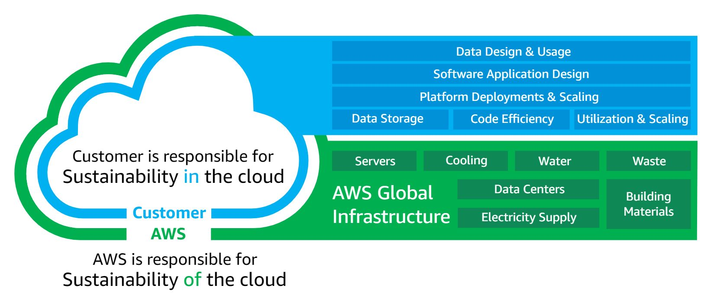
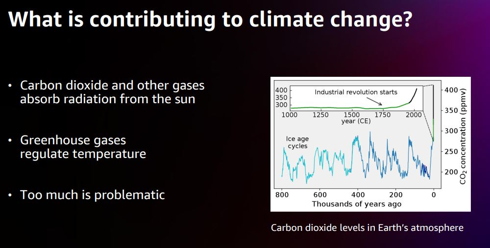
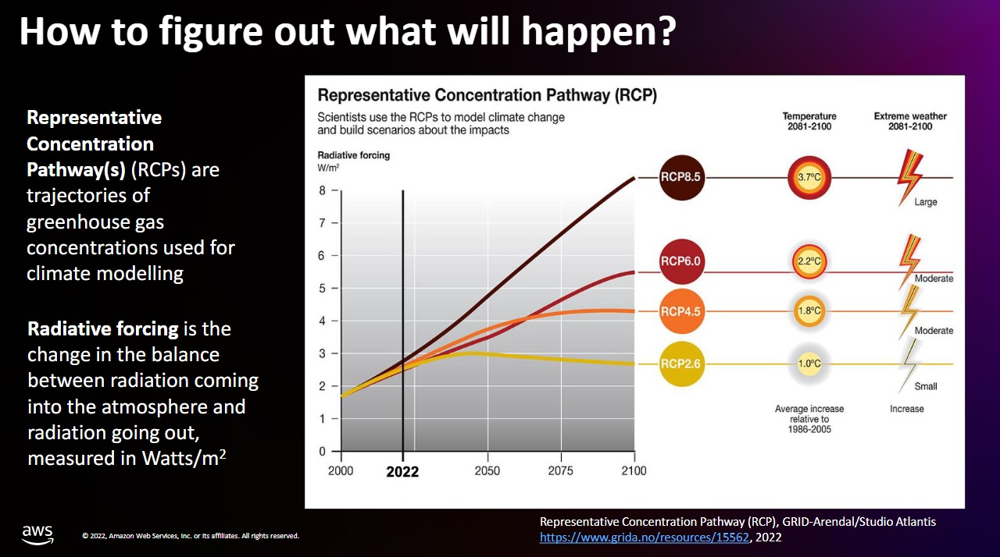
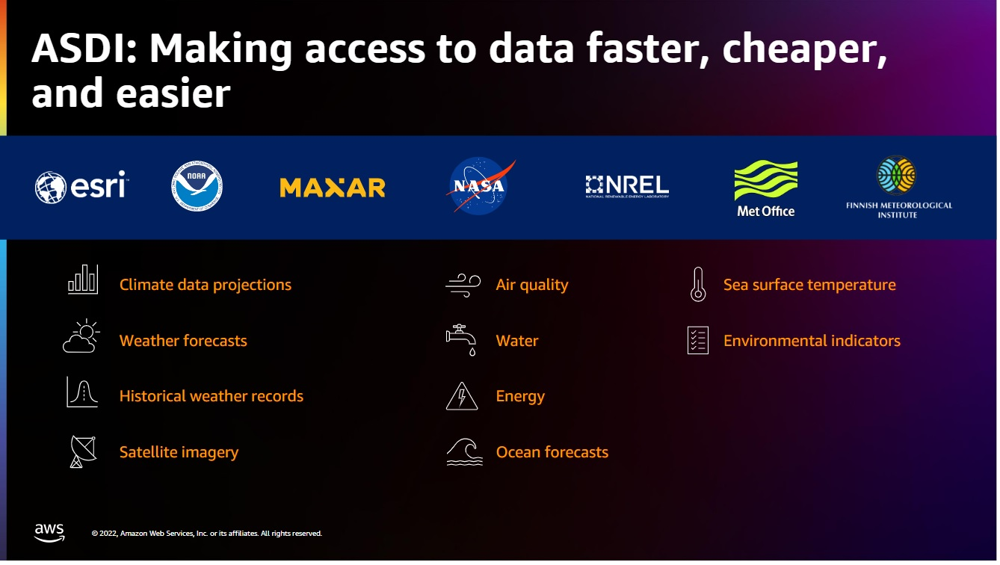
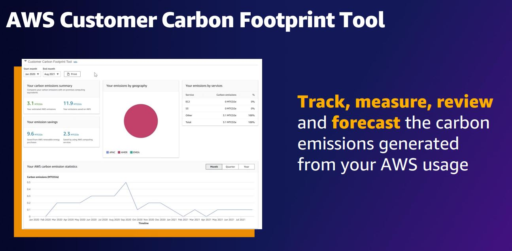

|ToC|
|---|

## Overview

At its core, sustainability refers to meeting the needs of the present without compromising the ability of future generations to meet their own needs. But Sustainability is a broad concept that can mean different things to different people. This blog serves as a useful starting point to build literacy around commonly referred sustainability terms and acronyms. This is not an complete list but should be able to help you get started.
  

### Environmental, Social, and Corporate Governance (ESG)

ESG is broadly defined as a set of non-financial criteria or metrics that reflect how a company performs as a steward of conservation and protection of the natural
environment (e.g., measuring carbon emissions, water usage, waste management policies), how a company manages relationships with employees, suppliers, customers and communities (Workforce diversity, Equal pay policies, Health and safety policies), and how a company puts in place the right leadership and internal controls (Board structure, Executive compensation, Tax strategy).
  

### Sustainability

The United Nations Brundtland Commission [defined](https://www.un.org/en/academic-impact/sustainability) sustainability in 1987 as "meeting the needs of the present without compromising the ability of future generations to meet their own needs"

When choosing AWS to deploy workload in the cloud, please note that Environmental sustainability is a [shared responsibility](https://docs.aws.amazon.com/wellarchitected/latest/sustainability-pillar/the-shared-responsibility-model.html) between customers and AWS. 

- ***Sustainability OF the cloud*** -
_Opportunity to reduce impact through migration of workloads from on-premises to AWS_. AWS is responsible for sustainability of the cloud; delivering efficient, shared infrastructure, water stewardship and sourcing renewable power. Studies by 451 Research have shown that AWS’ infrastructure is 3.6 times more energy efficient than the median of U.S. enterprise data centers surveyed and up to five times more energy efficient than the average in Europe. 451 Research also found that AWS can lower customers’ workload carbon footprints by nearly 80% compared to surveyed enterprise data centers, and up to 96% once AWS is powered with 100% renewable energy—a target we’re on path to meet by 2025. Checkout 451 Research's Black & White paper [The Carbon ReductionOpportunity of Moving to Amazon Web Services](https://sustainability.aboutamazon.com/carbon-reduction-aws.pdf) (PDF) and [Amazon's 2022 Sustainability Report](https://sustainability.aboutamazon.com/2022-report) to know more.

- ***Sustainability IN the cloud*** - 
*Optimizing your workload for sustainability with Well-architected for sustainability*. Customers are responsible for sustainability in the cloud, optimizing workloads and resource utilization, and minimizing the total resources required to be deployed for your workloads. The sustainability pillar of the AWS Well-Architected Framework helps organizations learn, measure, and improve their workloads using environmental best practices for cloud computing. To learn more about Sustainability pillar of the AWS Well-Architected Framework, please visit [here](https://docs.aws.amazon.com/wellarchitected/latest/sustainability-pillar/sustainability-pillar.html)

- ***Sustainability THROUGH the cloud*** - _Leverage AWS technologies and data services to solve sustainability challenges_. 
Deploying cloud-based solutions and advisory support to accelerate customer sustainability objectives.  
  

### The Paris Agreement

It is a legally binding international treaty on climate change adopted in Paris on 12th Dec'15 by 196 Parties at the UN Climate Change Conference (COP21). Its goal is to limit global warming to well below 2 degrees Celsius above pre-industrial levels, and to pursue efforts to limit the temperature increase to 1.5 degrees Celsius. For more information, visit [United Nations Framework Convention on Climate Change(UNFCCC)](https://unfccc.int/process-and-meetings/the-paris-agreement)
  

### The Climate Pledge (TCP)

The Climate Pledge is a a commitment to meet the goals of the Paris Agreement 10 years early—and achieve net-zero carbon by 2040.Amazon co-founded The Climate Pledge with _Global Optimism_ in 2019 and became the first company to sign the Pledge. Over 450 organizations from 55 industries and 38 countries across the globe have taken The Climate Pledge. Signatories agree to 3 areas of action:
1. **Regular Reporting** : 
Measure and report on GHG emissions on a regular basis.
2. **Carbon Elimination** :
Implement decarbonization strategies in line with the Paris Agreement through business change and innovations, including efficiency improvements, renewable energy, materials reductions, and other carbon emission elimination strategies.
3. **Credible Offsets** :
Neutralize any remaining emissions with additional, quantifiable, real, permanent, and socially beneficial offsets to achieve net-zero annual carbon emissions by 2040.

To learn more, visit [The Climate Pledge website](https://www.theclimatepledge.com/).
  

### Climate change

Climate change refers to long-term shifts in temperatures and weather patterns, mainly caused by human activities such as burning fossil fuels, clearing forests, and cultivating lands for agricultural use contribute to climate change by emitting carbon dioxide (CO₂) and other greenhouse gases (GHGs) that trap heat in the atmosphere. Effects include rising average temperatures and stronger and more frequent storms, drought, and wildfires.

 

The 20th century average global temperature is 59.0 degrees F (15.0 degrees C). The below diagram shows the impact on weather with respect to change in temperature: 
 

 
(Source: [AWS re:Invent 2022 - Modeling climate change impacts and risks at scale (SUS210)](https://youtu.be/3a8-Upchxqw?si=uLq-ekmN2X_UbX_7&t=747))
  

### Renewable Energy

Renewal energy refers to energy derived from natural sources that are replenished at a higher rate than they are consumed. Example of renewal energy sources include sunlight, wind, hydropower. 
As part of Amazon's commitment to reaching net-zero carbon emissions by 2040, Amazon is on a path to powering its operations with 100% renewable energy by 2025. In 2022, 90% of the electricity consumed by Amazon was attributable to renewable energy sources. In 2022, the electricity consumed in [19 AWS Regions](https://sustainability.aboutamazon.com/products-services/the-cloud?energyType=true) was attributable to 100% renewable energy.
  

### Carbon Neutral

The term carbon neutral refers to having a balance between the amount of carbon emitted and amount of carbon absorbed from the atmosphere in carbon sinks (any system that absorbs more carbon than it emits e.g., forests, soils, oceans ). Carbon neutral only accounts for CO2 emissions but not all other Green house gases(GHG).
  

### Carbon Offsets

Carbon offsets are produced by projects that carry out on-the-ground emissions reduction activities. Emission reduction activities include installing renewable energy infrastructure, planting trees, and increasing access to public and/or alternative transportation. Offsets can either be traded as part of a compliance market, where government regulations require emitters to either reduce their emissions or purchase offsets, or on the voluntary markets, where buyers and sellers trade of their own volition.
  

### Carbon Intensity (CI)  

Carbon intensity (measured as gCO2eq/kWh) is a way to measure how clean our electricity is. It refers to how many grams of carbon dioxide (CO2e) are released to produce a kilowatt hour (kWh) of electricity. Checkout information at [National Grid](https://www.nationalgrid.com/stories/energy-explained/what-is-carbon-intensity) and [Green Software](https://learn.greensoftware.foundation/carbon-awareness/#carbon-intensity) to learn more.
  

### Net-zero emissions

Net-zero emissions refers to achieving state where the amount of greenhouse gases(GHG) emitted by organization is counterbalanced by amount of greenhouse gases absorbed, with the aim of reducing the net emitted GHGs as close to zero as possible. Achieving net-zero emissions is more challenging that being carbon-neutral as you need to go beyon just removing CO2 emissions. To learn more, check information at [World Economic Forum](https://www.weforum.org/agenda/2022/08/carbon-neutral-net-zero-sustainability-climate-change/)
  

### AWS Data Exchange (ADX)

AWS Data Exchange is a managed service that makes it easy for AWS customers to find, subscribe to, and use third-party data in the AWS Cloud. It is a data marketplace with 300+ providers offering thousands of data sets through files, tables, and APIs—all from one place.It makes it easy to subscribe to third-party ESG scores, raw company-level data, industry frameworks, alternative data, and financial data. As a subscriber, you can browse AWS Marketplace for data sets and find the right subscription for your business. As a provider, you can leverage the latest AWS technologies to experiment, build, and deliver differentiated offerings to your customers. Numerous subscriptions are free of charge, while others carry a fee. _Scope: Company-level ESG and Financial Data_  . To learn more, visit [AWS Data Exchange](https://aws.amazon.com/data-exchange/why-aws-data-exchange/).  
  

### Amazon Sustainability Data Initiative (ASDI)
ASDI seeks to accelerate sustainability research and innovation by minimizing the cost and time required to acquire and analyze large sustainability datasets. ASDI supports innovators and researchers with the data, tools, and technical expertise they need to move sustainability to the next level.
_Scope: Scientific, Government and Geospatial Data_ . To learn more, visit [ASDI](https://registry.opendata.aws/collab/asdi/) and [Github repository](https://github.com/awslabs/amazon-asdi). 
  

     

### AWS Registry of Open Data

The [AWS Registry of Open Data](https://registry.opendata.aws/) hosts datasets, often for entities who have a mandated reporting requirement or a need to make data available publicly.  Of note, unless specifically stated in the applicable dataset documentation, datasets available through the Registry of Open Data on AWS are not provided and maintained by AWS. Datasets are provided and maintained by a variety of third parties under a variety of licenses.   

As an example, The AWS Registry of Open Data contains global weather datasets dating back over 200 years enabling agricultural crop breeders in the seed/chemical/fertilizer business to optimize their breeding stock. 
Checkout the blog [Calculating growing degree days using AWS Registry of Open Data](https://aws.amazon.com/blogs/industries/calculating-growing-degree-days-using-aws-registry-of-open-data/) to learn more about how this is used.
   

### AWS Customer Carbon Footprint Tool (CCFT)

AWS Customer Carbon Footprint Tool is a dashboard providing an overview of the carbon emissions associated with your usage of AWS products and services. It provides easy-to-understand data visualizations to show
customers their historical carbon emissions,
evaluate related trends as their use of AWS
evolves, estimate emissions avoided by using AWS instead of an on-premises data center, and review forecasted emissions based on their current usage. It helps to understand historical carbon footprint and review changes in emissions over time as Amazon progresses toward powering operations with 100% renewable energy. Historical carbon emissions data is available based on a customer’s AWS use from January 2020 onward. This data includes Scope 1 and Scope 2 emissions. To learn more, visit [here](https://aws.amazon.com/aws-cost-management/aws-customer-carbon-footprint-tool/).  

  

### Embodied Carbon
Embodied carbon is the carbon footprint of a material. It considers how many greenhouse gases (GHGs) are released throughout the supply chain and is often measured from cradle to (factory) gate, or cradle to site (of use). Embodied carbon may also be measured with the boundaries of cradle to grave, which is the most complete boundary condition. This boundary includes the extraction of materials from the ground,transport, refining, processing, assembly, in-use (of the product) and finally its end of life profile.
(Source : [Circular Ecology](https://circularecology.com/embodied-carbon.html))
  

### Circular Economy  

As per [European Parliament portal](https://www.europarl.europa.eu/news/en/headlines/economy/20151201STO05603/circular-economy-definition-importance-and-benefits), The circular economy is a model of production and consumption, which involves sharing, leasing, reusing, repairing, refurbishing and recycling existing materials and products as long as possible. In this way, the life cycle of products is extended.
  

### Greenhouse gas (GHG) Protocol  

The Greenhouse Gas Protocol (GHGP) provides standards for measuring and managing global warming impacts from an organization’s operations and value chain.
The greenhouse gases covered by the GHGP are the seven gases required by the UNFCCC/Kyoto Protocol (which is often called the “Kyoto Basket”). These gases are carbon dioxide (CO2), methane (CH4), nitrous oxide (N2O), the so-called F-gases (hydrofluorocarbons and perfluorocarbons), sulfur hexafluoride (SF6) nitrogen trifluoride (NF3). Each greenhouse gas is characterized by its global warming potential (GWP), which is determined by the gas’s greenhouse effect and its lifetime in the atmosphere. Since carbon dioxide (CO2) accounts for about 76 percent of total man-made greenhouse gas emissions, the global warming potential of greenhouse gases are measured relative to CO2, and are thus expressed as CO2-equivalent (CO2e).

The GHG Protocol organizes carbon emissions into the following scopes, along with relevant emission examples within each scope for a cloud provider such as AWS:

- **Scope 1**: refers to direct emissions from the activities of an organization or under its control. For example, fuel combustion by data center backup generators.
- **Scope 2**: refers to Indirect emissions from the generation of purchased electricity, steam, and heating/cooling consumed by the company.
- **Scope 3** – refers to indirect GHG emissions resulting from company’s activities, but occur outside the company’s direct control or ownership in the upstream and downstream supply chains (including suppliers and customers) of reporting company. Measuring these emissions requires collecting data from a wide range of external sources, like raw material suppliers, transportation providers, and other third parties. Checkout [Sustainability solutions in AWS Marketplace](https://aws.amazon.com/marketplace/solutions/sustainability) for more details.

From an AWS customer perspective, emissions from your workloads running on AWS are accounted for as indirect emissions, and part of your Scope 3 emissions. To learn more about Greenhouse Gas Protocol, visit [here](https://ghgprotocol.org/).
  

### Science-Based Target initiative (SBTi)  

The SBTi was founded in 2014 with the ambition of encouraging 100 companies to commit to setting GHG emissions reduction targets in line with climate science. Science-based targets provide companies with a clearly-defined path to reduce emissions in line with the Paris Agreement goals. To view guidance for companies in ICT (Information and Communication Technology) sector, please visit [here](https://sciencebasedtargets.org/sectors/ict) .
  

## Conclusion

Sustainability is a complex topic, but foundational to building a livable future. In this blog, I've covered some of the key terms that are central to understanding sustainability. My hope is this blog has provided a helpful starting point for grasping the core ideas and vocabulary around this critical subject. I have referred to multiple websites to gather this information and tried to add references to the information sources which I have referred to.
