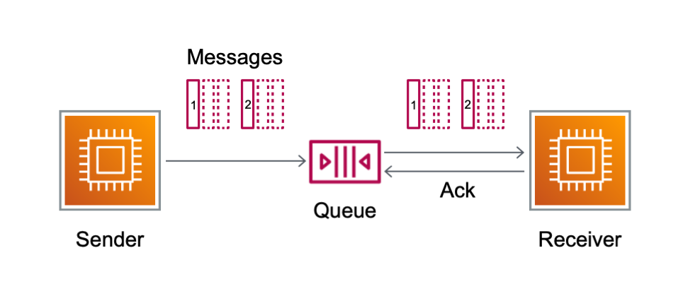
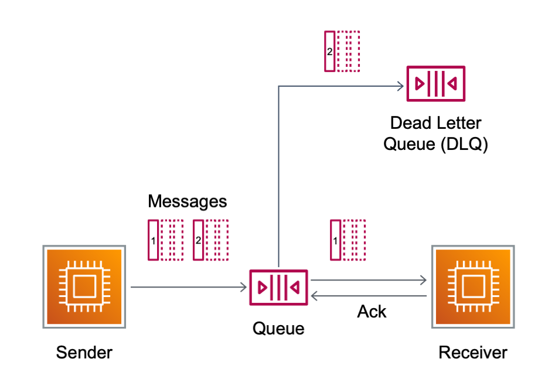
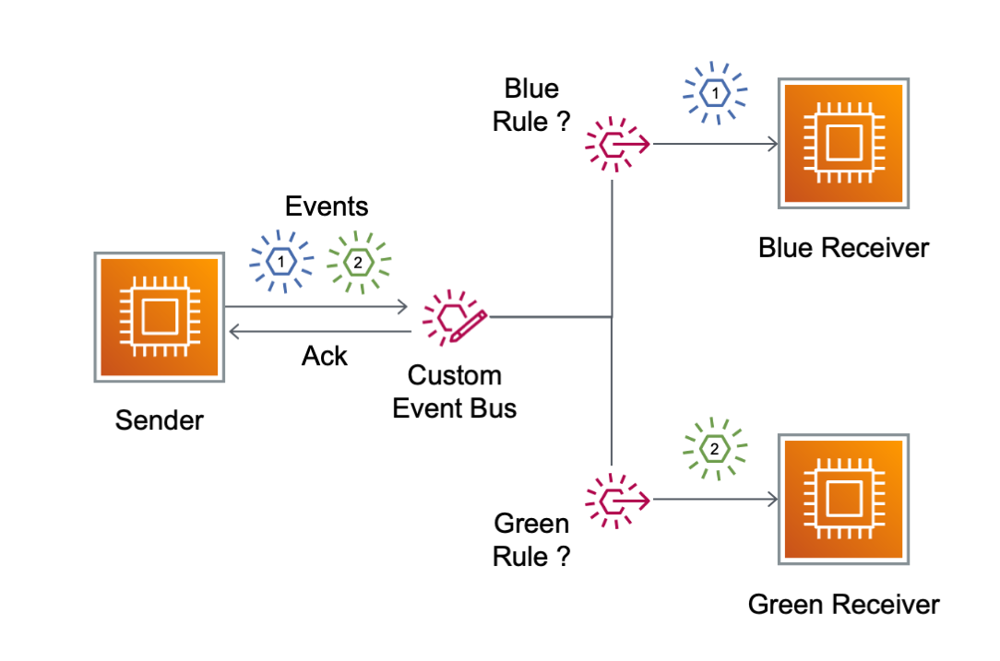
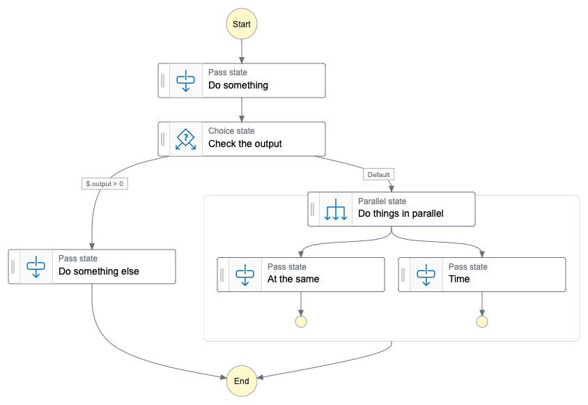
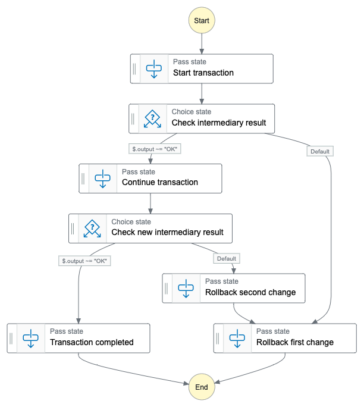

|ToC|
|---|

A software architecture is "event-driven" when specified events -- like a file being uploaded to a repository, or a database record being updated -- trigger the execution of business logic. Put simply, these sorts of architectures follow a simple cause-and-effect model. But the overall product doesn't have to be simple at all: by using business logic to trigger other events, which in turn run more logic, you can build highly complex processes.

While event-driven architectures seem simple on the surface, understanding how to implement them is crucial, and [understanding the difference between event-driven choreography, and service orchestration](/concepts/event-driven-architectures-service-orchestration-vs-choreography). What's more, there are many potential integration patterns you can use. These are some of the fundamental concepts to help you to understand -- and to more effectively implement -- such architectures. Event-driven architectures follow a cause-effect mental model: *"If this event happens, then run this business logic."* A complex process can be described in this way because each piece of business logic can emit other events that will in turn run more business logic.

## Immutability

Because events are related to something that happened in the past, they are immutable and cannot be updated. The information provided by events can however be overridden by newer events. For example, one event can describe the creation of a new product in an e-commerce catalogue, while another event can describe the deletion of such product because it is not available anymore.

The fact that events are immutable makes them useful in distributed architectures, where the business logic of an application runs across different components. Because is difficult to synchronize work between components running in different environments, immutable information avoids the risk of sharing information that is not correct anymore. For example, an event can say that an order has been created at a specific time. This event remains true even if the state of the order changes over time. On the other side, if an application reads the state of an order from a database, it cannot trust that the state of the order is still that and should always check on the database if it needs to be sure to process the order.

## Idempotency

Working with distributed architectures makes it difficult to ensure exactly once delivery of messages and you should expect to process a small number of duplicate events. To handle that, event-driven architectures should be designed to handle duplicates without side effects. An application is defined "idempotent" if processing duplicate inputs doesn’t change the final result of the application. You can achieve idempotency in different ways, the most common being comparing timestamps or storing an index of processed events.

- You can compare timestamps of input events with that of the latest event processed for the same scope (for example, the same customer, order, or product). If the event is older than the last one processed for the same scope, you can either skip the event or handle out-of-order processing, depending on your use case.

- Another approach is to store a unique index of processed events so that you can check if each input event has already been processed and skip it. To avoid the index to become too big over time, you should define an acceptable time window for which you should check event uniqueness. Depending on your use case, that can be five minutes, a day, or longer. After that time window has passed, events can be automatically removed from the index.

## Coupling

Chaining events in an event-driven architecture helps separate and isolate the different components inside a process because each component is only interested in which events they receive or emit and not on the internal implementations of other components. Isolating components is important because it reduces the effect of "coupling." By coupling, we intend the effect of one connected system over the other. For example, if one system is slower than usual, or the data model of one system is updated, that is the effect on the other system?

Coupling isn’t binary or unidimensional, and can derive from different types of dependencies. For example, there can be coupling  because of the different technologies used across two connected system (for example, Java Vs .NET), their location (can they see and reach each other? With how much latency?), data formats (that’s why standards such as XML and JSON are important when integrating different systems), or performance impacts (consider what happens if one of the two systems slows down or stops).

> "The appropriate level of coupling depends on the level of control you have over the endpoints." – Gregor Hohpe, [Enterprise Integration Patterns](https://www.oreilly.com/library/view/enterprise-integration-patterns/0321200683/)

## Integration patterns

Let’s have a look at common integration patterns and how they can be applied to event-driven architectures. During this evaluation, we’ll also look at the difference between having synchronous (occurring at the same time) or asynchronous (happening at different times) interactions.

### Synchronous request-response model

This is the most common way to connect two services. One service makes a request and waits to receive a response from the other service.

The advantages of this model are that is simple to implement, low latency, and it fails fast in case of an error.

On the other side, this is a synchronous integration and an example of temporal coupling because everything must happen at the same time. If one of the services slows down or stops working, there is a fault that needs to be handled, for example, using the DLQ pattern we’ll see next.

On AWS, a synchronous request-response model can be implemented using a REST API using the [Amazon API Gateway](https://docs.aws.amazon.com/apigateway/latest/developerguide/index.html?sc_channel=el&sc_campaign=appswave&sc_content=understanding-integration-patterns-in-event-driven-architecture&sc_geo=mult&sc_country=mult&sc_outcome=acq) or a GraphQL API using [AWS AppSync](https://docs.aws.amazon.com/appsync/latest/devguide/welcome.html?sc_channel=el&sc_campaign=appswave&sc_content=understanding-integration-patterns-in-event-driven-architecture&sc_geo=mult&sc_country=mult&sc_outcome=acq).

### Asynchronous point-to-point queue

In this case, one service sends a message to a queue that will store the message until it is processed by a receiving service polling from the queue.

This is an asynchronous integration that reduces temporal coupling. Other advantages are that it is resilient to failures or performance issues of the receiver. In fact, the receiver can control its consumption rate from the queue and adjust its speed to other business or technical requirements.

With this approach, only one receiver can consume each message. In case of multi-tenant systems, there can be fairness issues when one of the tenants is producing more messages than the others. In that case, it could be better to dedicate a queue to the high-throughput tenant.

On AWS, a message queue can be implemented using [Amazon SQS](https://docs.aws.amazon.com/AWSSimpleQueueService/latest/SQSDeveloperGuide/welcome.html?sc_channel=el&sc_campaign=appswave&sc_content=understanding-integration-patterns-in-event-driven-architecture&sc_geo=mult&sc_country=mult&sc_outcome=acq) or [Amazon MQ](https://docs.aws.amazon.com/amazon-mq/latest/developer-guide/welcome.html?sc_channel=el&sc_campaign=appswave&sc_content=understanding-integration-patterns-in-event-driven-architecture&sc_geo=mult&sc_country=mult&sc_outcome=acq).

### Dead letter queues (DLQs)

In the previous asynchronous point-to-point pattern, we used a queue to decouple a sender from a receiver. But what happens if the receiver is not able to process a message? We can add another queue that can act as a dead letter queue (DLQ) to collect the messages that have not been processed after a few retries or when a specific amount of time has passed.

In general, an error can happen at every point in an architecture where a message should be processed or some kind of decision over the message should be taken. For resilience, a DLQ should be configured to manage exceptions raised at those points.

Depending on your use case, some or all the messages in a DLQ might be retried after some time (for example, when a performance issue is solved) or when something has been fixed in the application (for example, a missing configuration has been corrected).

The messages that cannot be retried should be evaluated manually or automatically (depending on the volumes) to understand if they can be fixed (for example, if they contain a recoverable syntax or data format error) or studied to prevent similar errors in the future.

### Asynchronous point-to-point sender router

What happens if a sender is producing messages that need to be processed by different receivers? For example, let’s consider an e-commerce application selling both physical and digital products. When an order is created, physical products need inventory check and shipping, while digital products need a way to download the content to the user's device. Such orders have some parts in common (for example, payments), but different delivery pipelines. To process those orders, two queues can be implemented for the orders, one for physical products and one for digital orders. The sender can decide which is the correct queue depending on the type of order.

This pattern preserves most of the advantages of the asynchronous point-to-point (queue) pattern, but introduces a few disadvantages. The sender needs to know all the receivers (there can be more than two) and how to decide which is the right receiver for each message (routing logic).

This is introducing coupling between the sender and all the receivers. If a new receiver needs to be added (for example, to handle orders than contain mixed physical and digital products), then the routing logic implemented by the sender needs to be updated. Over time, the routing logic tends to become more complex and keeping it updated can potentially slow down future developments. This is a form of location coupling.

### Asynchronous message-router model (event bus)

To improve on the previous pattern, we can introduce a router that looks at the message to decide if they should be sent for processing to one or another receiver.

This approach reduces location coupling and is efficient for both the senders and the receivers. To simplify routing messages, we can also separate the message content (payload) from the message headers or metadata (envelope). Only data in the envelope should be used in the routing logic.

This is similar to what we do when sending a paper mail: we put the important part of the mail inside an envelope, and write on the envelope the instructions to deliver the mail (destination address), and to send it back (source or return-path address) in case it cannot be delivered.

A bus can handle multiple senders provided that it has the necessary information to route the messages that it receives from multiple sources to the right destination.

A bus can also route the same message to multiple destinations because different receivers could be interested in the content of a message.

A bus can be implemented on AWS using [Amazon EventBridge](https://docs.aws.amazon.com/eventbridge/latest/userguide/index.html?sc_channel=el&sc_campaign=appswave&sc_content=understanding-integration-patterns-in-event-driven-architecture&sc_geo=mult&sc_country=mult&sc_outcome=acq). Another approach is to use multiple [Amazon SNS](https://docs.aws.amazon.com/sns/latest/dg/index.html?sc_channel=el&sc_campaign=appswave&sc_content=understanding-integration-patterns-in-event-driven-architecture&sc_geo=mult&sc_country=mult&sc_outcome=acq) topics.

### Event-driven architectures

A receiver of a message can produce other messages. These messages are events that describe what happened when applying its business logic. For example, an order system can send a message (a `NewOrder` event) to a payment system. The payment system can then send messages to the delivery system in case the payment is correct (a `PaidOrder` event), or to a fraud management system if something suspicious is found during the payment (a `PossibleFraud` event).

Chaining multiple events and event processors together, where each event processor can be both the source or the receiver of events, creates an event-driven architecture.

Advantages of an event-driven architecture using a bus to route messages to the correct receivers is the limited temporal and location coupling.

To avoid data format coupling, it is a good practice to implement a shared policy for the event syntax, for example, by defining an event schema with mandatory and optional fields. Also, it’s important to define how much information to include in the events that are sent:

- If not enough information is sent in the event payload, the receiver might need to do synchronous request-response calls to get the missing information it needs to run its business logic.

- If too much information is included, the receiver might use a subset of the data that at some point in the future will need to have its format or values updated. Data format changes can have a cascading effect on all consuming services. It is therefore a good practice to decrease coupling by restricting information included in the events to what is necessary (often defined "key data").

### Workflows

Sometimes the flow of operations across multiple services needs to be coordinated. For example, this happens in case of payments or when a change on data managed by one service is strictly correlated to the data managed by another service. Following the example we used before, an ordering system should accept payment only when the products in the order are all available. This needs to coordinate the availability in the inventory systems with the payment and delivery of the order.

To simplify these use cases, a workflow can be implemented with a clear decision tree of how data (such as messages or events) enter the system, and it is then processed and passed across different services.

Many workflow systems use a direct acyclic graph (DAG) to design a workflow. Each node of the graph is a state that can transition to another state if they are connected by a vertex. The vertex defines how and when the transition to the target state happens. The transition usually happens based on the work (task) associated with the state and on conditions defined on the output of the task.

On AWS, a workflow can be designed and built using [AWS Step Functions](https://docs.aws.amazon.com/step-functions/latest/dg/welcome.html?sc_channel=el&sc_campaign=appswave&sc_content=understanding-integration-patterns-in-event-driven-architecture&sc_geo=mult&sc_country=mult&sc_outcome=acq).

### Compensating transactions (saga pattern)

Distributed transactions are one of the most complex and inefficient integrations that can be implemented between data sources. In modern architectures, distributed transactions are usually avoided by using different solutions. A common approach is to use a workflow that applies the changes in different steps and, when necessary, takes care of rollbacks by implementing compensating transactions that revert the state of the services that have already been processed.

This approach is called "saga pattern" because the sequence of transactions that needs to be applied on the data sources is called a "saga." When a transaction fails, the saga uses compensating transactions to revert all the changes that already occurred to their original values.

### Event sourcing

With event sourcing, we store all events in a repository (event log). From the event log, we are able to reconstruct the current and any paste state of the system.

Because events are immutable and contain a timestamp, the event log is append-only and effectively a time series of events. Depending on the volumes, it can be complex to store and manage all the events and being able to query in a reasonable time the event log to rebuild the state of the system at a specific time. For these reason, different solutions have been built over time but this pattern has not been widely adopted.

## Conclusion

The mental model of event-driven architectures is not that dissimilar to how we naturally look at the world: with a cause-effect relationship between the components of the architecture. Each component of the architecture can emit events that *cause* the processing by another component. If an order is created, then the payment should be checked.

Events that are shared between components are anchored to a specific point in time (their timestamp) and are immutable because they describe something that happened in the past, such as when a file has been uploaded or a customer profile is being updated. Immutable data is much easier to share in a distributed architecture because you don't need to check for their validity.

In distributed systems, you need to be prepared to the possibility to receive duplicate events. You should design your architecture to process data in an idempotent way so that, if the same event is processed twice, the final state of the system remains the same.

Event-driven architecture reduce coupling among the components and make it easier for different teams to independently work on those components without having to synchronize their work and wait for other teams to complete a task before they can proceed with their own activities. In this way, each team can work at their own speed without slowing down the work of other teams.

To speed up your implementations, you can apply integration patterns that solve common problems in a replicable way. Integration patterns help you think asynchronously and reduce side effects across components.

To dive into some practical implementations, or read more, have a look at:

- [Key Differences In Implementing Service Orchestration vs. Choreography](/concepts/event-driven-architectures-service-orchestration-vs-choreography)
- [Automate the Provisioning of Your Apache Airflow Environments](/tutorials/automating-mwaa-environments-and-workflows)
- [Orchestration vs. Choreography: Why using different co-ordination patterns matters to developers](/posts/microservices-orchestration-choreography)

