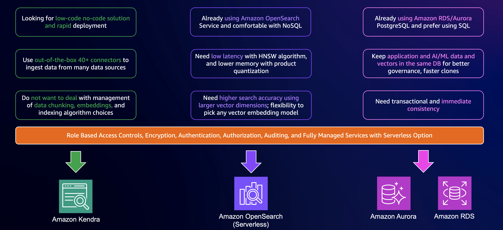
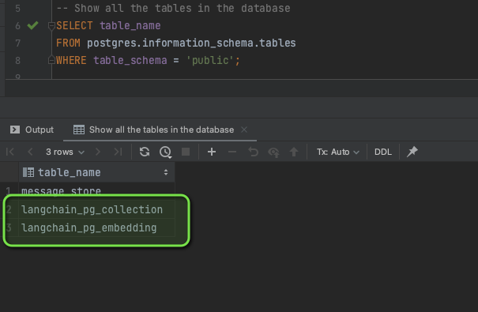
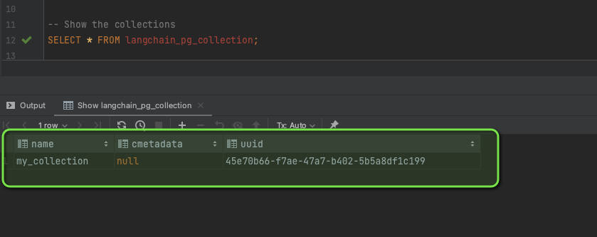
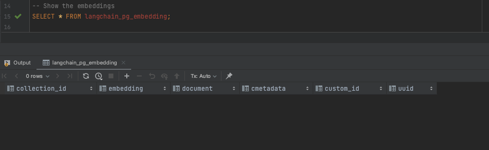
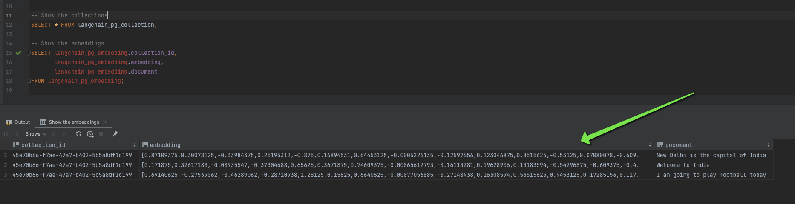
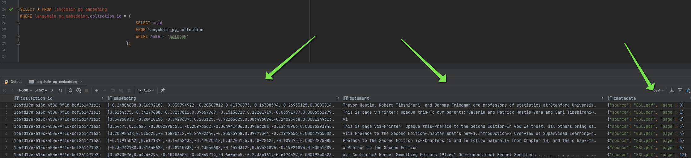

Welcome to the second part of our enlightening journey in the world of vector embeddings. In the [first part](https://community.aws/concepts/vector-embeddings-and-rag-demystified) of this series, we laid the groundwork by exploring the essentials of vector embeddings, from their fundamental concepts to their storage and indexing methods. We learned about the transformative role these embeddings play in AI and machine learning, and we started to scratch the surface of how tools like [Amazon Bedrock](https://docs.aws.amazon.com/bedrock/latest/userguide/what-is-bedrock.html?sc_channel=el&sc_campaign=genai&sc_geo=mult&sc_country=mult&sc_outcome=acq&sc_content=vector-embeddings-and-rag-demystified-2) and [LangChain](https://python.langchain.com/docs/get_started/introduction) can be utilized to harness the power of these embeddings.

As we continue our exploration, we will dive deeper into the practical aspects of vector embeddings. We're shifting our focus to few of the vector storage solutions available on AWS and how they can be used effectively to store and manage your embeddings. 

We'll discuss how services like [Amazon Aurora](https://docs.aws.amazon.com/AmazonRDS/latest/AuroraUserGuide/CHAP_GettingStartedAurora.html?sc_channel=el&sc_campaign=genai&sc_geo=mult&sc_country=mult&sc_outcome=acq&sc_content=vector-embeddings-and-rag-demystified-2) can be optimized for vector storage, providing you with the know-how to make the most of AWS's robust infrastructure. Moreover, we'll see how [LangChain](https://python.langchain.com/docs/get_started/introduction), an innovative tool introduced in [Part 1](https://community.aws/concepts/vector-embeddings-and-rag-demystified), plays a pivotal role in bridging the gap between vector embeddings and LLMs, making the integration process seamless and straightforward.

By the end, you will have a comprehensive understanding of the practical applications of vector embeddings in AWS environments. 

| ToC |
|-----|

## Vector Databases on AWS

AWS offers various services for selecting the right vector database, such as **[Amazon Kendra](https://docs.aws.amazon.com/kendra/latest/dg/what-is-kendra.html?sc_channel=el&sc_campaign=genai&sc_geo=mult&sc_country=mult&sc_outcome=acq&sc_content=vector-embeddings-and-rag-demystified-2)** for low-code solutions, **[Amazon OpenSearch](https://docs.aws.amazon.com/opensearch-service/latest/developerguide/what-is.html?sc_channel=el&sc_campaign=genai&sc_geo=mult&sc_country=mult&sc_outcome=acq&sc_content=vector-embeddings-and-rag-demystified-2)** Service for NoSQL enthusiasts, and **[Amazon RDS/Aurora](https://docs.aws.amazon.com/rds/)** PostgreSQL for SQL users.



For the purpose of this blog, we will explore using [Amazon Aurora/RDS](https://docs.aws.amazon.com/rds/?sc_channel=el&sc_campaign=genai&sc_geo=mult&sc_country=mult&sc_outcome=acq&sc_content=vector-embeddings-and-rag-demystified-2) with `pgvector` as a vector store. 

## Amazon RDS/Aurora With `pgvector` and `LangChain`

Imagine stepping into the world of PostgreSQL databases, where managing high-dimensional vector data just got a whole lot easier, thanks to [Amazon Aurora](https://docs.aws.amazon.com/AmazonRDS/latest/AuroraUserGuide/CHAP_GettingStartedAurora.html?sc_channel=el&sc_campaign=genai&sc_geo=mult&sc_country=mult&sc_outcome=acq&sc_content=vector-embeddings-and-rag-demystified-2) and [Amazon RDS for PostgreSQL](https://docs.aws.amazon.com/AmazonRDS/latest/UserGuide/CHAP_PostgreSQL.html?sc_channel=el&sc_campaign=genai&sc_geo=mult&sc_country=mult&sc_outcome=acq&sc_content=vector-embeddings-and-rag-demystified-2), and their integration with `pgvector`. This isn't just another technical add-on; it's a [community-driven extension](https://github.com/pgvector/pgvector) that transforms the way we handle vectors in databases. Think of `pgvector` as a bridge connecting the robustness of relational databases with the dynamic world of vector data.

Let's say you're working with vectors that have up to 16,000 dimensions. Sounds daunting, right? But here's where `pgvector` shines, making it practical by optimizing indexing for up to 2,000 dimensions, thus tailoring your similarity search performance to be both efficient and effective. It's like having a superpower in your database toolkit, especially if you're already a fan of PostgreSQL and have your data neatly structured.

Now, let's talk about speed and accuracy, the two pillars of modern data searches. `pgvector` introduces approximate nearest neighbor (ANN) indexing methods, including the cutting-edge **IVFFLAT** and **HNSW** (hierarchical navigable small worlds), which we discussed earlier. It’s like navigating a complex maze with a highly detailed map. These methods help you zip through massive datasets, finding those near-perfect matches swiftly, without compromising much on the quality of your results. It's all about striking that sweet balance, crucial for applications in generative AI. For more details check this detailed blog on [Performance benchmarking and data ingestion with pgvector and HNSW on Amazon RDS for PostgreSQL](https://aws.amazon.com/blogs/database/accelerate-hnsw-indexing-and-searching-with-pgvector-on-amazon-aurora-postgresql-compatible-edition-and-amazon-rds-for-postgresql/).

> Before running the code, ensure an 'Aurora instance' is configured and all details are added to the '.env file'. Create the [pgvector extension](https://docs.aws.amazon.com/AmazonRDS/latest/AuroraPostgreSQLReleaseNotes/AuroraPostgreSQL.Extensions.html?sc_channel=el&sc_campaign=genai&sc_geo=mult&sc_country=mult&sc_outcome=acq&sc_content=vector-embeddings-and-rag-demystified-2) on your Aurora PostgreSQL database cluster:
>
> ```sql
> CREATE EXTENSION vector;
> ```

Now, lets see how we can get started with [Aurora](https://docs.aws.amazon.com/AmazonRDS/latest/AuroraUserGuide/CHAP_GettingStartedAurora.html?sc_channel=el&sc_campaign=genai&sc_geo=mult&sc_country=mult&sc_outcome=acq&sc_content=vector-embeddings-and-rag-demystified-2)  with `pgvector` and `LangChain`.

```python
from langchain.embeddings import BedrockEmbeddings
from langchain.llms import Bedrock
from langchain.vectorstores.pgvector import PGVector, DistanceStrategy
from dotenv import load_dotenv
import os

# Load environment variables from a .env file
load_dotenv()

# Define the collection name for storing vectors
COLLECTION_NAME = "my_collection"

# Construct the connection string to the PostgreSQL database
CONNECTION_STRING = PGVector.connection_string_from_db_param(                                                  
            driver=os.getenv("PGVECTOR_DRIVER"),
            user=os.getenv("PGVECTOR_USER"),
            password=os.getenv("PGVECTOR_PASSWORD"),
            host=os.getenv("PGVECTOR_HOST"),
            port=os.getenv("PGVECTOR_PORT"),
            database=os.getenv("PGVECTOR_DATABASE"),
        )

# Initialize the text embedding model
embeddings = BedrockEmbeddings()

# Create a PGVector instance for the vector database
store = PGVector(
                    collection_name=COLLECTION_NAME,
                    connection_string=CONNECTION_STRING,
                    embedding_function=embeddings,
                    distance_strategy=DistanceStrategy.EUCLIDEAN
                )
```

Here we set up a vector store using `pgvector` for PostgreSQL on [Amazon Aurora](https://docs.aws.amazon.com/AmazonRDS/latest/AuroraUserGuide/CHAP_GettingStartedAurora.html?sc_channel=el&sc_campaign=genai&sc_geo=mult&sc_country=mult&sc_outcome=acq&sc_content=vector-embeddings-and-rag-demystified-2).

1. **Import Statements**: We import classes from `langchain` for handling embeddings, connecting to [Bedrock](https://docs.aws.amazon.com/bedrock/latest/userguide/what-is-bedrock.html?sc_channel=el&sc_campaign=genai&sc_geo=mult&sc_country=mult&sc_outcome=acq&sc_content=vector-embeddings-and-rag-demystified-2) LLM, and interfacing with a PostgreSQL database.
2. **Collection Name**: We define the table in the database where vector embeddings will be stored.
3. **Connection String**: We construct a connection string using environment variables.
4. **Text Embedding Model**: We initialize `BedrockEmbeddings`, likely a pre-trained model for generating vector embeddings from text.
5. **Vector Database Store Instance**: We create an instance of `PGVector`, configured with the collection name, connection string, embedding function, and distance strategy.

`LangChain` creates two tables in the Aurora database: `langchain_pg_collection` and `langchain_pg_embedding`.

We connect to the Aurora database using any SQL client/IDE.



We can see the collection we created, `my_collection`.



We expect the embeddings table to be empty, since we haven't stored any embeddings yet.



Now let's create some vectors and store their embeddings in the Aurora database.

```python
# List of textual data for vector embedding conversion
texts = ["New Delhi is the capital of India", "Welcome to India", "I am going to play football today"]

# Create a PGVector database instance and populate it with vector embeddings
store.from_texts(
                    texts=texts,
                    collection_name=COLLECTION_NAME,
                    connection_string=CONNECTION_STRING,
                    embedding=embeddings
                )
```

We can verify these newly added vectors in our database.



## Document Loading Using `LangChain`

Now that we know how to create embeddings and store them in a vector store, let's see how to load an entire document. In the real world, data often comes in document form, and we need to store it in a vector store before any downstream operations like similarity search.

[LangChain](https://python.langchain.com/docs/get_started/introduction) provides document loaders for various data formats, such as PDFs, text files, HTML documents, and more.

We'll download the book, "[The Elements of Statistical Learning](https://hastie.su.domains/Papers/ESLII.pdf)" by Trevor Hastie, Robert Tibshirani, and Jerome Friedman, embed it using `BedrockEmbeddings`, and store the entire book in the Aurora database using LangChain's `document_loaders` module.

```python
# Import necessary modules and classes for document loading, text splitting, embedding, and vector storage
from langchain.document_loaders import PyPDFLoader
from langchain.text_splitter import RecursiveCharacterTextSplitter
from langchain.embeddings import BedrockEmbeddings
from langchain.vectorstores.pgvector import PGVector
from dotenv import load_dotenv
import os

# Load environment variables from a .env file
load_dotenv()

# Define the file path for the PDF document
file_path = 'ESL.pdf'

# Initialize a loader for PDF documents
loader = PyPDFLoader(file_path=file_path)

# Initialize a text splitter for dividing text into chunks
text_splitter = RecursiveCharacterTextSplitter(chunk_size=2000, chunk_overlap=100)

# Load and split the document
data = loader.load_and_split(text_splitter=text_splitter)

# Define the collection name for storing embeddings
COLLECTION_NAME = "eslbook"

# Construct the connection string to the PostgreSQL database
CONNECTION_STRING = PGVector.connection_string_from_db_params(                                                  
                                                                driver=os.getenv("PGVECTOR_DRIVER"),
                                                                user=os.getenv("PGVECTOR_USER"),
                                                                password=os.getenv("PGVECTOR_PASSWORD"),
                                                                host=os.getenv("PGVECTOR_HOST"),
                                                                port=os.getenv("PGVECTOR_PORT"),
                                                                database=os.getenv("PGVECTOR_DATABASE"),
                                                            )

# Initialize the text embedding model
embeddings = BedrockEmbeddings()

# Create a vector database store instance and populate it with document data and embeddings
db = PGVector.from_documents(
                                documents=data,
                                embedding=embeddings,
                                collection_name=COLLECTION_NAME,
                                connection_string=CONNECTION_STRING
                            )
```

We can then check the embeddings and raw data in Aurora.

```sql
SELECT * FROM langchain_pg_embedding
WHERE langchain_pg_embedding.collection_id = (
                                                SELECT uuid
                                                FROM langchain_pg_collection
                                                WHERE name = 'eslbook'
                                             );
```



## Embedding Vector Store and Retrieval 

After setting up the vector store and populating it with embeddings, we can leverage those embeddings to retrieve information based on similarity using `LangChain`.

Before proceeding, let's discuss [Retrieval-Augmented Generation (RAG)](https://arxiv.org/abs/2005.11401), a methodology combining information retrieval with new content generation. In machine learning, RAG systems first retrieve relevant documents based on a query, then use a language model to generate responses that synthesize the retrieved data, particularly useful in question-answering systems.

Now, let's utilize [Amazon Aurora/RDS](https://docs.aws.amazon.com/rds/?sc_channel=el&sc_campaign=genai&sc_geo=mult&sc_country=mult&sc_outcome=acq&sc_content=vector-embeddings-and-rag-demystified-2) with `pgvector` and `LangChain` for storage and retrieval of vector embeddings.

```python
from langchain.llms import Bedrock
from langchain.chains import RetrievalQA
from langchain.callbacks import StdOutCallbackHandler

# Initialize the language model
llm = Bedrock(
                model_id='anthropic.claude-v2', 
                model_kwargs={'max_tokens_to_sample': 4096}
            )

# Set up the retrieval chain with the language model and database retriever
chain = RetrievalQA.from_chain_type(
                                        llm=llm,
                                        retriever=db.as_retriever(),
                                        verbose=True
                                    )

# Initialize the output callback handler
handler = StdOutCallbackHandler()

# Run the retrieval chain with a query
chain.run(
            'What is machine learning?',
            callbacks=[handler]
        )
```

In this code snippet:

- We first import the necessary components from `LangChain`.
- We initialize a `Bedrock` language model with specific parameters.
- We then create a `RetrievalQA` chain that incorporates our vector store retriever and the language model.
- We define a `StdOutCallbackHandler` to handle the output.
- Finally, we execute the `run` method on our chain with a query about machine learning.

The `RetrievalQA` chain conducts a two-step process:

1. **Retrieval**: It uses the `db.as_retriever()` function to query the vector store for embeddings that are similar to the query.
2. **Question Answering**: The retrieved embeddings are then provided to the language model to help it generate a relevant and informed response.

By executing the `chain.run` method with a question, we are effectively using our vector store to enhance the context available to the language model, leading to more accurate and contextually relevant answers.

This powerful combination of vector storage and retrieval facilitated by `LangChain` and `pgvector` can be applied to numerous applications, from customer service bots to complex analytical tools. It is a testament to how vector search and AI language models are being integrated to deliver advanced solutions in the realm of natural language processing and beyond.

As we continue to push the boundaries of what's possible with machine learning and data retrieval, tools like `LangChain` and extensions like `pgvector` will become increasingly valuable in building intelligent, context-aware systems. Whether you are a developer, data scientist, or product manager, understanding and utilizing these tools can significantly enhance the capabilities of your applications and services.

With the embedded vectors now at our disposal, the potential use cases are vast and exciting. From enhancing search functionality within applications to creating dynamic recommendation systems, the integration of vector stores into our data strategies is an important step in harnessing the full potential of AI and machine learning technologies.

## Summary

In this second part of [our series](https://community.aws/concepts/vector-embeddings-and-rag-demystified), we dove into the practical applications of vector embeddings using AWS services. We focused on [Amazon Aurora](https://docs.aws.amazon.com/AmazonRDS/latest/AuroraUserGuide/CHAP_GettingStartedAurora.html?sc_channel=el&sc_campaign=genai&sc_geo=mult&sc_country=mult&sc_outcome=acq&sc_content=vector-embeddings-and-rag-demystified-2) and [Amazon RDS](https://docs.aws.amazon.com/AmazonRDS/latest/UserGuide/Welcome.html?sc_channel=el&sc_campaign=genai&sc_geo=mult&sc_country=mult&sc_outcome=acq&sc_content=vector-embeddings-and-rag-demystified-2), integrated with `pgvector`, showcasing how these tools can effectively manage high-dimensional vector data. By exploring the setup and use of vector stores in Amazon Aurora and employing [LangChain](https://python.langchain.com/docs/get_started/introduction), we demonstrated how to create, store, and utilize vector embeddings for complex data retrieval and processing tasks.

We highlighted the innovative use of Retrieval-Augmented Generation (RAG) in enhancing language model responses, demonstrating the power of combining vector storage with AI models for more accurate and contextually relevant results. 

For further exploration and to deepen your understanding, you are encouraged to check out this [GitHub page](https://github.com/build-on-aws/llm-rag-vectordb-python) which includes, sample applications, and tutorials showcasing the capabilities of [Amazon Bedrock](https://docs.aws.amazon.com/bedrock/latest/userguide/what-is-bedrock.html?sc_channel=el&sc_campaign=genai&sc_geo=mult&sc_country=mult&sc_outcome=acq&sc_content=vector-embeddings-and-rag-demystified-2) with Python. These will guide you in integrating Bedrock with databases, utilizing RAG techniques, and experimenting with [LangChain](https://python.langchain.com/docs/get_started/introduction) and Streamlit.
