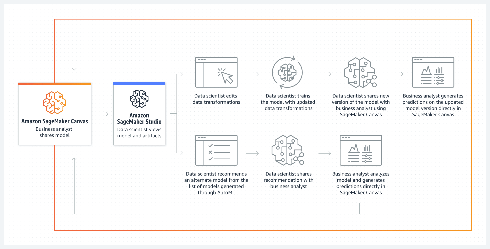
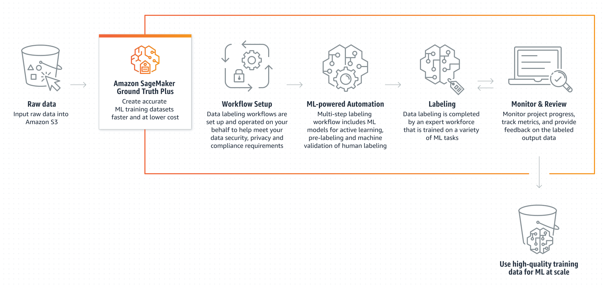

## Introduction

Machine learning (ML) is transforming how business, science, and society operate by enabling computers to learn from data and experiences and emulate human tasks such as pattern recognition, forecasting, and generating content. However, the subject itself remains elusive to those without the technical knowledge. This leaves many businesses unable to tap the potential of ML. Amazon SageMaker makes ML practical by providing a fully managed platform to build, train, and deploy models with ease. In this post, we’ll explore how SageMaker eliminates the heavy lifting of ML, making it possible for any team to generate value from data. You’ll learn what capabilities SageMaker offers to accelerate development and simplify deployment of ML models. With SageMaker, you can finally put machine learning to work for your business.

## What is Amazon SageMaker?

Amazon SageMaker is a cloud-based machine learning service that aims to make building, training, and deploying machine learning models more accessible. With SageMaker, developers can upload training data, select a machine learning algorithm, and have models train automatically on managed infrastructure. This removes the need for manually setting up servers and clusters. Once a model is trained, developers can deploy it with one click to start making real-time predictions.

SageMaker provides end-to-end capabilities for a typical machine learning workflow. This includes data preparation, feature engineering, model training, deployment, and monitoring. By handling much of the underlying infrastructure, SageMaker simplifies the process of developing machine learning models.

Companies are using SageMaker for various machine learning applications such as forecasting, recommendation engines, fraud detection and Generative AI. The service continues to evolve by adding new algorithms, instance types, and integrations. Overall, SageMaker aims to reduce the complexity faced by developers when building impactful machine learning models.

## Key Capabilities and Features of Amazon SageMaker

### Managing machine learning workflows

SageMaker Studio provides an integrated web environment for end-to-end ML workflows. This will let you to easily setup projects, track experiments, organize models and data, visualize results, and collaborate. This allows you to use popular programming languages such as Python and R in a notebook interface very similar to Jupyter Lab.

### Building models

SageMaker makes model building easier by providing pre-built containers and algorithms. You provide an algorithm, training code, and dataset, and train it on the provided infrastructure. In addition SageMaker supports popular frameworks like TensorFlow, PyTorch, and XGBoost. You can also bring your own frameworks using custom containers. This flexibility allows rapid testing of different approaches.

### Training models

SageMaker offers a fully-managed machine learning platform to help engineers and data scientists quickly build, train, and deploy high-quality models at any scale. You need to specify the compute resources you need like GPU type and number of instances. By using features such as [GPU instances and training compilers](https://aws.amazon.com/sagemaker/faqs), training time and costs can be significantly reduced.

### Deploying models

You can use sagemaker to easily deploy machine learning models for real-time or batch predictions. Once your model is trained in SageMaker, it can be deployed to create an endpoint. This endpoint is a REST API that receives prediction requests, runs the request through the deployed model, and returns predictions.

### Monitoring models

SageMaker provides tools to monitor the health and performance of machine learning models deployed as endpoints. Developers can enable continuous monitoring on a model endpoint which will track key performance metrics like invocation count, latency, and memory usage. This allows detecting when a model endpoint is unhealthy or performing poorly.

### SageMaker Canvas

SageMaker Canvas is a GUI interface that allows you to quickly build, train and deploy machine learning models without writing any code. With SageMaker Canvas you can drag and drop prebuilt components like datasets, algorithms, and training configurations onto canvas to assemble a full machine learning pipeline.

### SageMaker Clarify

SageMaker Clarify lets you detect bias in models and explains predictions by providing metrics to identify biases against certain groups in training data and models. you can get individual predictions, which will show you which input features most influenced a specific prediction, which will help in debugging the behaviour of the model.

### SageMaker Data Wrangler

You can use this feature to quickly prepare and clean data for machine learning without writing any code. you can also use it to combine datasets, transform data, handle missing values, and perform other data preparation and feature engineering tasks to get data ready for training machine learning models.

### SageMaker Jumpstart

Amazon SageMaker JumpStart gives you quick access to prebuilt machine learning solutions, sample notebooks, and hosted models that can be customized and deployed with little machine learning expertise required. JumpStart allows you to choose from a catalog of solutions like tabular data processing, computer vision, and natural language processing to get started quickly on building and training ML models. Also JumpStart integrates with other SageMaker capabilities. The notebooks leverage features like Clarify, Data Wrangler, Feature Store, and Model Monitor. You can use sagemake jumpstart to acceleratr your machine learning journey through reusable assets, templates, and models.

### SageMaker Ground Truth

You can use SageMaker Ground Truth to create highly accurate training datasets. Ground Truth helps you with data labeling tasks at sacle. And ground truth provides you with tools to verify, analyze and monitor labeling quality. The integration with S3 also gives you the ability to store your dataset which can later be used to train models with SageMaker training jobs.

### Machine Learning Governance

You can use SageMaker ML Governance to monitor the entire process of your machine learning models from training to deployment. This give you the ability to deploy responsible models by monitoring the model, detecting biases and more to meet regulatory requirements and increase trust in AI systems.

### Deploying Machine Learning Models at Scale

SageMaker MLOps gives you the abilities to deploy ML models at scale by providing CI/CD pipelines for model building and deployment, model monitoring, automated drift detection and retraining, integration with Git/GitHub for version control and collaboration, and tools for experiment tracking and model lineage. With these capablities you can operationalize ML models into production, manage large volume of ML expirements, and more to improve efficiency and reduce errors while improving the productivity of teams.

## Use Cases

### Generative AI

Amazon SageMaker JumpStart provides quick access to prebuilt machine learning models that can be deployed on SageMaker with minimal setup. This can be very useful for generative AI models like text generators, image generators, etc. With JumpStart, pre-trained large language models like GPT-3 can be quickly deployed for text generation without having to train the models from scratch. Similarly, generative adversarial networks and variational autoencoders for image generation can be deployed as SageMaker endpoints. By using the prebuilt containers and configurations, developers can avoid the complex process of setting up the infrastructure and environment for training and hosting generative models. Overall, SageMaker JumpStart lowers the barriers to getting started with deploying generative models by providing quick access to popular generative models like the Stability AI Stable Diffusion, AI21 Jurassic and HuggingFace Falcon models. This accelerates the development cycle and allows focusing on model evaluation and improvement rather than environment setup.

### Fraud Detection

Fraud is a major challenge that many companies face today, including [Mastercard](https://aws.amazon.com/solutions/case-studies/mastercard-ai-ml-testimonial). With the rise of online transactions and digital payments, fraudsters are constantly finding new ways to game systems and commit fraud. Companies are leveraging Amazon SageMaker to build highly accurate fraud detection models in order to counteract this. These models are trained by using anomaly detection, a principal that determines whether a certain transaction is unusual, relative to the rest. These models usually come with their own set of challenges, such as the imbalanced data problem, which happens because fraudulent transactions occur much less frequently than non-fradulent transactions, thereby resulting in an imbalanced data set. This results in a bias in the model, which makes it less likely to detect fraud since it doesn't know enough about what fraud could look like. To mitigate such challenges, SageMaker also comes with managed (and no code) data preprocessing solutions such as [SageMaker Data Wrangler](https://aws.amazon.com/sagemaker/data-wrangler).

### Forecasting

It is possible to leverage Amazon SageMaker to build forecasting models that predict future sales, demand, and other metrics. Forecasting takes past data and uses it to predict trends that may reoccur in the future. SageMaker provides built-in algorithms like DeepAR that are optimized for time series forecasting. By bringing your historical time series data into SageMaker notebooks, you can train forecasting models that learn patterns and seasonality in the data. These models can then be deployed into production to generate forecasts on an ongoing basis.

## Conclusion

Amazon SageMaker provides a robust platform to accelerate machine learning development and deployment. By handling infrastructure, workflows, and DevOps, SageMaker removes the undifferentiated heavy lifting that can hinder ML projects. This allows teams to focus their time on the parts that create business value - the data, algorithms, and use cases. With intuitive interfaces, prebuilt components, and automation, SageMaker makes sophisticated ML accessible to more developers. And capabilities like debugging, monitoring, and bias detection promote developing responsible, high-quality models. Whether tackling common challenges like forecasting and fraud or innovating in emerging areas, Amazon SageMaker gives you the tools to transform data into insight with machine learning.

To learn more about machine learning, read [Introduction to Artificial Intelligence and Machine Learning](https://community.aws/posts/introduction-to-artificial-intelligence-and-machine-learning). You can also get started with several common use cases by checking out the links below:

* [Proprietary Foundation Models on SageMaker Jumpstart](https://community.aws/posts/using-proprietary-foundation-models-sagemaker-jumpstart-building-gen-ai-apps).
* [Fraud detection using machine learning](https://aws.amazon.com/solutions/implementations/fraud-detection-using-machine-learning/)
* [Forecasting stock prices with SageMaker Canvas](https://community.aws/tutorials/no-code-ai-with-sagemaker-canvas)
