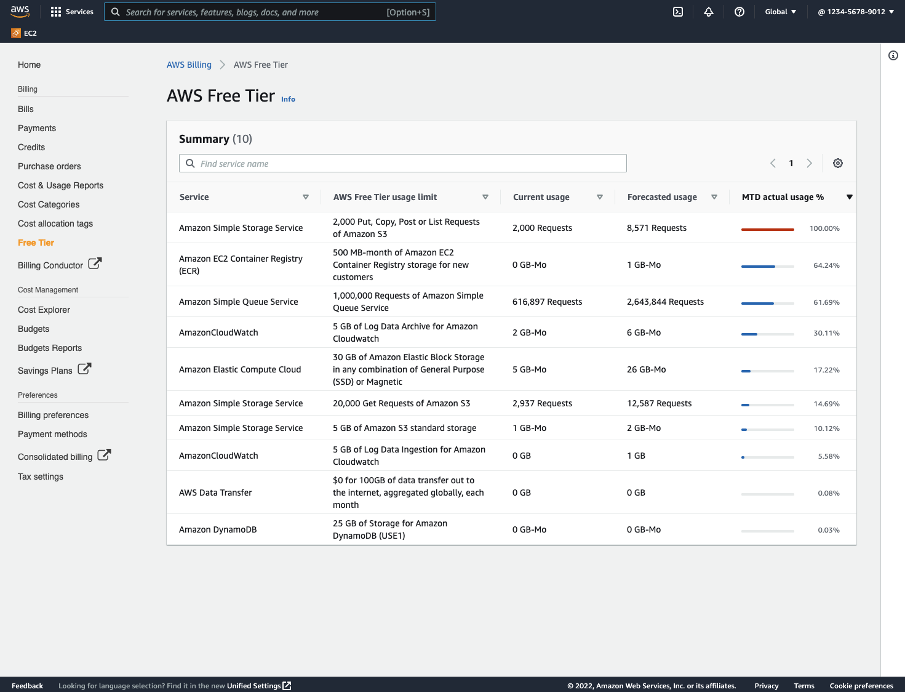

# Billing and Cost Optimization Essentials

When using the cloud to host your applications and systems, it is important to understand how the billing model works, and how you can optimize your costs. The cloud allows you to trade fixed expenses (such as data centers and physical servers) for variable expenses, and only pay for the resources as you consume them. There are a number of different billing dimensions, depending on the type of resource you use. These can range from the amount of time a resource is running; how much data is stored, transferred, or processed; or the number of API invocations made.

## **Sections:**

- [How do I view my costs?](#how-do-i-view-my-costs)
- [Can I get an alert when my spending projection is above a certain amount?](#can-i-get-an-alert-when-my-spending-projection-is-above-a-certain-amount)
- [What resources are free?](#what-resources-are-free)
- [Can I pay a fixed, predictable amount per month?](#can-i-pay-a-fixed-predictable-amount-per-month)
- [How can I reduce my monthly bill?](#how-can-i-reduce-my-monthly-bill)
- [What are Spot instances?](#what-are-spot-instances)
- [Automatically scale resources based on demand](#automatically-scale-resources-based-on-demand)
- [Optimizing compute costs](#optimizing-compute-costs)
- [Optimizing data transfer costs](#optimizing-data-transfer-costs)
- [Optimizing database costs](#optimizing-database-costs)
- [How to optimize a fixed workload](#how-to-optimize-a-fixed-workload)
- [Tools and services to help with cost optimization](#tools-and-services-to-help-with-cost-optimization)

## **How do I view my costs?**

The first step in understanding your billing is to be able to see what resources you have, and what they cost to run. The [AWS Billing Dashboard](https://docs.aws.amazon.com/awsaccountbilling/latest/aboutv2/view-billing-dashboard.html) in the AWS Management Console shows the high-level overview of your current monthly costs, along with a forecast based on the currently running resources. If you are not yet familiar with the console, we recommend reading the [Getting Started with the AWS Management Console](https://aws.amazon.com/getting-started/hands-on/getting-started-with-aws-management-console/) tutorial. Billing information is considered sensitive, and as such, only the root user of any AWS account initially has access to this section of the console. If you are unable to view the billing dashboard, you will need to [delegate access](https://docs.aws.amazon.com/IAM/latest/UserGuide/tutorial_billing.html) to your [AWS IAM user](https://docs.aws.amazon.com/IAM/latest/UserGuide/id_users.html). Here is an example of the billing dashboard, showing which services are currently in use, and what they cost:

While the billing dashboard gives you an overview and a high-level breakdown of costs, you may want to look at costs in more detail. This can be done by using the [AWS Cost Explorer](https://console.aws.amazon.com/billing/home?/costexplorer#/costexplorer). It allows you to see which services were used, and the amount each contributed to your monthly spend. There is also a graph showing the different values, and you can use it to filter across a number of different dimensions, such as Region or service. Here is an example of what it could look like:

## **Can I get an alert when my spending projection is above a certain amount?**

Yes! And it should be one of the first things you set up when creating a new AWS account. Follow the instructions in the [Amazon CloudWatch User Guide](https://docs.aws.amazon.com/AmazonCloudWatch/latest/monitoring/monitor_estimated_charges_with_cloudwatch.html) to set up an alert based on total estimated charges. You can set additional alarms based on a number of metrics or dimensions, depending on your needs.

## **What resources are free?**

The [AWS Free Tier](https://aws.amazon.com/free/) provides customers the ability to explore and try out AWS services free of charge up to specified limits for each service. The Free Tier comprises three different types of offerings: a 12-month Free Tier, an Always Free offer, and short-term trials. Services with a 12-month Free Tier allow customers to use the product for free up to specified limits for one year from the date the account was created. Services with an Always Free offer allow customers to use the product for free up to specified limits as long as they are an AWS customer. Services with a short-term trial are free to use for a specified period of time or up to a one-time limit, depending on the service selected. To see what Free Tier resources you are currently using, and how much of each you are using, open up the [Free Tier dashboard](https://console.aws.amazon.com/billing/home#/freetier) under the Billing section of your AWS account. Here is an example of what you will be able to see:

<!-- The account ID is visible in the upper right of this screenshot. Please fix. -->

If you have not yet set up an account, or this is your first time using AWS, we recommend you familiarize yourself with the [AWS Management Console](https://aws.amazon.com/getting-started/hands-on/getting-started-with-aws-management-console/), and read through [Setting Up Your AWS Environment](https://aws.amazon.com/getting-started/guides/setup-environment/).

## **Can I pay a fixed, predictable amount per month?**

Services on AWS are usually billed on a per-consumption rate based on different dimensions, such as the length of time the resource is running, amount of data processed or transfered, and number of requests. Some of the services have a [Free Tier](https://aws.amazon.com/free/)], and your monthly costs depend on the combination of services that you use.

If you are looking for a solution with a fixed, predictable cost, [Amazon Lightsail](https://aws.amazon.com/lightsail/) is a service that offers easy-to-use virtual private server (VPS) instances, containers, storage, databases, and more at a cost-effective monthly price. As an example, follow this tutorial on [deploying a WordPress site on Amazon Lightsail](https://aws.amazon.com/getting-started/hands-on/launch-a-wordpress-website/).
<!-- The Lightsail tutorial linked above is for building a LAMP stack. Did you mean to link to a different tutorial? -->

## **How can I reduce my monthly bill?**

You can reduce your monthly bill in a number of ways. These range from optimizing the instance or database quantities or sizes you are using, [migrating from licensed databases to open source ones](https://aws.amazon.com/blogs/database/migrating-a-commercial-database-to-open-source-with-aws-sct-and-aws-dms/), [automatically scaling up and down based on demand](#automatically-scale-resources-based-on-demand), or changing your services to use AWS Lambda or other serverless services that scale down to zero when not in use. Another option is to switch off environments and resources that are not in use 24/7. As an example, there are 168 total hours in a week. If the developers only use the development environment during office hours (8 AM-6 PM [10 hours]), seven days a week, turning it off would save you 98 hours per week (~58.33%). To implement this solution, you can look at the [Instance Scheduler on AWS](https://aws.amazon.com/solutions/implementations/instance-scheduler/) to automatically turn off instances and databases on a schedule.

The sections below will cover specific scenarios for using AWS Spot instances; auto scaling to scale up or down based on load; and optimizing network, compute, and database costs.

## **What are Spot instances?**

When you spin up an EC2 instance, it is called an [On-Demand instance](https://docs.aws.amazon.com/AWSEC2/latest/UserGuide/ec2-on-demand-instances.html), with the associated costs per second of running. You can also spin it up as an [EC2 Spot instance](https://docs.aws.amazon.com/AWSEC2/latest/UserGuide/using-spot-instances.html), which lets you take advantage of unused EC2 capacity in the AWS Cloud. Spot instances are available at up to a 90% discount compared to On-Demand prices. The caveat here is that as it relies on unused EC2 capacity, it may be terminated at some point if there is a spike in on-demand instances, with a 2 minute warning of when this will happen. This allows you complete any requests in-flight on the instance, and gracefully shut it down, or [suspend it](https://docs.aws.amazon.com/autoscaling/ec2/userguide/as-suspend-resume-processes.html) till there is spot capacity available again. You can also use a combination of different spot instance types to reduce the likelihood not having enough capacity for your requests - see the next section to learn more.

## **Automatically scale resources based on demand**

Scaling resources up and down based on the current workload enables you to have just enough capacity to handle incoming requests. For Amazon EC2 instances, this can be done by using auto scaling and configuring scaling rules based on the metrics like CPU load, network in/out, number of requests, and [more](https://docs.aws.amazon.com/autoscaling/ec2/userguide/tutorial-ec2-auto-scaling-load-balancer.html). For workloads where you have predictable spikes, such as a system used by a school where most people log in and start using it at 7 AM, you can configure auto scaling with [predictive scaling](https://docs.aws.amazon.com/autoscaling/ec2/userguide/ec2-auto-scaling-predictive-scaling.html) to scale on a schedule between 6:50 AM-6:10 PM, as an example.

As mentioned in the previous section, Spot instances are another way to reduce the costs for EC2 instances. Using auto scaling, you can create blended fleets of instances that are composed of a combination of on-demand and Spot instances, with options to choose which Spot instances to use. As an example, you can configure it to use spot instances for both `m5.large` and `m5.xlarge`, with a weighting attached to indicate how much capacity each provides - in this instance, the `m5.xlarge` is has twice as much compute as the `m5.large`, so assigning it a value of 2, and the `m5.large` a value of 1 will allow auto scaling to make a decision on which type to choose when scaling. The [dimension of which spot instance to choose](https://docs.aws.amazon.com/autoscaling/ec2/userguide/ec2-auto-scaling-mixed-instances-groups.html) can be configured based on `lowest-price`, where it will pick the instance with the lowest per-unit cost as defined with the weights, or `capacity-optimized`, where it will choose the instance type with the most current spot capacity, reducing the chance of your workload being interrupted.

If you are using Lambda functions for your applications, there is an opensource tool [Lambda power tuner](https://docs.aws.amazon.com/lambda/latest/operatorguide/profile-functions.html) hosted on [github](https://github.com/alexcasalboni/aws-lambda-power-tuning) that helps test code using different Lambda configurations to find the best cost / performance combination for you.

## **Optimizing compute costs**

A good starting point for cost optimization is to analyze your EC2 instance or Lambda function sizes based on the amount of processing they do. There are a number of different [EC2 instance types](https://aws.amazon.com/ec2/instance-types/) that are optimized for different workloads, e.g. high frequency CPUs, high memory capacity, fast NVME SSD local storage, attached GPUs for machine learning, high network throughput to name a few. As an example, if you see that your workload is CPU intensive, it may be cheaper to use the `C5` family of instances instead of the `M5` general purpose ones. Conversely, if you see only periodic spikes in CPU usage, the burstable `T` family of instances could be better suited to your workload. To get started optimizing your compute, you can use the [AWS Compute Optimizer](https://aws.amazon.com/compute-optimizer/) to analyze running workloads to make recommendations.

## **Optimizing data transfer costs**

When transfering data between AWS regions, Availability Zones, or out of the AWS network, it has an [associated cost](https://aws.amazon.com/blogs/architecture/overview-of-data-transfer-costs-for-common-architectures/) with it. By desiging your infrastructure to route traffic along optimal routes, you are able to reduce this cost. The first step is to look at VPC Endpoints if you are making any calls to AWS services like S3, ECR, etc [full list of supported services](https://docs.aws.amazon.com/vpc/latest/privatelink/configure-endpoint-service.html). By creating a VPC Endpoint inside your VPC, your calls to the supported AWS services are routed through it, and remain inside the AWS network instead of calling out of the VPC to the internet and back in again to the AWS network, and avoids accruing the network egress costs.

The next step is to optimize the calls between your infrastructure. When deploying across multiple availability zones (AZs) for resilliency, you can make use of [availability zone affinity](https://aws.amazon.com/blogs/architecture/improving-performance-and-reducing-cost-using-availability-zone-affinity/) to ensure calls are routed as much as possible inside each availability zone. If your application uses a database using [Amazon RDS](https://aws.amazon.com/rds/), you can create [read-replicas](https://docs.aws.amazon.com/AmazonRDS/latest/UserGuide/USER_MySQL.Replication.ReadReplicas.html) so that all read calls made can be done using the read-replica inside the same availability zone.

## **Optimizing database costs**

To start optimizing database costs, you can deploy additional [read-replicas](https://docs.aws.amazon.com/AmazonRDS/latest/UserGuide/USER_MySQL.Replication.ReadReplicas.html) to offload queries from the primary database that only reads data. This will free up capacity on the primary node that handles all the data changes (updates, inserts, and deletes). This will help optimize up to the point where you need to start scaling the database instance up or down as load fluctuates. You can change the instance size of an RDS database, but that required the database to go offline while the instance type is changed. If your application needs continuous uptime, it is worth using [Amazon Aurora](https://aws.amazon.com/rds/aurora/), a relational database service that combines the speed and availability of high-end commercial databases with the simplicity and cost-effectiveness of open-source databases. Aurora is fully compatible with MySQL and PostgreSQL, allowing existing applications and tools to run without requiring modification. [Amazon Aurora Serverless](https://aws.amazon.com/rds/aurora/serverless/) is an on-demand, scalable configuration for Aurora where the database [automatically starts up, shuts down, and scales capacity](https://aws.amazon.com/getting-started/hands-on/building-serverless-applications-with-amazon-aurora-serverless/) up or down based on your application's needs.

## **How to optimize a fixed workload**

When you have optimized your workload as much as you can, and there is a fixed minimum load you need to support, it is worth considering signing up for a [Savings Plan](https://aws.amazon.com/blogs/aws/new-savings-plans-for-aws-compute-services/). A Savings Plan is a flexible discount model that provides you with the same discounts as Reserved Instances, in exchange for a commitment to use a specific amount (measured in dollars per hour) of compute power over a one or three year period. Savings Plans are available in two flavors:

**Compute Savings Plans** provide the most flexibility and help to reduce your costs by up to 66% (just like Convertible RIs). The plans automatically apply to any EC2 instance regardless of region, instance family, operating system, or tenancy, including those that are part of EMR, ECS, or EKS cluster. For example, you can shift from C4 to C5 instances, move a workload from Dublin to London, or migrate from EC2 to Fargate, benefiting from Savings Plan prices along the way, without having to do anything.

**EC2 Instance Savings Plans** apply to a specific instance family within a region and provide the largest discount (up to 72%, just like Standard RIs). Just like with RIs, your savings plan covers usage of different sizes of the same instance type (such as a c5.4xlarge or c5.large) throughout a region. You can even switch from Windows to Linux while continuing to benefit, without having to make any changes to your savings plan.

## **Tools and services to help with cost optimization**

- Optimizing S3 storage costs by using [Intelligient Tiering](https://aws.amazon.com/s3/storage-classes/intelligent-tiering/)
- [S3 Storage Lens](https://youtu.be/E2vy1yhJSHE)
- [Cost anomaly detector](https://aws.amazon.com/aws-cost-management/aws-cost-anomaly-detection/)
