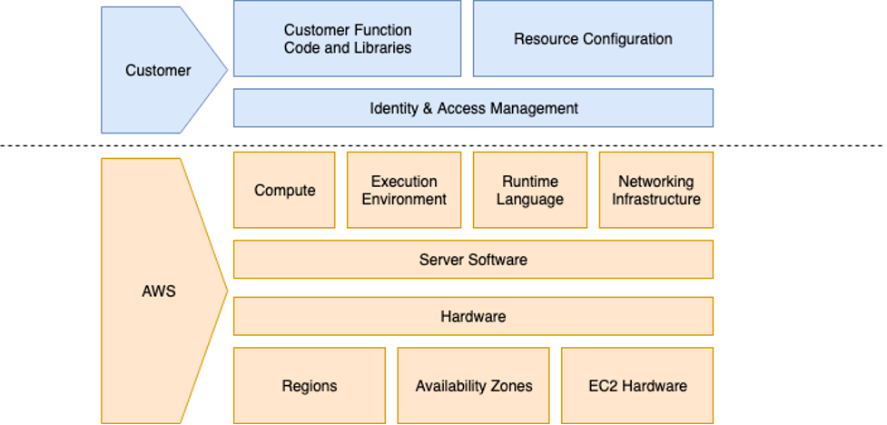

## Introduction

Securing your account and cloud resources can be a daunting task. Security practices must be constantly reassessed and adjusted as bad actors continue to evolve their techniques. This guide will provide you with essential tasks that you can perform from day one of your cloud journey. The following practices are considered essential to an organizations security posture but are by no means definitive nor are they a guarantee of assured protection. These practices can be considered proper due diligence and should be applied where applicable. For each of the following areas additional links are provided that dive deeper into each topic.

### What is Cloud Security?

What is cloud security? Much like the traditional security you find in on-premises networks, cloud security involves the practice of building secure, high-performing, resilient, and efficient infrastructure for your applications. Cloud security involves the implementation of controls designed to prevent attack as well as controls to detect, respond, and remediate should the need be. Cloud Security can involve a mix of Network and Infrastructure security, Host and Endpoint Security, Data Protection and Encryption, Identity Management, Application Security, and Logging, Monitoring and Threat Detection. Cloud Security is not a single thing, but rather a practice that makes use of tools and techniques to protect an organizations data, resources, and processes.

## What is the Shared Responsibility Model?

Security and Compliance is a shared responsibility between AWS and the customer. By following this shared model, customers can reduce the operational burden as AWS assumes responsibility for operating, managing, and controlling the components "of the cloud". This leaves customers to focus on building their applications, and implement their services assuming responsibility of securing those services "in the cloud."
Read more about the [Shared Responsibility Model](https://aws.amazon.com/compliance/shared-responsibility-model/).

## Get Started by Securing Your AWS Account

When you first [create a new AWS account](https://aws.amazon.com/getting-started/guides/setup-environment/module-one/), there are a number of recommended steps to follow to manage and access it securely.

### Root User

When you create an AWS account you start with what is known as the root user. This is the first AWS user that exists inside your AWS account. AWS recommends that you do not use this account for day-to-day operations as it has full access and control of the account, and should follow the [recommended best practices](https://docs.aws.amazon.com/accounts/latest/reference/best-practices-root-user.html) to secure the root user. This involves locking away your root user access keys, using a strong password, enabling AWS multi-factor authentication, and [creating an IAM user](https://aws.amazon.com/getting-started/guides/setup-environment/module-two/) to access your account. This account can be assigned admin privileges and should be used for all administrative tasks going forward.

### Security Contacts

Next, you should assign alternate security contacts to your account. The alternate security contact will receive security-related notifications, including notifications from the AWS Abuse Team. You can learn more about the importance of setting this contact information early in your account setup in the blog post:[Update the alternate security contact across your AWS accounts for timely security notifications](https://aws.amazon.com/blogs/security/update-the-alternate-security-contact-across-your-aws-accounts-for-timely-security-notifications/).

### Region Control

Once you have your security contacts specified you should consider the [AWS regions](https://docs.aws.amazon.com/AmazonRDS/latest/UserGuide/Concepts.RegionsAndAvailabilityZones.html) where your workloads should run, and the regions where they should not. You can then [lock down the unused regions](https://docs.aws.amazon.com/general/latest/gr/rande-manage.html) to ensure no workloads can be run from these regions. While this could be related to cost optimization, it also lends itself to security. How so? By locking down the regions in which you do not expect to see workloads you will not need to monitor these regions as you would with regions you actively use.

### AWS CLI and Console Access

At this point, you have secured the root user, created an one or more IAM users, assigned security contacts, and locked down the regions in which workloads can run. Next let's consider how users will interact with AWS resources. There are two primary methods of interaction, the AWS CLI and the AWS Console. It's recommended to setup Single Sign-on for the AWS CLI and AWS Console. See the article, [Configuring the AWS CLI to use AWS IAM Identity Center (successor to AWS Single Sign-On)](https://docs.aws.amazon.com/cli/latest/userguide/cli-configure-sso.html) for details on how to set up AWS Single Sign-on, now known as [AWS IAM Identity Center](https://aws.amazon.com/iam/identity-center/).

### IAM Groups

The next step in securing your account is to setup [AWS IAM user groups](https://docs.aws.amazon.com/IAM/latest/UserGuide/id_groups.html) to control access. Rather than control individual users' access by setting policies directly on the user, it is best to create a group, assign the required permissions to it, and then assign users to the group. They will inherit the permissions of that group. This offers a more scalable way of providing access control to many users.

Following these practices from the onset will help to provide secure access to your AWS resources. Next we will discuss how to secure the infrastructure you build on AWS.

## Securing the Infrastructure You Build

The infrastructure you build is often overlooked as it's part of the underlying architecture and not something that's customer facing. However, if the infrastructure fails the services you provide your customers fails. For this reason it's imperative that the infrastructure is [secured](https://aws.amazon.com/products/security/) from day one.

### Amazon VPC Security

As you build out your cloud infrastructure you'll begin by creating an [Amazon Virtual Private Cloud](https://docs.aws.amazon.com/vpc/latest/userguide/what-is-amazon-vpc.html) (VPC). This is a virtual network that you define (a default one is created in each region when you create your account) that allows you to launch resources. A VPC resembles a traditional network as it has a [CIDR](https://en.wikipedia.org/wiki/Classless_Inter-Domain_Routing) IP address range assigned to it, and is subdivided by [creating subnets](https://docs.aws.amazon.com/vpc/latest/userguide/configure-subnets.html). Your subnets can be used to provide isolation for different sets of resources. Subnets can either be public or private. [Public subnets](https://docs.aws.amazon.com/vpc/latest/userguide/VPC_Scenario1.html) have a route to an [Internet Gateway](https://docs.aws.amazon.com/vpc/latest/userguide/VPC_Internet_Gateway.html), have access to the internet via this gateway, and can be reached from the internet if the relevant access controls allow it. [Private subnets](https://docs.aws.amazon.com/vpc/latest/userguide/VPC_Scenario2.html) have a routing table as well, but do not have a route to an Internet Gateway, so by default cannot reach the internet, and cannot be reached from the internet. To enable resources in a private subnet to access the internet, a [NAT Gateway](https://docs.aws.amazon.com/vpc/latest/userguide/vpc-nat-gateway.html) is needed. At the subnet level, a network access control list ([ACL](https://docs.aws.amazon.com/AmazonS3/latest/userguide/acl-overview.html)) [allows or denies](https://docs.aws.amazon.com/vpc/latest/userguide/vpc-network-acls.html) specific inbound or outbound traffic. You can use the default network ACL for your VPC, or you can create a custom network ACL for your VPC. Network ACLs are numbered lists, processed in top-down order, and are stateless - this means that you will need an inbound and outbound network ACL rule to allow bi-directional traffic.

### Security Groups

As you deploy resources into your VPC you can associate [Security Groups](https://docs.aws.amazon.com/vpc/latest/userguide/VPC_SecurityGroups.html) with them. A Security Group controls the traffic that is allowed to reach and leave the resources that it is associated with. They are similar to a firewall, but instead of using just a list or range of IP addresses, it can use the resource reference to keep an updated list of IP addresses based on the ones assigned to each resource in the group. As an example, if you create an autoscaling group to spin up Amazon EC2 instances, each instance is assigned a new IP when it starts up. By adding a security group to these instances, you can grant access to your database server's security group via the EC2 instances' security group ID, and any new EC2 instance launched with have access to the database without needing to add its IP address to the allowed list. Security Group rules are similar to Network ACLs as when creating them, you match on port, protocol, and addresses, but the are stateful - you can think of them much in the same way as a Stateful Firewall. When you create an entry to allow a specific type of traffic, you do not need to create a rule to match the return traffic, being stateful, the return traffic will be allowed. To better understand how Security Groups and ACLs interact, [this comparison is useful](https://docs.aws.amazon.com/vpc/latest/userguide/VPC_Security.html#VPC_Security_Comparison).

### AWS Network Firewall and DDoS Protection

To add an additional layer of infrastructure security, you can deploy the [AWS Network Firewall](https://aws.amazon.com/network-firewall/). The Network Firewall is a managed service that deploys protection for your Amazon VPC. It provides more fine-grained protection than Security Groups, as it can incorporate context from traffic flows, like tracking connections and protocol identification, to enforce policies such as preventing your VPCs from accessing domains using an unauthorized protocol. This is done through the configuration of custom [Suricata Rules](https://suricata.readthedocs.io/en/suricata-6.0.0/rules/). For example, you can configure the [Network Firewall to protect against Malware attacks](https://aws.amazon.com/blogs/security/how-to-deploy-aws-network-firewall-to-help-protect-your-network-from-malware/). Taking this a step further you can deploy another managed service, [AWS Shield Advanced](https://aws.amazon.com/shield/) to protect against DDoS threats.

## Securing the Resources You Create

As you create resources in the AWS cloud you must consider how to secure them based on current best practices. This is true if you deploy an EC2 instate, a database, serverless resources. In this section we will provide some essential security steps to secure the resources you create.

### EC2 Security

As you create resources in AWS, you should take care to follow recommended security best practices for the type of resource you are working with. For EC2 instances security begins by [controlling network access](https://docs.aws.amazon.com/AWSEC2/latest/UserGuide/infrastructure-security.html#control-network-traffic) to your instances, for example, through configuring your VPC and security groups - see the [Amazon VPC Security](#amazon-vpc-security) section.

Another aspect of instance security is that of managing the credentials used to connect to your instances. This starts with the IAM user permissions you assign, but extends to the group assigned. This provides a level of security for the user working with the EC2 instance, but not for the instance itself. You should also configure [IAM roles](https://docs.aws.amazon.com/AWSEC2/latest/UserGuide/iam-roles-for-amazon-ec2.html) that are attached to the instance and permissions associated with those roles. To access an EC2 instance, instead of opening up the port for [SSH](https://en.wikipedia.org/wiki/Secure_Shell), or setting up a [bastion / jump host](https://aws.amazon.com/blogs/mt/replacing-a-bastion-host-with-amazon-ec2-systems-manager/), you should use [EC2 Instance connect](https://docs.aws.amazon.com/AWSEC2/latest/UserGuide/ec2-instance-connect-methods.html).

You should ensure that the guest operating system and software deployed to the it is [up-to-date with any operating system updates and security patches](https://docs.aws.amazon.com/AWSEC2/latest/UserGuide/update-management.html). You can find more details on [Security in Amazon EC2](https://docs.aws.amazon.com/AWSEC2/latest/UserGuide/ec2-security.html)

### Database Security

Securing your database is an import aspect of your security approach. As mentioned in the [Amazon VPC Security](#amazon-vpc-security) section, it is recommended to deploy databases to a private subnet to prevent access from external parties over the internet. AWS offers 15 purpose-built databases, and each have different aspect relating to how you secure them, but all share the following aspects.

### Authentication

To access a database, some form of authentication is required. This can take the form of a username and password, which should be [rotated on a regular basis](https://aws.amazon.com/blogs/security/rotate-amazon-rds-database-credentials-automatically-with-aws-secrets-manager/). You can alternatively make use of [Amazon RDS Proxy](https://aws.amazon.com/rds/proxy/) to leverage IAM roles to manage access to the database for you. Some of the database services, like [Amazon DynamoDB](https://aws.amazon.com/dynamodb/), make use of [IAM roles](https://docs.aws.amazon.com/amazondynamodb/latest/developerguide/authentication-and-access-control.html) to provide access, so you do not need to manage any credentials yourself.

### Minimum permissions

Restricting access to your database only to services / infrastructure that require it is a recommended best practice. This can be done by [setting up security groups](https://docs.aws.amazon.com/AmazonRDS/latest/UserGuide/Overview.RDSSecurityGroups.html) for your RDS instances, [Amazon Neptune](https://aws.amazon.com/neptune/) [databases](https://docs.aws.amazon.com/neptune/latest/userguide/get-started-security.html), or for [Amazon Redshift](https://aws.amazon.com/redshift/) [clusters](https://docs.aws.amazon.com/redshift/latest/dg/r_Database_objects.html).

### Backing up and testing restores

Backup up your data should be a priority, and also running frequent restores to confirm the backups are working correctly. [AWS Backup](https://aws.amazon.com/backup/) allows you to easily configure and manage backups for specific AWS services, including RDS, DynamoDB, Neptune, and more.

### Serverless Security

For serverless security, you should be familiar with [AWS Lambda](https://aws.amazon.com/lambda/), [Amazon API Gateway](https://aws.amazon.com/api-gateway/), Amazon DynamoDB, [Amazon SQS](https://aws.amazon.com/sqs/), as well as [Identity and Access Management](https://aws.amazon.com/iam/). With Serverless security, AWS takes a greater responsibility as compared to the shared responsibility model. As a customer you would be responsible for the data, applications, IAM, data encryption and integrity, authentication, monitoring and logging. You can see this in the image below.

While many techniques are similar regarding serverless security, they will vary slightly. Even so, you must continue to use authentication and authorization mechanisms. No doubt you will continue to provide [data encryption and integrity](https://docs.aws.amazon.com/lambda/latest/dg/security-dataprotection.html).

### Inventory and Configuration

Your security strategy should also include [monitoring, logging, and configuration management](https://docs.aws.amazon.com/serverlessrepo/latest/devguide/security-logging-monitoring.html). And you will still need to provide DoS and Infrastructure Protection to some degree which can be done with AWS Shield and AWS Shield Advanced.

## Securing your data

Customers store a great deal of data in the AWS cloud. This data contains information that is critical to the operation of an organization. It includes customer data, intellectual property, orders linked directly to revenue, and more. In this section we will share essentials on how to configure data that is stored on AWS as well as data that is transferred over the network to and from AWS.

### S3 Security

The next essential for cloud security is the protection of data. In AWS data is stored in S3. S3 have several controls to protect the data. The article, [Top 10 security best practices for securing data in Amazon S3](https://aws.amazon.com/blogs/security/top-10-security-best-practices-for-securing-data-in-amazon-s3/) covers the most fundamental techniques. These techniques include blocking public S3 buckets at the organization level, using bucket policies to verify all access granted is restricted and specific, encryption, and protection.

### Encrypting data at rest

For encryption, AWS Key Management Service (KMS) allows you to create and control keys used to encrypt or digitally sign your data. There are a few options available to those who wish to encrypt their data on AWS. One such method is to use [Server-side encryption with Amazon S3-managed encryption keys (SSE-S3)](https://docs.aws.amazon.com/AmazonS3/latest/userguide/UsingServerSideEncryption.html). Using this method the encryption happens after the data is sent to AWS using keys that are managed by AWS. 

The second option is to encrypt the data once it's in AWS, but rather than using keys that are created and managed by AWS, you can perform server-side encryption with customer master keys (CMKs) that are stored in AWS KMS ([SSE-KMS](https://docs.aws.amazon.com/kms/latest/developerguide/services-s3.html).

The third option for storing encrypted data on AWS is to use Client-side encryption. With Client-side encryption the data is encrypted prior to being transferred to AWS. 

An example of how both client-side encryption and server-side encryption benefits customers can be seen in the image below.

### Virtual Private Networks (VPN)

There are several technologies that fall within the definition of a VPN. The idea behind a VPN is that your Data in transit maintains its integrity and can be securely exchanged between two parties. AWS offers multiple technologies that help to keep your data-in-transit secure. One of those is known as AWS PrivateLink. An [AWS PrivateLink](https://www.youtube.com/watch?v=_mHLkFeTuFo) provides encrypted, private connectivity between VPCs, AWS services, and your on-premises networks. This is done without exposing your traffic to the public internet. This too could be considered a Virtual Private Network. 

However, in most cases, a discussion of VPN revolves around the use of data encryption. Depending on the circumstances, you may need to provide encryption between a client and your AWS cloud resources. This situation would require [Client VPN](https://aws.amazon.com/vpn/client-vpn/). On the other hand, you might be passing data between your data center or branch office and your AWS resources. You can accomplish this using IPSec tunnels between your on-premises resources and your our Amazon Virtual Private Clouds (VPC) or AWS Transit Gateway. This secure connectivity is known as [Site-to-Site VPN](https://aws.amazon.com/vpn/site-to-site-vpn/).

A final area to mention in regards to encrypting data-in-transit has to do with managing your cloud resources using the AWS Console. While you would not normally refer to this connectivity as a VPN, it is worthy to note that your session to the AWS console uses TLS encryption. Thus your configurations are kept confidential as you build your secure architecture. TLS is also used with the AWS API.

## Monitoring your environment

With each of the above aspects secured its essential that you monitor what's happening in your environment. This will help to identify threats and offer the ability to proactively mitigate them.

### Visibility Into Traffic Flows

After covering the essentials of cloud security in the above areas it's beneficial to close out our list of essentials by discussing how you can monitor your environment. AWS offers several managed services to assist in this regard, along with self-service options. For example, you can [use VPC Flow Logs to log and view network traffic flows](https://aws.amazon.com/blogs/aws/vpc-flow-logs-log-and-view-network-traffic-flows/), or you can make use of Amazon CloudWatch to [analyze AWS WAF Logs](https://aws.amazon.com/blogs/mt/analyzing-aws-waf-logs-in-amazon-cloudwatch-logs/) or even to [create alarms for EC2 instances](https://aws.amazon.com/blogs/mt/use-tags-to-create-and-maintain-amazon-cloudwatch-alarms-for-amazon-ec2-instances-part-1/). You can learn more about AWS CloudWatch in [this Workshop](https://catalog.us-east-1.prod.workshops.aws/workshops/a8e9c6a6-0ba9-48a7-a90d-378a440ab8ba/en-US).

### Visibility Into Account Activity

Additionally, [AWS CloudTrail](https://aws.amazon.com/cloudtrai) monitors and records account activity across your AWS infrastructure, giving you control over storage, analysis, and remediation actions. This is essential for creating an administrative audit trail, identifying security incidents, and for troubleshooting operational issues.

### Detecting Threats

Finally, Amazon GuardDuty can be used to provide threat detection, and even to take it a step further by causing the published findings to initiate auto-remediation actions within your AWS Environment.

By addressing each of these operational areas you will be well on your way to providing essential security features to your cloud environment.
