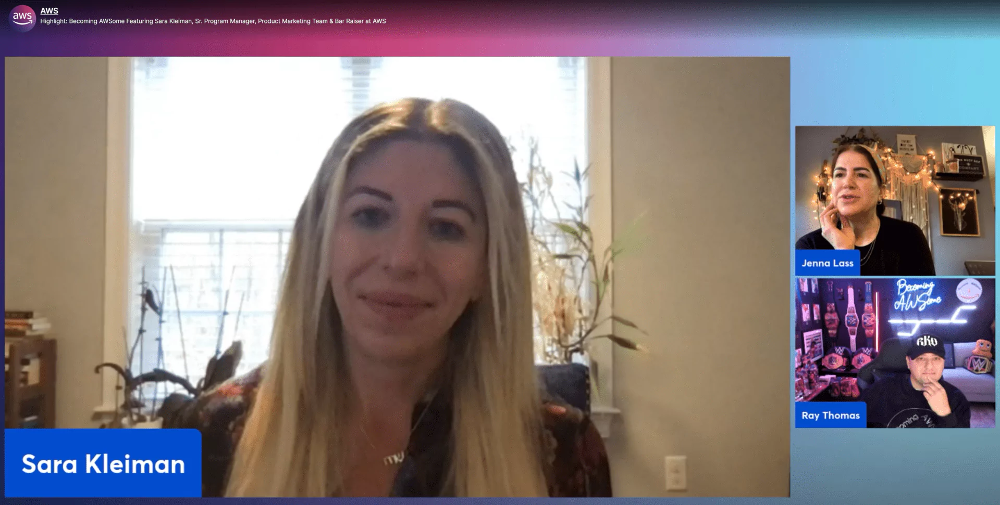

We wrapped up 2023, our first year of having this podcast, with Sara Kleiman! We had a great time getting to know her as a Product Management leader, Bar Raiser and simply AWSome Human!

Being part of the product marketing team, she started first on AI and then moved to the Data side. She currently built a net new function for the product marketing organization that scales marketing programs to non-marketers. 

Check out the recording here:

https://www.twitch.tv/videos/2009334707

**🐦 Reach out to the hosts and guests:**

- Ray: [https://www.linkedin.com/in/raythomas/](https://www.linkedin.com/in/raythomas/)
- Jenna: [https://www.linkedin.com/in/jennalass/](https://www.linkedin.com/in/jennalass/)
