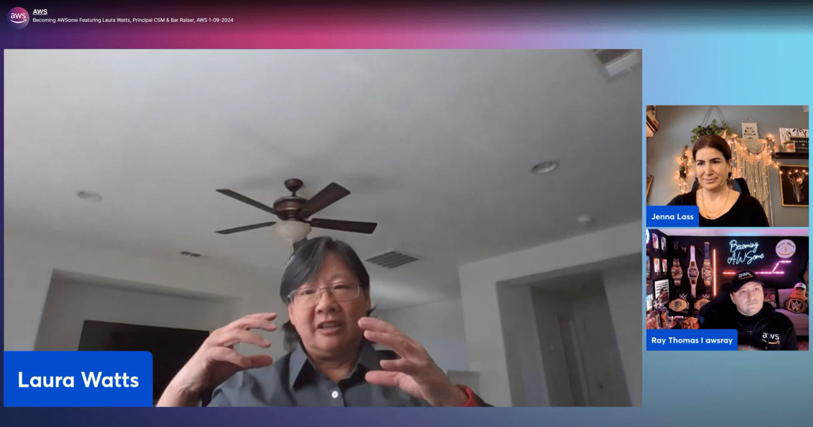

We had such a great time with an impressive innovator and leader. Laura shares how she helped build a new service for the Oil & Gas industry and provides incredible insights as to the scale and scope of someone operating at the Principal level. It's such an important topic given all the confusion about how "Titles" work at Amazon. We also dive into being a Bar Raiser and what it really means to  be one and the critical role we play during final interviews.

Check out the recording here:

https://www.twitch.tv/videos/2027654849

## Links from today's episode

- [Short Survey Link on today's episode](https://www.pulse.aws/survey/DF3ZR6IK)

**🐦 Reach out to the hosts and guests:**

- Ray: [https://www.linkedin.com/in/raythomas/](https://www.linkedin.com/in/raythomas/)
- Jenna: [https://www.linkedin.com/in/jennalass/](https://www.linkedin.com/in/jennalass/)
- Laura: [https://www.linkedin.com/in/lauratwatts/](https://www.linkedin.com/in/lauratwatts//)
