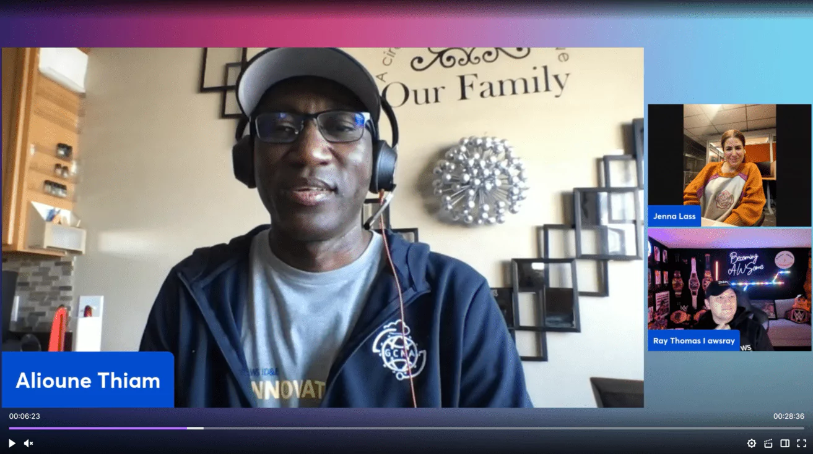

Alioune Thiam, Sr. Systems Development Engineer, was such a joy to meet. We were inspired by his charitable work overseas to the critical work he does on AWS's infrastructure, serving all of AWS's customers. We started with his incredible charity work inspired by his father and the communities it impacts. Then diving into his role and journey at AWS, the learnings, opportunities and how Amazon enables him to thrive and be his authentic self. Key Time Stamps in "description" of recording below. 

Check out the recording here:

https://www.twitch.tv/videos/2034580364 

## Links from today's episode

- [Short Survey Link on today's episode](https://pulse.aws/survey/6PQDXEFG)

**🐦 Reach out to the hosts and guests:**

- Ray: [https://www.linkedin.com/in/raythomas/](https://www.linkedin.com/in/raythomas/)
- Jenna: [https://www.linkedin.com/in/jennalass/](https://www.linkedin.com/in/jennalass/)
- Alioune: [https://www.linkedin.com/in/aliounethiam/](https://www.linkedin.com/in/aliounethiam/)
