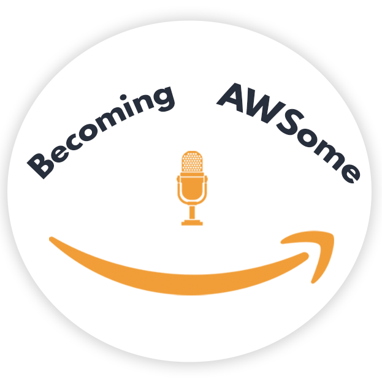

"Becoming AWSome," hosted by Ray Thomas & Jenna Lass, is a live weekly show on AWS’s Twitch Channel (www.Twitch.tv/AWS), which premiered on Feb. 7th, 2023. It offers viewers an unscripted, behind-the-scenes insight into AWS's culture and opportunities. Distinctively, it's the first Talent Acquisition-focused podcast on the AWS channel, carving out a unique audience niche amidst other tech-centric shows centered on AWS’s services.

Diving deep into professional experience and personal interests, Amazon insiders introduce audiences to the "Humans of AWS," showcasing the brilliant minds and passionate hearts that power AWS. It's a rare glimpse into the personalities and innovators shaping the future of cloud computing. 

## Hosts the show

- **Ray Thomas** the happy go lucky guy at AWS known for his custom AWS swag including high top sneakers and sourcing chops. He's been at AWS for 5 years finding AWSome Solution Architects and recruiting for over two decades. But guess what? He’s got a super cool side too! Ray is a WWE Superfan, alongside his 13 year old daughter, Leah! Imagine a room filled with shiny wrestling belts, autographed photos, and loads of cool figurines - that's Ray's world! When he's not cheering on the wrestlers at live shows with Leah, he's chilling in the middle of the ocean, fishing rod in hand, enjoying the sunrise. Oh, and he’s also loves his camera, freezing memorable moments in time whenever he can. 

- **Jenna Lass** the Principal Recruiter at AWS who's been rocking it at Amazon for over 10 years. Jenna isn't just great at her job and enjoys setting up great hiring processes for success; she's a superstar mentor, guiding and inspiring others to aim high. But there's so much more to her! Jenna's a free spirit at heart, soaking up the beauty of nature in upstate New York. She's all about finding her zen with yoga and unwinding at spa retreats. Family means the world to her, and so do her adorable dogs, each named after guitar brands (how cool is that?). Jenna’s life? It's a wonderful blend of nurturing careers, embracing the outdoors, and living every moment with love and laughter!

If you have any questions, comments, or ideas, **reach out** to us. Feel free to send us an email at: [becomingawsome@amazon.com](mailto:BecomingAWSome@amazon.com)

## Schedule

Come learn live with us as we meet incredible HUMANS at AWS for the first time as well! We stream every Tuesday at 2:30pm ET.

### Episodes

| S04E02 | Becoming AWSome Featuring Laura Watts | 2024-01-09  | Laura Watts | [Link to show notes](livestreams/becoming-awsome/)
| S03E23 | Becoming AWSome Featuring Sara Kleiman | 2023-12-19  | Sara Kleiman | [Link to show notes](livestreams/becoming-awsome/)
