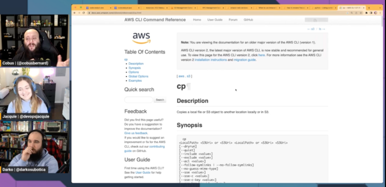

Join us for for the "unofficial" first episode of of Build On Answered, where we joined the Build On Weekly [Twitch](https://twitch.tv/aws) show to review your questions and Answers in the [AWS Stack Overflow Collective](https://stackoverflow.com/collectives/aws) live on air. 

https://www.twitch.tv/videos/1752019282

In this episode we reviewed Amazon EC2 and S3 questions! We reproduced the problems found in the top questions and build code to test out different solutions and understand the full context of each solution.

## Hosts

* [**Darko Mesaroš**](https://www.linkedin.com/in/darko-mesaros/), Senior Developer Advocate @ AWS
* [**Cobus Bernard**](https://www.linkedin.com/in/cobusbernard/), Senior Developer Advocate @ AWS
* [**Jacquie Grindrod**](https://www.linkedin.com/in/jacquelyne-grindrod/), Senior Developer Advocate @ AWS

## What is the AWS Collective?

Users who join the [AWS Stack Overflow Collective](https://stackoverflow.com/collectives/aws) will find curated, centralized community resources to help them more easily discover the most up-to-date answers including those recommended or written by AWS subject matter experts, technical articles such as how-to guides, and Bulletins for upcoming events and releases. 

Members can keep tabs on where they rank on the leaderboard and be promoted to Recognized Member status based on their contributions. By bringing knowledge and users together, the AWS Collective will help the community continue to learn, share, and grow.

