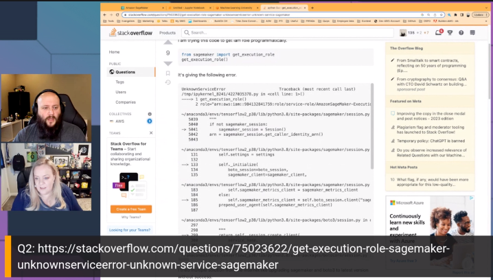

Join us for  Episode 2: All About SageMaker, on Build On Answered, the [Twitch](https://twitch.tv/aws) show where expert hosts review top viewed questions from the [AWS Stack Overflow Collective](https://stackoverflow.com/collectives/aws) live on air!

https://www.twitch.tv/videos/1785690757

In this episode, we focused on the top questions in the AWS Collective on Stack Overflow related to Amazon SageMaker. We built code to test out different solutions and showed viewers how to build the solution.

## Hosts

* [**Julie Gunderson**](https://twitter.com/Julie_Gund), Senior Developer Advocate @ AWS
* [**Cobus Bernard**](https://twitter.com/cobusbernard), Senior Developer Advocate @ AWS

## This Week's Questions

1. [Load S3 Data into AWS SageMaker Notebook](https://stackoverflow.com/questions/48264656/load-s3-data-into-aws-sagemaker-notebook)
2. [get_execution_role() sagemaker: UnknownServiceError: Unknown service: 'sagemaker-metrics'. Valid service names are: accessanalyzer](https://stackoverflow.com/questions/75023622/get-execution-role-sagemaker-unknownserviceerror-unknown-service-sagemaker)
3. [IAM Roles for Sagemaker?](https://stackoverflow.com/questions/55840023/iam-roles-for-sagemaker)

## Do you have feedback and/or ideas for questions we should review on future shows?

Let us know [HERE](https://www.pulse.aws/survey/B1J8HOF5)

## What is the AWS Collective?

Users who join the [AWS Stack Overflow Collective](https://stackoverflow.com/collectives/aws) will find curated, centralized community resources to help them more easily discover the most up-to-date answers including those recommended or written by AWS subject matter experts, technical articles such as how-to guides, and Bulletins for upcoming events and releases. 

Members can keep tabs on where they rank on the leaderboard and be promoted to Recognized Member status based on their contributions. By bringing knowledge and users together, the AWS Collective will help the community continue to learn, share, and grow.

