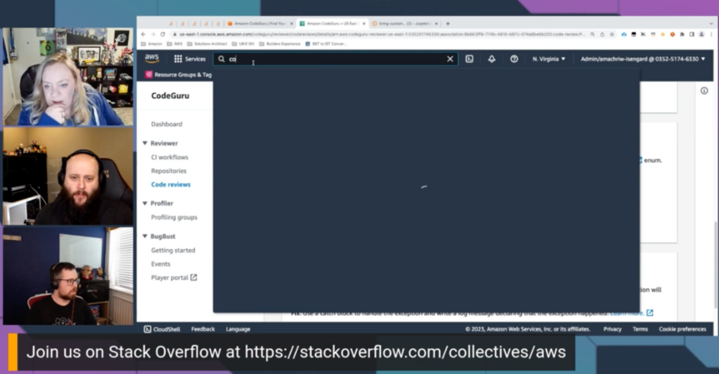

Join us for  Episode 3: All About Machine Learning, on Build On Answered, the [Twitch](https://twitch.tv/aws) show where expert hosts review top viewed questions from the [AWS Stack Overflow Collective](https://stackoverflow.com/collectives/aws) live on air!

https://www.twitch.tv/videos/1798187015

In this episode, we focused on the top questions in the AWS Collective on Stack Overflow related to Machine Learning. We built code to test out different solutions and showed viewers how to build the solution.

## Hosts

* [**Julie Gunderson**](https://twitter.com/Julie_Gund), Senior Developer Advocate @ AWS
* [**Cobus Bernard**](https://twitter.com/cobusbernard), Senior Developer Advocate @ AWS
* [**Chris Williams**](https://www.linkedin.com/in/the-devops-guy/), Senior Solution Architect @ AWS

## This Week's Questions

1. [Is it possible to 'FAIL'/'Abort' a pipeline based on CodeGuru analysis (review/profiler)?](https://stackoverflow.com/questions/75658232/is-it-possible-to-fail-abort-a-pipeline-based-on-codeguru-analysis-review-p)
    * Additional resources for this question:
      * [Amazon CodeGuru Security](https://aws.amazon.com/codeguru/?sc_channel=el&sc_campaign=livestreams&sc_content=boa-2023-04-19&sc_geo=mult&sc_country=mult&sc_outcome=acq)
      * [AWS Step Functions](https://aws.amazon.com/step-functions/?sc_channel=el&sc_campaign=livestreams&sc_content=boa-2023-04-19&sc_geo=mult&sc_country=mult&sc_outcome=acq)
      * [CodeGuruReviewer](https://boto3.amazonaws.com/v1/documentation/api/latest/reference/services/codeguru-reviewer.html?sc_channel=el&sc_campaign=livestreams&sc_content=boa-2023-04-19&sc_geo=mult&sc_country=mult&sc_outcome=acq)
      * [CodePipeline](https://boto3.amazonaws.com/v1/documentation/api/latest/reference/services/codepipeline.html?sc_channel=el&sc_campaign=livestreams&sc_content=boa-2023-04-19&sc_geo=mult&sc_country=mult&sc_outcome=acq)
2. [AWS SageMaker - How to load trained sklearn model to serve for inference?](https://stackoverflow.com/questions/65168915/aws-sagemaker-how-to-load-trained-sklearn-model-to-serve-for-inference)
    * Additional resources for this question:
      * [Bring Your Own Containers](https://docs.aws.amazon.com/sagemaker/latest/dg/model-monitor-byoc-containers.html?sc_channel=el&sc_campaign=livestreams&sc_content=boa-2023-04-19&sc_geo=mult&sc_country=mult&sc_outcome=acq)
      * [Amazon SageMaker Studio](https://aws.amazon.com/sagemaker/studio/?sc_channel=el&sc_campaign=livestreams&sc_content=boa-2023-04-19&sc_geo=mult&sc_country=mult&sc_outcome=acq)
3. [AWS(boto3) Rekognition: how to process all images in bucket and return in each JSON file?](https://stackoverflow.com/questions/75583273/awsboto3-rekognition-how-to-process-all-images-in-bucket-and-return-in-each-j?sc_channel=el&sc_campaign=livestreams&sc_content=boa-2023-04-19&sc_geo=mult&sc_country=mult&sc_outcome=acq)
    * Additional resources for this question:
      * [Amazon Rekognition](https://aws.amazon.com/rekognition/?sc_channel=el&sc_campaign=livestreams&sc_content=boa-2023-04-19&sc_geo=mult&sc_country=mult&sc_outcome=acq)
      * [Step Functions Distributed Map – A Serverless Solution for Large-Scale Parallel Data Processing](https://aws.amazon.com/blogs/aws/step-functions-distributed-map-a-serverless-solution-for-large-scale-parallel-data-processing/?sc_channel=el&sc_campaign=livestreams&sc_content=boa-2023-04-19&sc_geo=mult&sc_country=mult&sc_outcome=acq)
4. [Amazon Textract vs Amazon Rekognition DetectText](https://stackoverflow.com/questions/56008341/amazon-textract-vs-amazon-rekognition-detecttext)
    * Additional resources for this question:
      * [Amazon Textract](https://aws.amazon.com/textract/?sc_channel=el&sc_campaign=livestreams&sc_content=boa-2023-04-19&sc_geo=mult&sc_country=mult&sc_outcome=acq)
      * [AWS CLI Command Reference: detect-text](https://awscli.amazonaws.com/v2/documentation/api/latest/reference/rekognition/detect-text.html?sc_channel=el&sc_campaign=livestreams&sc_content=boa-2023-04-19&sc_geo=mult&sc_country=mult&sc_outcome=acq)

## Do you have feedback and/or ideas for questions we should review on future shows?

Let us know [HERE](https://www.pulse.aws/survey/B1J8HOF5)

## What is the AWS Collective?

Users who join the [AWS Stack Overflow Collective](https://stackoverflow.com/collectives/aws) will find curated, centralized community resources to help them more easily discover the most up-to-date answers including those recommended or written by AWS subject matter experts, technical articles such as how-to guides, and Bulletins for upcoming events and releases.

Members can keep tabs on where they rank on the leaderboard and be promoted to Recognized Member status based on their contributions. By bringing knowledge and users together, the AWS Collective will help the community continue to learn, share, and grow.
