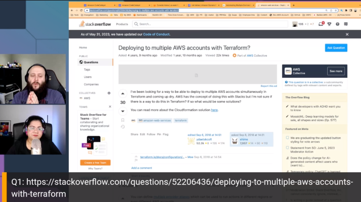

Join us for  Episode 6: All About Terraform with Rohini, of Build On Answered, the [Twitch](https://twitch.tv/aws) show where expert hosts review top viewed questions from the [AWS Stack Overflow Collective](https://stackoverflow.com/collectives/aws) live on air!

https://www.twitch.tv/videos/1850485117

In this episode, we focused on the top questions in the AWS Collective on Stack Overflow related to Terraform. We built code to test out different solutions and showed viewers how to build the solution.

## Hosts

* [**Rohini Goankar**](https://www.linkedin.com/in/rohinigaonkar/), Senior Developer Advocate @ AWS
* [**Cobus Bernard**](https://twitter.com/cobusbernard), Senior Developer Advocate @ AWS

## This Week's Questions

1. [Deploying to multiple AWS accounts with Terraform?](https://stackoverflow.com/questions/52206436/deploying-to-multiple-aws-accounts-with-terraform)
2. [Local state cannot be unlocked by another process on terraform](https://stackoverflow.com/questions/71940888/local-state-cannot-be-unlocked-by-another-process-on-terraform)
3. [Should .terraform.lock.hcl be included in the .gitignore file?](https://stackoverflow.com/questions/67963719/should-terraform-lock-hcl-be-included-in-the-gitignore-file)

## Do you have feedback and/or ideas for questions we should review on future shows?

Let us know [HERE](https://www.pulse.aws/survey/B1J8HOF5)

## What is the AWS Collective?

Users who join the [AWS Stack Overflow Collective](https://stackoverflow.com/collectives/aws) will find curated, centralized community resources to help them more easily discover the most up-to-date answers including those recommended or written by AWS subject matter experts, technical articles such as how-to guides, and Bulletins for upcoming events and releases. 

Members can keep tabs on where they rank on the leaderboard and be promoted to Recognized Member status based on their contributions. By bringing knowledge and users together, the AWS Collective will help the community continue to learn, share, and grow.

