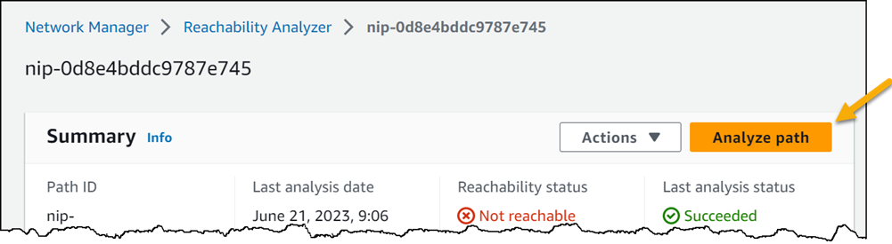

Join us for Episode 7 of Build On Live: Answered, the [Twitch](https://twitch.tv/aws) show where expert hosts review top viewed questions from the [AWS Stack Overflow Collective](https://stackoverflow.com/collectives/aws) live on air!

In this episode we will be focusing on resilient architectures. We have selected some of the top viewed questions in the AWS Collective and built code and demos around the best answers to those questions!

https://www.twitch.tv/videos/1856494950 

## Hosts

* [**Julie Gunderson**](https://twitter.com/Julie_Gund), Senior Developer Advocate @ AWS
* [**Cobus Bernard**](https://twitter.com/cobusbernard), Senior Developer Advocate @ AWS
* [**Seth Eliot**](https://twitter.com/setheliot), Principle Developer Advocate @ AWS

## This Weeks Questions:
1. [Cannot ping AWS EC2 instance](https://stackoverflow.com/questions/21981796/cannot-ping-aws-ec2-instance)
2. [Does AWS S3 cross-region replication use same URL for multiple regions?](https://stackoverflow.com/questions/29284951/does-aws-s3-cross-region-replication-use-same-url-for-multiple-regions)
3. [What is the difference between Amazon ECS and Amazon EC2?](https://stackoverflow.com/questions/40575584/what-is-the-difference-between-amazon-ecs-and-amazon-ec2)

## Show Notes

Why did [Reachability Analyzer](https://docs.aws.amazon.com/vpc/latest/reachability/what-is-reachability-analyzer.html) still claim the [security group](https://docs.aws.amazon.com/vpc/latest/userguide/vpc-security-groups.html) was the problem, even after Seth added in inbound rule for ICMP?

* This was definitely a case of [PEBCAK](https://en.wiktionary.org/wiki/PEBCAK). Remember when setting up the path to be analyzed, it asks for a **protocol**? Seth, specified **TCP** (from the choices TCP or UDP). Well, [ICMP](https://aws.amazon.com/what-is/icmp/) (the new rule Seth added), is not TCP, so analyzer correctly determined there was no _TCP_ path to the instance.

Can we just re-run an analysis on an already defined path in Reachability Analyzer?

* Yes! The big orange button that Seth somehow did not see:
  

## Do you have ideas for questions we should review on future shows?

Let us know [HERE](https://www.pulse.aws/survey/VZHLE9FS)

## What is the Collective?

Users who join the [AWS Stack Overflow Collective](https://stackoverflow.com/collectives/aws) will find curated, centralized community resources to help them more easily discover the most up-to-date answers including those recommended or written by AWS subject matter experts, technical articles such as how-to guides, and Bulletins for upcoming events and releases. 

Members can keep tabs on where they rank on the leaderboard and be promoted to Recognized Member status based on their contributions. By bringing knowledge and users together, the AWS Collective will help the community continue to learn, share, and grow.
