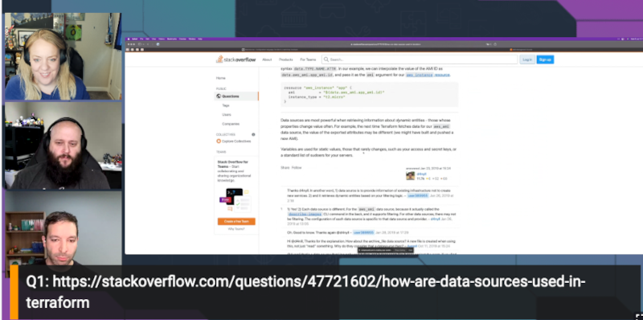

Join us for Episode 8 of Build On Live: Answered, the [Twitch](https://twitch.tv/aws) show where expert hosts review top viewed questions from the [AWS Stack Overflow Collective](https://stackoverflow.com/collectives/aws) live on air!

https://www.twitch.tv/videos/1863985265

In this episode we will be focusing on Terraform. We have selected some of the top viewed questions in the AWS Collective and built code and demos around the best answers to those questions!

## Hosts

* [**Julie Gunderson**](https://twitter.com/Julie_Gund), Senior Developer Advocate @ AWS
* [**Cobus Bernard**](https://twitter.com/cobusbernard), Senior Developer Advocate @ AWS
* [**Kerim Satirli**](https://twitter.com/ksatirli), Senior Developer Advocate @ HashiCorp

## This Weeks Questions

1. [How are data sources used in Terraform?](https://stackoverflow.com/questions/47721602/how-are-data-sources-used-in-terraform)
2. [How to attach multiple IAM policies to IAM roles using Terraform?](https://stackoverflow.com/questions/45486041/how-to-attach-multiple-iam-policies-to-iam-roles-using-terraform)
3. [Terraform: correct way to attach AWS managed policies to a role?](https://stackoverflow.com/questions/45002292/terraform-correct-way-to-attach-aws-managed-policies-to-a-role)
4. [How do I create an SSH key in Terraform?](https://stackoverflow.com/questions/49743220/how-do-i-create-an-ssh-key-in-terraform)

## Do you have ideas for questions we should review on future shows?

Let us know [HERE](https://www.pulse.aws/survey/VZHLE9FS)

## What is the Collective?

Users who join the [AWS Stack Overflow Collective](https://stackoverflow.com/collectives/aws) will find curated, centralized community resources to help them more easily discover the most up-to-date answers including those recommended or written by AWS subject matter experts, technical articles such as how-to guides, and Bulletins for upcoming events and releases.

Members can keep tabs on where they rank on the leaderboard and be promoted to Recognized Member status based on their contributions. By bringing knowledge and users together, the AWS Collective will help the community continue to learn, share, and grow.
