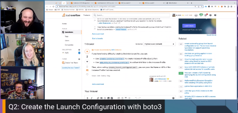

Join us for Episode 9: All About Boto3, Auto Scaling, and Chaos Engineering of Build On Answered, the [Twitch](https://twitch.tv/aws) show where expert hosts review top viewed questions from the [AWS Stack Overflow Collective](https://stackoverflow.com/collectives/aws) live on air!

https://www.twitch.tv/videos/1876114874

We would love [your feedback](https://www.pulse.aws/survey/FCUOXLAQ) and suggestions of which questions to look at in next episodes!

## Hosts

* [**Julie Gunderson**](https://twitter.com/Julie_Gund), Senior Developer Advocate @ AWS
* [**Cobus Bernard**](https://twitter.com/cobusbernard), Senior Developer Advocate @ AWS
* [**Chris Williams**](https://www.linkedin.com/in/the-devops-guy/), Solution Architect @ AWS

## This Week's Questions

1. [How is "Target Groups" different from "Auto-Scaling Groups" in AWS?](https://stackoverflow.com/questions/48529074/how-is-target-groups-different-from-auto-scaling-groups-in-aws)
2. [Create the Launch Configuration with boto3](https://stackoverflow.com/questions/76599396/create-the-launch-configuration-with-boto3)
3. [AWS Fault Injection Simulator returning 'Not authorized to perform the required action'](https://stackoverflow.com/questions/71108333/aws-fault-injection-simulator-returning-not-authorized-to-perform-the-required)

## Links shared

* [AWS Load Balancer Target Groups](https://docs.aws.amazon.com/elasticloadbalancing/latest/application/load-balancer-target-groups.html?sc_channel=el&sc_campaign=livestreams&sc_content=boa-2023-07-17&sc_geo=mult&sc_country=mult&sc_outcome=acq)
* [Introduction to Blue-Green Deployments](https://docs.aws.amazon.com/whitepapers/latest/blue-green-deployments/introduction.html?sc_channel=el&sc_campaign=livestreams&sc_content=boa-2023-07-17&sc_geo=mult&sc_country=mult&sc_outcome=acq)
* [Tutorial to show how Amazon EC2 Autoscaling can be implemented](https://aws.amazon.com/tutorials/ec2-auto-scaling-spot-instances/?sc_channel=el&sc_campaign=livestreams&sc_content=boa-2023-07-17&sc_geo=mult&sc_country=mult&sc_outcome=acq)
* [Health Checks for your Target Groups](https://docs.aws.amazon.com/elasticloadbalancing/latest/application/target-group-health-checks.html?sc_channel=el&sc_campaign=livestreams&sc_content=boa-2023-07-17&sc_geo=mult&sc_country=mult&sc_outcome=acq)
* [Learn more about Launch Templates](https://docs.aws.amazon.com/autoscaling/ec2/userguide/launch-templates.html?sc_channel=el&sc_campaign=livestreams&sc_content=boa-2023-07-17&sc_geo=mult&sc_country=mult&sc_outcome=acq)
* [What is AWS Resilience Hub?](https://docs.aws.amazon.com/resilience-hub/latest/userguide/what-is.html?sc_channel=el&sc_campaign=livestreams&sc_content=boa-2023-07-17&sc_geo=mult&sc_country=mult&sc_outcome=acq)
* [What is AWS Fault Injection Simulator](https://docs.aws.amazon.com/fis/latest/userguide/what-is.html?sc_channel=el&sc_campaign=livestreams&sc_content=boa-2023-07-17&sc_geo=mult&sc_country=mult&sc_outcome=acq)
* [Tutorials for AWS Fault Injection Simulator](https://docs.aws.amazon.com/fis/latest/userguide/fis-tutorials.html?sc_channel=el&sc_campaign=livestreams&sc_content=boa-2023-07-17&sc_geo=mult&sc_country=mult&sc_outcome=acq)
* Netflix [Simian Army](https://github.com/Netflix/SimianArmy) for causing chaos to test your system

## Do you have ideas for questions we should review on future shows?

Let us know [HERE](https://www.pulse.aws/survey/VZHLE9FS)

## What is the Collective?

Users who join the [AWS Stack Overflow Collective](https://stackoverflow.com/collectives/aws) will find curated, centralized community resources to help them more easily discover the most up-to-date answers including those recommended or written by AWS subject matter experts, technical articles such as how-to guides, and Bulletins for upcoming events and releases.

Members can keep tabs on where they rank on the leaderboard and be promoted to Recognized Member status based on their contributions. By bringing knowledge and users together, the AWS Collective will help the community continue to learn, share, and grow.
