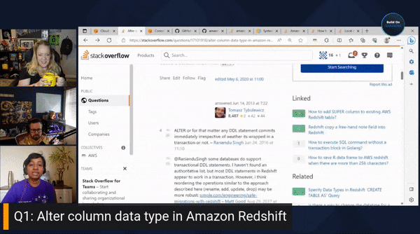

Join us for the Redshift episode of Build On Answered, the Twitch show where expert hosts review top viewed questions from the AWS Stack Overflow Collective live on air! This week we have Anusha Challa from the Redshift team answering questions

https://www.twitch.tv/videos/1900421697

## Hosts

* [**Julie Gunderson**](https://twitter.com/Julie_Gund), Senior Developer Advocate @ AWS
* [**Anusha Challa**](https://www.linkedin.com/in/anusha-challa-31600916/), Data Warehousing Solution Architect @ AWS
* [**Chris Williams**](https://www.linkedin.com/in/the-devops-guy/), Solution Architect @ AWS

## This Week's Questions

1. [Alter column data type in Amazon Redshift?](https://stackoverflow.com/questions/17101918/alter-column-data-type-in-amazon-redshift)
2. [Show tables, describe tables equivalent in redshift?](https://stackoverflow.com/questions/18733385/show-tables-describe-tables-equivalent-in-redshift)
3. [Amazon redshift: bulk insert vs COPYing from s3](https://stackoverflow.com/questions/25454477/amazon-redshift-bulk-insert-vs-copying-from-s3)

## Do you have feedback and/or ideas for questions we should review on future shows?

Let us know [HERE](https://www.pulse.aws/survey/B1J8HOF5)

## What is the Collective?

Users who join the [AWS Stack Overflow Collective](https://stackoverflow.com/collectives/aws) will find curated, centralized community resources to help them more easily discover the most up-to-date answers including those recommended or written by AWS subject matter experts, technical articles such as how-to guides, and Bulletins for upcoming events and releases.

Members can keep tabs on where they rank on the leaderboard and be promoted to Recognized Member status based on their contributions. By bringing knowledge and users together, the AWS Collective will help the community continue to learn, share, and grow.
