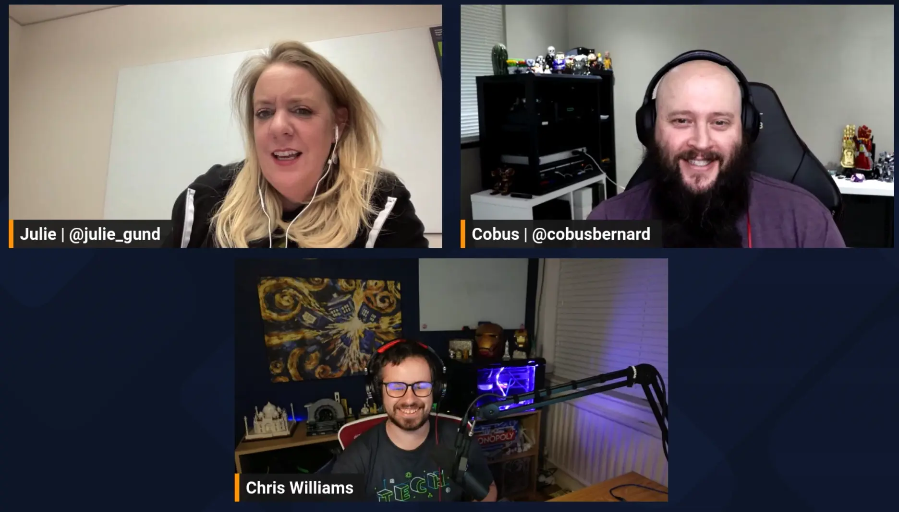

Join us for the Season 2 premier of Build On Answered where the team focusses on Amazon Bedrock questions on Stack Overflow!

https://www.twitch.tv/videos/1954377155

## Hosts

* [**Julie Gunderson**](https://twitter.com/Julie_Gund), Senior Developer Advocate @ AWS
* [**Cobus Bernard**](https://www.linkedin.com/in/cobusbernard/), Senior Developer Advocate @ AWS
* [**Chris Williams**](https://www.linkedin.com/in/the-devops-guy/), Solution Architect @ AWS

## This Week's Questions

1. [How to give AWS Bedrock access to all uses in account?](https://stackoverflow.com/questions/77099840/how-to-give-aws-bedrock-access-to-all-uses-in-account)
1. [AWS:Invoking bedrock client from boto3 throwing error](https://stackoverflow.com/questions/77250007/awsinvoking-bedrock-client-from-boto3-throwing-error)
    1. Difference between Amazon Bedrock [`bedrock`](https://boto3.amazonaws.com/v1/documentation/api/latest/reference/services/bedrock.html) and [`bedrock-runtime`](https://boto3.amazonaws.com/v1/documentation/api/latest/reference/services/bedrock-runtime.html) in [Boto3](https://boto3.amazonaws.com/v1/documentation/api/latest/index.html#).
1. [How to send a request to AWS Bedrock properly?](https://stackoverflow.com/questions/77215634/how-to-send-a-request-to-aws-bedrock-properly)

## Do you have feedback and/or ideas for questions we should review on future shows?

Let us know [HERE](https://www.pulse.aws/survey/B1J8HOF5)

## What is the Collective?

Users who join the [AWS Stack Overflow Collective](https://stackoverflow.com/collectives/aws) will find curated, centralized community resources to help them more easily discover the most up-to-date answers including those recommended or written by AWS subject matter experts, technical articles such as how-to guides, and Bulletins for upcoming events and releases.

Members can keep tabs on where they rank on the leaderboard and be promoted to Recognized Member status based on their contributions. By bringing knowledge and users together, the AWS Collective helps the community continue to learn, share, and grow.
