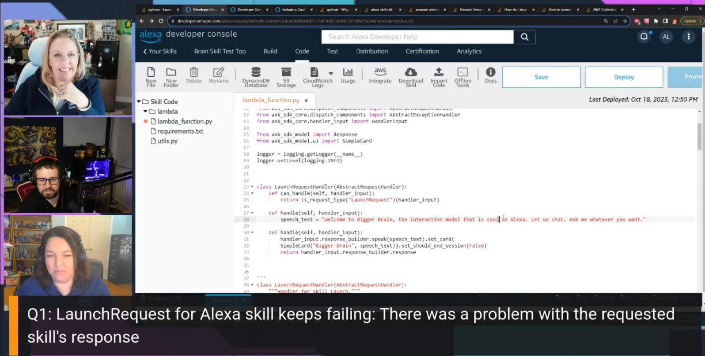

Join us for the 2nd episode is Season 2 of Build On Answered where we discuss Stack Overflow questions about Amazon Alexa from Stack Overflow with [Amanda Lange](https://www.linkedin.com/in/amandajlange/) [[X/Twitter](https://twitter.com/lita_gemini)]!

https://www.twitch.tv/videos/1964353102

## Hosts

* [**Julie Gunderson**](https://twitter.com/Julie_Gund), Senior Developer Advocate @ AWS
* [**Chris Williams**](https://www.linkedin.com/in/the-devops-guy/), Solution Architect @ AWS

## This Week's Questions

1. [LaunchRequest for Alexa skill keeps failing: There was a problem with the requested skill's response](https://stackoverflow.com/questions/77234845/launchrequest-for-alexa-skill-keeps-failing-there-was-a-problem-with-the-reques)
2. [Why is my Alexa Skill not reactiong with my intents?](https://stackoverflow.com/questions/77085171/why-is-my-alexa-skill-not-reactiong-with-my-intents)
3. [Alexa developer console simulator returning wrong intent](https://stackoverflow.com/questions/76908470/alexa-developer-console-simulator-returning-wrong-intent)

## Do you have feedback and/or ideas for questions we should review on future shows?

Let us know [HERE](https://www.pulse.aws/survey/B1J8HOF5)

## What is the Collective?

Users who join the [AWS Stack Overflow Collective](https://stackoverflow.com/collectives/aws) will find curated, centralized community resources to help them more easily discover the most up-to-date answers including those recommended or written by AWS subject matter experts, technical articles such as how-to guides, and Bulletins for upcoming events and releases.

Members can keep tabs on where they rank on the leaderboard and be promoted to Recognized Member status based on their contributions. By bringing knowledge and users together, the AWS Collective helps the community continue to learn, share, and grow.
