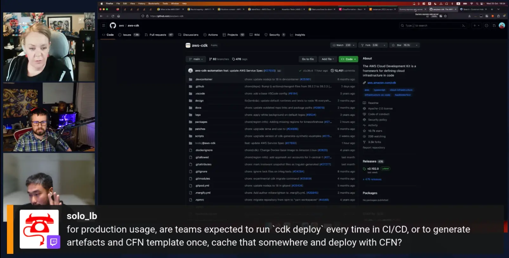

Join us for the Season 2 Episode 3 where we talk about Stack Overflow questions covering AWS CDK with Askar Serikov!

https://www.twitch.tv/videos/1960974515

## Hosts

* [**Julie Gunderson**](https://twitter.com/Julie_Gund), Senior Developer Advocate @ AWS
* [**Chris Williams**](https://www.linkedin.com/in/the-devops-guy/), Solution Architect @ AWS

## This Week's Questions

1. [What IAM permissions are needed to use CDK Deploy?](https://stackoverflow.com/questions/57118082/what-iam-permissions-are-needed-to-use-cdk-deploy)
1. [How to import existing VPC in aws cdk?](https://stackoverflow.com/questions/59301265/how-to-import-existing-vpc-in-aws-cdk)
1. [How can I create a DependsOn relation between EC2 and RDS using aws-cdk](https://stackoverflow.com/questions/61250772/how-can-i-create-a-dependson-relation-between-ec2-and-rds-using-aws-cdk)
1. [How to get logical ID of resource with CDK?](https://stackoverflow.com/questions/61803090/how-to-get-logical-id-of-resource-with-cdk)

## Do you have feedback and/or ideas for questions we should review on future shows?

Let us know [HERE](https://www.pulse.aws/survey/B1J8HOF5)

## What is the Collective?

Users who join the [AWS Stack Overflow Collective](https://stackoverflow.com/collectives/aws) will find curated, centralized community resources to help them more easily discover the most up-to-date answers including those recommended or written by AWS subject matter experts, technical articles such as how-to guides, and Bulletins for upcoming events and releases.

Members can keep tabs on where they rank on the leaderboard and be promoted to Recognized Member status based on their contributions. By bringing knowledge and users together, the AWS Collective helps the community continue to learn, share, and grow.
