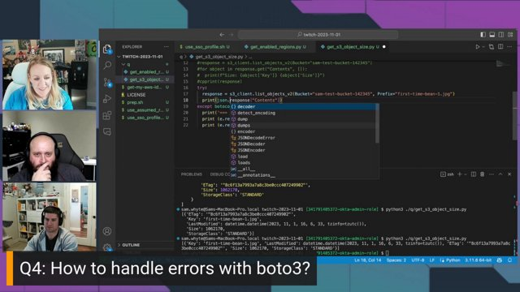

Join us for the Season 2 Episode 4 where we talk about Stack Overflow questions covering AWS SDK with Sam Whyte from Gremlin!

https://www.twitch.tv/videos/1966754111

## Hosts

* [**Julie Gunderson**](https://twitter.com/Julie_Gund), Senior Developer Advocate @ AWS
* [**Cobus Bernard**](https://www.linkedin.com/in/cobusbernard/), Senior Developer Advocate @ AWS

## Guest
* [**Sam Whyte**](https://www.linkedin.com/in/samuel-whyte-b434a565/), Principal Reliability Specialist @ [Gremlin](https://www.gremlin.com/)

## This Week's Questions

1. [How do I get the file / key size in boto S3?](https://stackoverflow.com/questions/5315603/how-do-i-get-the-file-key-size-in-boto-s3/77365128#77365128)
2. [How to identify disabled regions in AWS?](https://stackoverflow.com/questions/56182935/how-to-identify-disabled-regions-in-aws/75871763#75871763)
3. [Listing contents of a bucket with boto3](https://stackoverflow.com/questions/30249069/listing-contents-of-a-bucket-with-boto3)
4. [How to handle errors with boto3?](https://stackoverflow.com/questions/33068055/how-to-handle-errors-with-boto3)

## Do you have feedback and/or ideas for questions we should review on future shows?

Let us know [HERE](https://www.pulse.aws/survey/B1J8HOF5)

## What is the Collective?

Users who join the [AWS Stack Overflow Collective](https://stackoverflow.com/collectives/aws) will find curated, centralized community resources to help them more easily discover the most up-to-date answers including those recommended or written by AWS subject matter experts, technical articles such as how-to guides, and Bulletins for upcoming events and releases.

Members can keep tabs on where they rank on the leaderboard and be promoted to Recognized Member status based on their contributions. By bringing knowledge and users together, the AWS Collective helps the community continue to learn, share, and grow.
