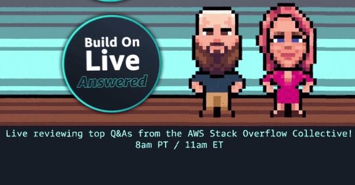

Join us for Build On Live: Answered, the [Twitch](https://twitch.tv/aws) show where expert hosts review top viewed questions from the [AWS Stack Overflow Collective](https://stackoverflow.com/collectives/aws) live on air!

Each episode, we reproduce the problems found in the top questions and build code to test out different solutions and understand the full context of each solution.

This show is as interactive as our audience makes it, so join us as we work through this together!

## Hosts

* [**Julie Gunderson**](https://twitter.com/Julie_Gund), Senior Developer Advocate @ AWS
* [**Cobus Bernard**](https://twitter.com/cobusbernard), Senior Developer Advocate @ AWS
* **Chris Williams**, Senior Solution Architect @ AWS

## Schedule

Join us for our upcoming episodes on the 1st and 3rd Wednesday of the month!!

| Upcoming Episode | Name| Date | Link to Watch |
|--|--|--|--|
| **SO01E12** | All about Kubernetes with Jérôme Petazzoni | September 6, 8am PT | [Watch here](https://twitch.tv) |
| **SO02E01** | All about Surprises | September 20, 8am PT | [Watch here](https://twitch.tv) |

Watch past episodes!

| Episode | Name| Date | Link to Watch | Link to Show Notes |
|--|--|--|--|--|
| **S01E11** | All about Amazon Redshift | August 16, 8am PT | [Watch here](https://twitch.tv) | [Show Notes](/livestreams/build-on-answered/2023-08-16)
| **S01E10** | In-studio with Cobus and Julie | August 2, 8am PT | [Watch here](https://twitch.tv)
| **S01E09** | Boto3, Autoscaling, Chaos, and More with Julie, Chris, and Cobus | July 19, 2023 | [Watch here](https://www.twitch.tv/videos/1876114874) | [Show Notes](/livestreams/build-on-answered/2023-07-19) |
| **S01E08** | More Terraform with Kerim | July 5, 2023 | [Watch here](https://www.twitch.tv/videos/1864025107 ) | [Show Notes](/livestreams/build-on-answered/2023-07-05)|
| **S01E07** | Resiliency with Seth | June 21, 2023 | [Watch here](https://www.twitch.tv/videos/1856494950 ) | [Show Notes](/livestreams/build-on-answered/2023-06-21)|
| **S01E06** | Talking Terraform with Rohini | June 7, 2023 | [Watch here](https://www.twitch.tv/videos/1850485117) | [Show Notes](/livestreams/build-on-answered/2023-06-07)|
| **S01E05** | MLOps Questions part 2 | May 17, 2023 | [Watch here](https://www.twitch.tv/videos/1850485117) | [Show Notes](/livestreams/build-on-answered/2023-05-17)|
| **S01E04** | MLOps Questions part 1 | May 3, 2023 | [Watch here](https://www.twitch.tv/videos/1850485117) | [Show Notes](/livestreams/build-on-answered/2023-05-03)|
| **S01E03** | ML Questions MLOPS | April 19, 2023 | [Watch here](https://www.twitch.tv/videos/1850485117) | [Show Notes](/livestreams/build-on-answered/2023-04-19)|
| **S01E02** | ML Questions about Amazon SageMaker | April 5, 2023 | [Watch here](https://www.twitch.tv/videos/1850485117) | [Show Notes](/livestreams/build-on-answered/2023-04-05)|
| **S01E01** | DevOps Questions | March 8, 2023 | [Watch here](https://www.twitch.tv/videos/1850485117) | [Show Notes](/livestreams/build-on-answered/2023-03-08)|

