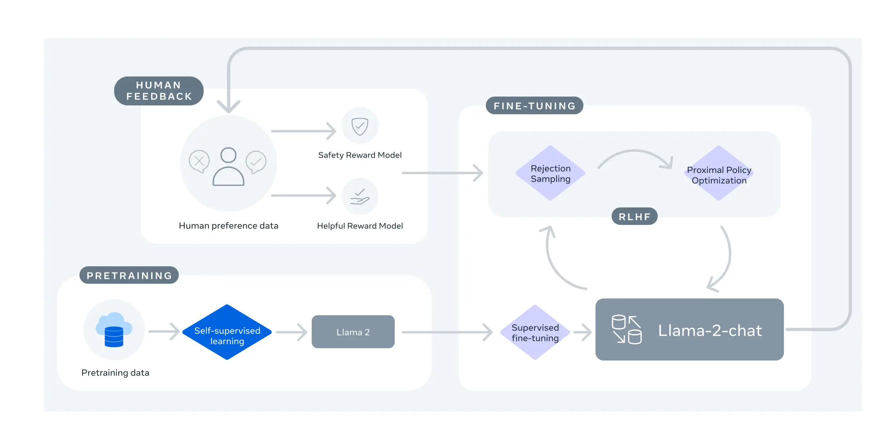

Welcome to **season 2** of Build On Generative AI! 🎉 Yes, we have heard you, and we will continue with our show, every Monday at 9AM PST/Noon EST/18h CET 👏 Today, Emily and Darko are kicking off the new season by talking about Large Language Models (duh!), and more specifically about [LLama2](https://huggingface.co/docs/transformers/main/model_doc/llama2) the latest LLM coming out of Meta!

Emily and Darko look into the [paper](https://arxiv.org/pdf/2307.09288.pdf) behind LLama2, and evaluate the model. Lastly, as is tradition - we go ahead and actually deploy the model using [SageMaker Jumpstart](https://go.aws/464j9qb) and see it live in action.

Check out the recording here:

https://www.twitch.tv/videos/1900520389

## Links from today's episode

- [LLama2 Paper](https://arxiv.org/pdf/2307.09288.pdf)
- [SageMaker Jumpstart](https://bit.ly/4437dmY)
- [LLama2 on SageMaker Jumpstart](https://aws.amazon.com/blogs/machine-learning/llama-2-foundation-models-from-meta-are-now-available-in-amazon-sagemaker-jumpstart/?sc_channel=el&sc_campaign=livestreams&sc_content=build-on-live&sc_geo=mult&sc_country=mult&sc_outcome=acq)

**Reach out to the hosts and guests:**

- Emily: [https://www.linkedin.com/in/emily-webber-921b4969/](https://www.linkedin.com/in/emily-webber-921b4969/) 
- Darko: [https://twitter.com/darkosubotica](https://twitter.com/darkosubotica)
