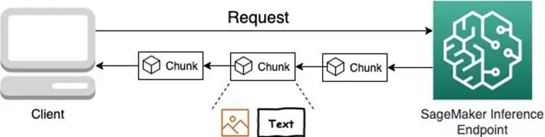

Before we start, if you are intersted in **Cost Optimization**, make sure to check out our Build On Live show that is happening on the **28th of September 2023, at 8AM PST**, LIVE 🟣 right here on https://twitch.tv/aws. More information (and a funny video) can be found [HERE](https://www.linkedin.com/feed/update/urn:li:activity:7107025923568259072/)



In today's episode Darko is joined by Raghu, as they explore the wonderfull world of Amazon SageMaker hosting endpoints. This time, looking into the [brand new feature - Streaming](https://aws.amazon.com/blogs/machine-learning/elevating-the-generative-ai-experience-introducing-streaming-support-in-amazon-sagemaker-hosting/?sc_channel=el&sc_campaign=livestreams&sc_content=build-on-generative-ai&sc_geo=mult&sc_country=mult&sc_outcome=acq). No, not that kind of streaming, rather it's the kind where we get to stream the respones out of a LLM. This means that instead of waiting for the LLM to generate the response and then get the whole response back to the user, we are streaming the response as it is being made. Definitely making the experience working with a LLM hosted by SageMaker that much better.

To enable this, just make sure your `serving.properties` file contains something like this:
```text
engine=MPI 
option.model_id=tiiuae/falcon-7b-instruct
option.trust_remote_code=true
option.tensor_parallel_degree=1
option.max_rolling_batch_size=32
option.rolling_batch=auto
option.output_formatter=jsonlines
option.paged_attention=false
option.enable_streaming=true
```
The last option `option.enable_streaming=true` is the one that does the magic 🪄

Check out the recording here:

https://www.twitch.tv/videos/1922979917

## Links from today's episode

- [Blog post about the streaming feature](https://aws.amazon.com/blogs/machine-learning/elevating-the-generative-ai-experience-introducing-streaming-support-in-amazon-sagemaker-hosting/?sc_channel=el&sc_campaign=livestreams&sc_content=build-on-generative-ai&sc_geo=mult&sc_country=mult&sc_outcome=acq)
- [The code we used today](https://github.com/aws-samples/sagemaker-hosting/tree/main/GenAI-Hosting/Large-Language-Model-Hosting/LLM-Streaming)
- [Deep Learning Containers](https://docs.aws.amazon.com/sagemaker/latest/dg/large-model-inference-dlc.html?sc_channel=el&sc_campaign=livestreams&sc_content=build-on-generative-ai&sc_geo=mult&sc_country=mult&sc_outcome=acq)
- [Falcon 7b on Hugging face](https://huggingface.co/tiiuae/falcon-7b)


**Reach out to the hosts and guests:**

- Raghu: [https://www.linkedin.com/in/raghunandannr/](https://www.linkedin.com/in/raghunandannr/)
- Darko: [https://www.linkedin.com/in/darko-mesaros/](https://www.linkedin.com/in/darko-mesaros/)
