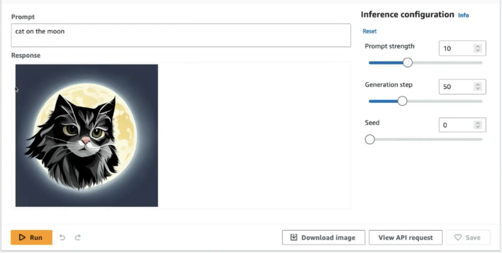

The day is finally here, [Amazon Bedrock](https://aws.amazon.com/bedrock/?sc_channel=el&sc_campaign=livestreams&sc_content=build-on-generative-ai&sc_geo=mult&sc_country=mult&sc_outcome=acq) is Available to all! 🥳 It's been a while since it was in preview, but we are very happy to finally have access to it now that it is Generally Available. Today Emily and Darko are joined by Mark, a Principal AI/ML Specialist SA as we take a look at how Amazon Bedrock works, why it exists, and how you can get your hands on it. (Hint: You can use a wonderful [workshop](https://github.com/aws-samples/amazon-bedrock-workshop)).

But, to make your first Amazon Bedrock steps - go check out the [playground](https://docs.aws.amazon.com/bedrock/latest/userguide/text-playground.html?sc_channel=el&sc_campaign=livestreams&sc_content=build-on-generative-ai&sc_geo=mult&sc_country=mult&sc_outcome=acq) 👏

Lastly, as we bid farewell to Mark, Emily and Darko look in what it takes to mitigate Bias in Large Language Models.

Finally, I bring you the most amazing words from Amazon Bedrock it self, as a goodbye to the episode:

```
Human: Write me a goodbye message to Twitch Chat!

Here is a goodbye message to Twitch Chat:

Well Twitch Chat, it's been fun hanging out with all of you! I know we've had some wild conversations and crazy moments together. You always keep me on my toes with your wild emotes, spam, and memes. Even when you're trolling me, I can't help but laugh at your antics. I appreciate you all coming to spend time with me and being part of the community. Sadly, all good things must come to an end eventually. I'm signing off for now, but I hope to see your familiar usernames again soon! Stay awesome Twitch Chat. Until next time, this is goodbye! *sends heart emote*
```

Check out the recording here:

https://www.twitch.tv/videos/1950916227

## Links from today's episode

- [Bedrock Workshop](https://github.com/aws-samples/amazon-bedrock-workshop)
- [Bias mitigation for LLMs](https://github.com/aws-samples/bias-mitigation-for-llms)
- [Using bedrock with RAG notebook](https://github.com/aws-samples/amazon-bedrock-workshop/blob/main/03_QuestionAnswering/02_qa_w_rag_claude_pinecone.ipynb)

**Reach out to the hosts and guests:**

- Emily: [https://www.linkedin.com/in/emily-webber-921b4969/](https://www.linkedin.com/in/emily-webber-921b4969/) 
- Darko: [https://www.linkedin.com/in/darko-mesaros/](https://www.linkedin.com/in/darko-mesaros/)
