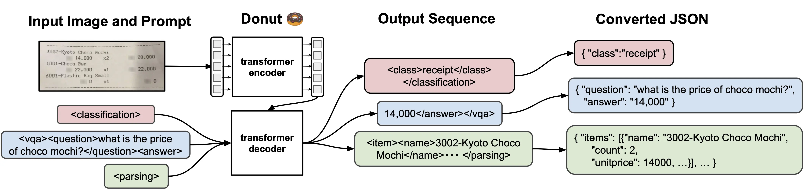

The ability to read text from images and documents has been around for a long time. But that text we get is often just a bunch of unstructured strings. Taking a step further, we could use something like [Amazon Textract](https://aws.amazon.com/textract/?sc_channel=el&sc_campaign=livestreams&sc_content=build-on-live&sc_geo=mult&sc_country=mult&sc_outcome=acq) to get more information and sense from a document. But what if we take it *even* further and utilize Generative AI to aid us further. Well, in today's session Emily and Darko are joined by Arlind to discuss and show just that! 🥳

Check out the recording here:

https://www.twitch.tv/videos/1970457460

## Links from today's episode

- [Donut](https://github.com/clovaai/donut)

**Reach out to the hosts and guests:**

- Arlind: [https://www.linkedin.com/in/arlind-nocaj/](https://www.linkedin.com/in/arlind-nocaj/)
- Emily: [https://www.linkedin.com/in/emily-webber-921b4969/](https://www.linkedin.com/in/emily-webber-921b4969/) 
- Darko: [https://www.linkedin.com/in/darko-mesaros/](https://www.linkedin.com/in/darko-mesaros/)
