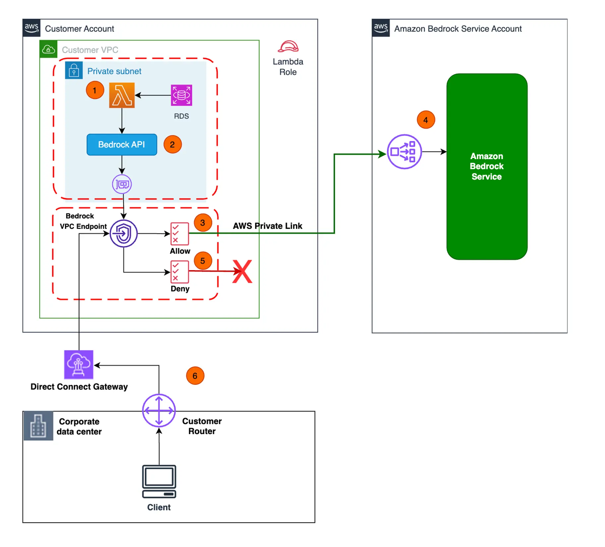

Today, Darko is joined by Ram, as we look into the way to secure you Amazon Bedrock workloads. More specifically we discuss and demonstrate how to setup [AWS PrivateLink](https://aws.amazon.com/privatelink/?sc_channel=el&sc_campaign=livestreams&sc_content=build-on-generative-ai&sc_geo=mult&sc_country=mult&sc_outcome=acq) to securely communicate with the Amazon Bedrock Service. Ram shows us how to configure the VPC, Permissions and anything else needed to have your Lambda functions communicate with Amazon Bedrock via the AWS PrivateLink.

If you want to follow along, there is a [Blog Post](https://aws.amazon.com/blogs/machine-learning/use-aws-privatelink-to-set-up-private-access-to-amazon-bedrock/?sc_channel=el&sc_campaign=livestreams&sc_content=build-on-generative-ai&sc_geo=mult&sc_country=mult&sc_outcome=acq) available for your reading pleasure! 🥳

The thing that really stood out to me is the ability to setup Endpoint policies that only allow invoking a specific model 👏
```json
{
	"Version": "2012-10-17",
	"Statement": [
		{
		    "Action": [
		        "bedrock:InvokeModel"
		        ],
		    "Resource": [
		        "arn:aws:bedrock:*::foundation-model/anthropic.claude-instant-v1"
		        ],
		    "Effect": "Allow",
		    "Principal": {
                "AWS": "arn:aws:iam::<accountid>:role/GenAIStack-Bedrock"
            }
		}
	]
}
```

To learn more, and see how we set all this up. Check out the recording here:

https://www.twitch.tv/videos/1970690862

## Links from today's episode
- [Amazon Bedrock](https://aws.amazon.com/bedrock/?sc_channel=el&sc_campaign=livestreams&sc_content=build-on-generative-ai&sc_geo=mult&sc_country=mult&sc_outcome=acq)
- [Blog post by Ram](https://aws.amazon.com/blogs/machine-learning/use-aws-privatelink-to-set-up-private-access-to-amazon-bedrock/?sc_channel=el&sc_campaign=livestreams&sc_content=build-on-generative-ai&sc_geo=mult&sc_country=mult&sc_outcome=acq)

**Reach out to the hosts and guests:**

- Ram: [https://www.linkedin.com/in/ramvittal/](https://www.linkedin.com/in/ramvittal/)
- Darko: [https://www.linkedin.com/in/darko-mesaros/](https://www.linkedin.com/in/darko-mesaros/)
