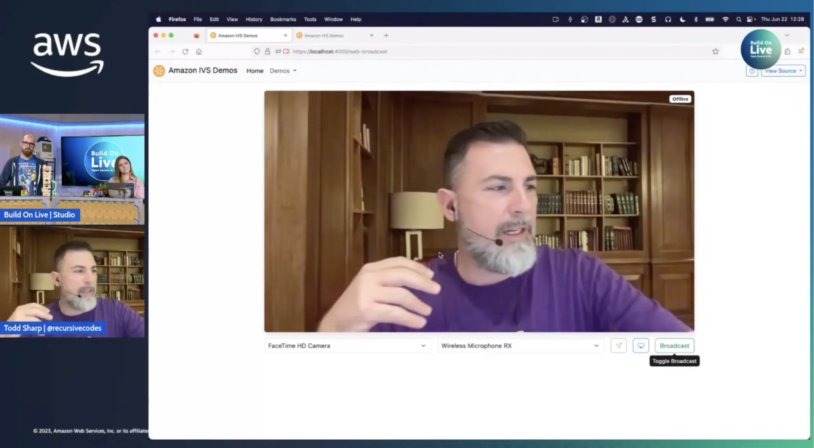

Live streaming is massively popular due to its interactive and unpredictable nature. But, the unpredictability means that sometimes less than desirable events can be live streamed and that offensive, insensitive chat messages are posted in chat messages during a live stream. Manual admin intervention can be used to prevent or stop offensive live streams and moderate inappropriate chat messages, but manual intervention isn't always 100% perfect. Automated moderation can help, but lacks the contextual awareness of the manual approach. The best approach is a healthy mix of manual and automatic moderation. In this session, we'll look at the various approaches to moderating a live stream and how they can be approved with the help of AI and ML. We'll look at how to analyze portions of a live stream for offensive or inappropriate content and use that analysis as a prompt for moderator intervention. 

To get the full guide how to deploy this yourself, as well as the code, make sure to check out Todd's blog post in the link section below.

If you are looking to check out [Amazon IVS](https://aws.amazon.com/pm/ivs/?sc_channel=el&sc_campaign=livestreams&sc_geo=mult&sc_country=mult&sc_outcome=acq&sc_content=livestream-spaces), give their demos a try over at [https://ivs.rocks](https://ivs.rocks).

Check out the recording here:

https://www.youtube.com/watch?v=nI7UaHJbm5Q&t=6723s

## Links from today's episode

- [Todd's blog post with all the code](https://dev.to/aws/creating-safer-online-communities-with-aiml-content-moderation-1bn)
- [CDK Code](https://gist.github.com/recursivecodes/296abd02411a3dc017d31c414672085a)
- [Lambda function Code](https://gist.github.com/recursivecodes/ca464a29fc38ef0399d8f2b64b838817)

**🐦 Reach out to the hosts and guests:**

Todd: [https://twitter.com/gjyoungjr](https://twitter.com/gjyoungjr)

Mike: [https://www.linkedin.com/in/mikegchambers/](https://www.linkedin.com/in/mikegchambers/)

Jacquie: [https://twitter.com/devopsjacquie](https://twitter.com/devopsjacquie)
