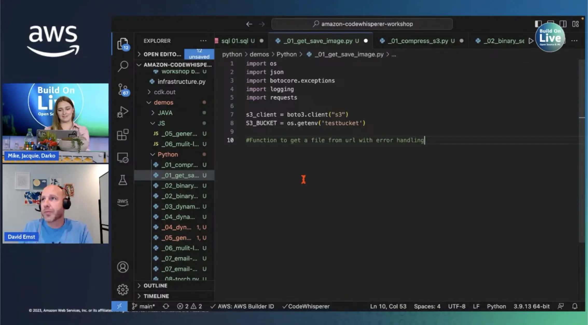

Writing code can be hard, it IS fun, but can be frustrating at times. What if you had a little helper sitting in your favorite IDE, and you can ask it to suggest code snippets for specific asks? Well, let me introduce you to that little helper - [Amazon CodeWhisperer](https://aws.amazon.com/codewhisperer/?sc_channel=el&sc_campaign=livestreams&sc_geo=mult&sc_country=mult&sc_outcome=acq&sc_content=livestream-spaces). The latest tool that can utilize AI to help you write better code.

We are joined by David today, who shows us the ins and outs of this tool, and how you can get started using it for free. 👏 Make sure to check out the workshop in the links down below if you wish some hands on experience.

Check out the recording here:

https://www.youtube.com/watch?v=nI7UaHJbm5Q&t=15060s

## Links from today's episode

- [CodeWhisperer workshop](https://catalog.us-east-1.prod.workshops.aws/workshops/6838a1a5-4516-4153-90ce-ac49ca8e1357)

**🐦 Reach out to the hosts and guests:**

David: [https://www.linkedin.com/in/davidmernst/](https://www.linkedin.com/in/davidmernst/)

Jacquie: [https://twitter.com/devopsjacquie](https://twitter.com/devopsjacquie)

Mike: [https://www.linkedin.com/in/mikegchambers/](https://www.linkedin.com/in/mikegchambers/)

Darko: [https://twitter.com/darkosubotica](https://twitter.com/darkosubotica)
