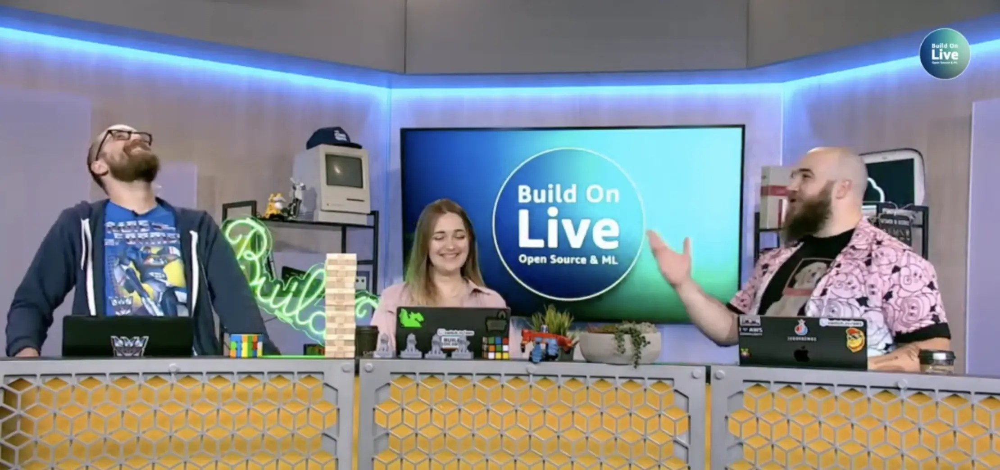

Join the second Build On Live Event of 2023:  Build On Live | Open Source & ML! The Developer Advocate hosts will be chatting with expert guests about various top of mind topics from the open source and machine learning worlds. By tuning into this event you can expect to learn about key areas like: building applications & tools using AI, how to use AI to boost your productivity, how to use AI responsibly, & much more.

## Hosts of the show

Everyone is friends, so join in the conversation both on or off the air with your hosts!

- Mike Chambers, Specialist Developer Advocate: From the far flung lands of Brisbane, Australia. Reach out to him on [Twitter](https://twitter.com/mikegchambers) or [LinkedIn](https://www.linkedin.com/in/mikegchambers/).
- Jacquie Grindrod, Senior Developer Advocate: Coming in from Vancouver, BC. Talk with her on [Twitter](https://twitter.com/devopsjacquie) or [LinkedIn](https://www.linkedin.com/in/jacquelyne-grindrod/).
- Darko Mesaroš (Дарко Месарош), Senior Developer Advocate: Driving all the way up from Seattle, WA. Talk with him on [Twitter](https://twitter.com/darkosubotica) or [LinkedIn](https://www.linkedin.com/in/darko-mesaros/).

## Schedule and Show notes

Here is the schedule of the day and the show notes of each session:

|  Name | Speaker | Link to Show Notes
|--|--|--|
| Using Large Language Models to Chat to Your Documents | Heiko Hotz, Sr. Machine Learning SA, AWS  | [Show Notes](./open-source-and-machine-learning/using-llms-to-chat-to-your-documents) |
| Video Translation Using AI | Gilbert Young Jr, Sr. Serverless Developer, Serverless Guru | [Show Notes](./open-source-and-machine-learning/video-translation-using-ai) |
|  Creating Safer Online Communities using AI | Todd Sharp, Principal Developer Advocate, Amazon IVS, Twitch  | [Show Notes](./open-source-and-machine-learning/creating-safer-online-communities-using-ai) |
|  Responsibility and Security in Generative AI | Mike Chambers, Specialist Developer Advocate, AWS  | [Show Notes](./open-source-and-machine-learning/responsibility-and-security-with-generative-ai) |
|  Reinforcement Learning With Human Feedback | Emily Webber, Principal AI/ML Specialist SA, AWS | [Show Notes](./open-source-and-machine-learning/responsibility-and-security-with-generative-ai) |
|  Generating Code With Amazon CodeWhisperer | David Ernst, Sr. DevOps Specialist SA, AWS | [Show Notes](./open-source-and-machine-learning/generating-code-with-codewhisperer) |

If you rather check out the entire live stream from the start to the end (technical issues and all), you can do so here:

https://www.youtube.com/watch?v=nI7UaHJbm5Q
