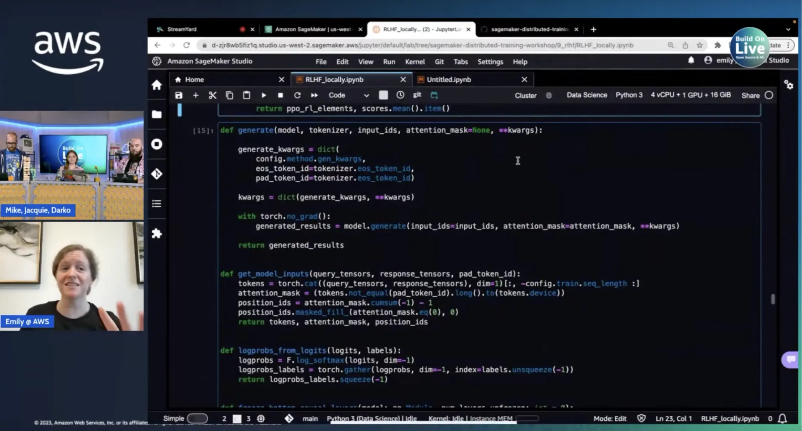

Emily Webber is joining us, all the way from the CVPR (Computer Vision and Pattern Recognition) conference in Vancouver. Today she is talking to us all about Reinforcement Learning with Human Feedback (RLHF). We talk about reward functions, supervised learning, and yes - reinforcement learning, but in the scope of Generative AI.

If you are interested in diving deeper into the world of RLHF, check out the workshop down below and give it a go yourself. Make sure to he workshop a follow, as there are new features which are currently a work in progress, and you do not want to miss out on that.

Check out the recording here:

https://www.youtube.com/watch?v=nI7UaHJbm5Q&t=12221s

## Links from today's episode

- [Sagemaker Distributed Training Workshop](https://github.com/aws-samples/sagemaker-distributed-training-workshop/blob/main/9_rlhf/RLHF_locally.ipynb)

**🐦 Reach out to the hosts and guests:**

Emily: [https://www.linkedin.com/in/emily-webber-921b4969/](https://www.linkedin.com/in/emily-webber-921b4969/)

Jacquie: [https://twitter.com/devopsjacquie](https://twitter.com/devopsjacquie)

Mike: [https://www.linkedin.com/in/mikegchambers/](https://www.linkedin.com/in/mikegchambers/)

Darko: [https://twitter.com/darkosubotica](https://twitter.com/darkosubotica)
