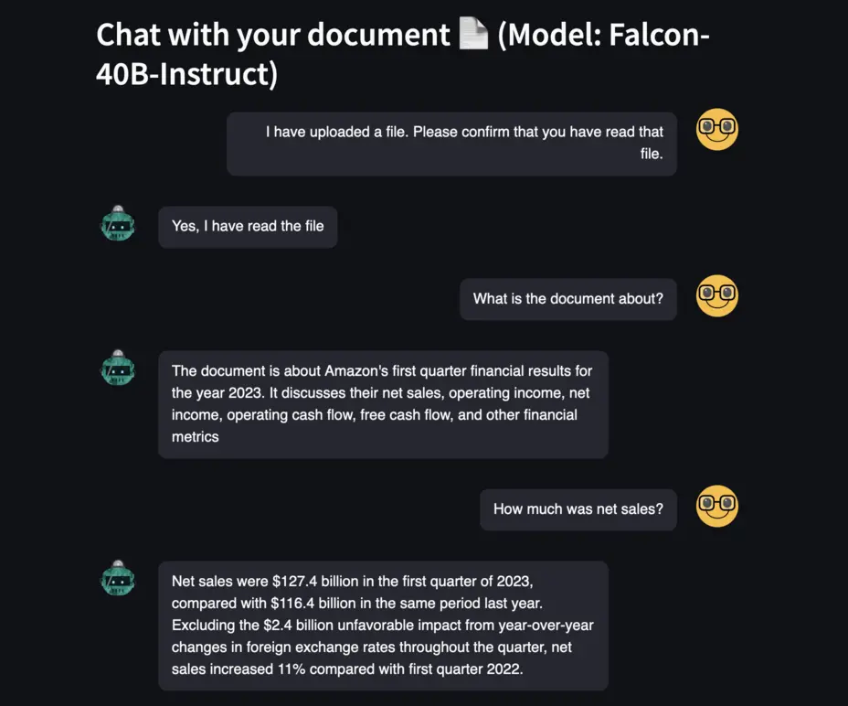

Are you ready to build a chat bot? And not just any kind of chat bot. A chat bot that will  represent a document you send it. Yes, you can ask it questions about itself, and it will respond 🤯. Heiko is joining us today on how he has built that. And, how you can follow along and build it yourself, all out of open source elements.
 
We challenge you to build this chat bot and improve upon it. Go ahead, the link to the code is down at the bottom, give it a shot 👏

Check out the recording here:

https://www.youtube.com/watch?v=nI7UaHJbm5Q&t=2064s

## Links from today's episode

- [Github Repo with all the code used](https://github.com/marshmellow77/falcon-document-chatbot)
- [Falcon Open Source LLM model](https://www.tii.ae/news/uaes-technology-innovation-institute-launches-open-source-falcon-40b-large-language-model)
- [StreamLit](https://streamlit.io/)
- [LangChain](https://api.python.langchain.com/en/latest/)

**🐦 Reach out to the hosts and guests:**

Heiko: [https://www.linkedin.com/in/heikohotz/](https://www.linkedin.com/in/heikohotz/)

Mike: [https://www.linkedin.com/in/mikegchambers/](https://www.linkedin.com/in/mikegchambers/)

Darko: [https://twitter.com/darkosubotica](https://twitter.com/darkosubotica)
