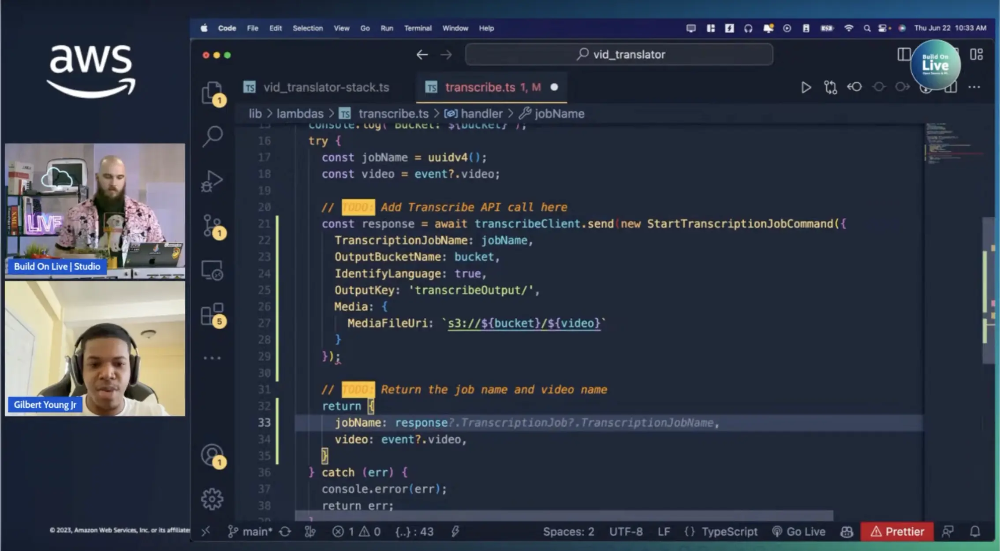

In this session we are joined by Gilbert Young Jr., as he demos the tool he as built for translating videos using AI. Not only does it translate the content of the video, but it also uses speech synthesis to produce an audio version of the translation. But wait, that's not all - Gilbert also decides to do something few people are willing to do. He is building in a new feature LIVE on stream. So brave. Make sure to check out the session below, check out the tool Gilbert made, and give him a follow on Twitter.

Check out the recording here:

https://www.youtube.com/watch?v=nI7UaHJbm5Q&t=4093s

## Links from today's episode

- [GraphixAi](https://app.graphixai.com)
- [Natural TTS synthesis by conditioning WAVENET on MEL spectrogram predictions](https://arxiv.org/pdf/1712.05884v2.pdf)
- [Speech Synthesis Resources](https://paperswithcode.com/task/speech-synthesis)

**🐦 Reach out to the hosts and guests:**

Gilbert: [https://twitter.com/gjyoungjr](https://twitter.com/gjyoungjr)

Mike: [https://www.linkedin.com/in/mikegchambers/](https://www.linkedin.com/in/mikegchambers/)

Darko: [https://twitter.com/darkosubotica](https://twitter.com/darkosubotica)
