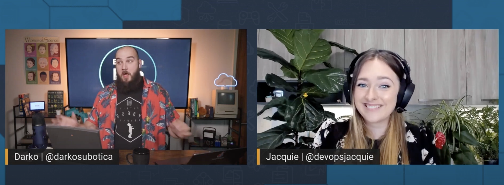

Welcome to the first episode of Build on Weekly! 🥳 Here we introduce ourselves, say hi to chat, and tell you what this show is all about. We will be posting here, on buildon.aws, to **share show notes, links, socials, code, and any other things mentioned during the live stream** with you! 🚀

If you miss an episode, don't worry! We will upload recordings of all our episodes to this youtube [playlist](https://youtube.com/playlist?list=PLDqi6CuDzubwBQdL4N1tVUwWeNEtOG9vL)! Make sure to smash that like and subscribe button! 🥹

## Deployed Weekly

https://youtu.be/Fg8tHF054l4

Let's look at some news, blog posts, and interesting tidbits from the previous week.

**Links from the discussion:**

- Get a free MFA Token if you are an US AWS User: [https://aws.amazon.com/blogs/security/eligible-customers-can-now-order-a-free-mfa-security-key/](https://aws.amazon.com/blogs/security/eligible-customers-can-now-order-a-free-mfa-security-key/)
- CloudWatch logs integration with Visual Studio Code: [https://aws.amazon.com/about-aws/whats-new/2022/06/aws-toolkit-visual-studio-amazon-cloudwatch-logs-integration/](https://aws.amazon.com/about-aws/whats-new/2022/06/aws-toolkit-visual-studio-amazon-cloudwatch-logs-integration/)
- Launch a static Website on AWS, with Pulumi, with 10 lines of YAML: [https://www.pulumi.com/blog/deploy-aws-static-website-with-yaml/](https://www.pulumi.com/blog/deploy-aws-static-website-with-yaml/)
- Great blog post by Matt Asay on the actual implementations of Test Driven Development: [https://www.techrepublic.com/article/test-driven-development-talked/](https://www.techrepublic.com/article/test-driven-development-talked/)
- Check out Cloud Quests, a gamified way to a Cloud Practitioner: [https://explore.skillbuilder.aws/learn/course/external/view/elearning/11458/aws-cloud-quest-cloud-practitioner](https://explore.skillbuilder.aws/learn/course/external/view/elearning/11458/aws-cloud-quest-cloud-practitioner)

## Open Source Corner

https://youtu.be/S7xuTViq2r0

Today we have the wonderful David Nalley, a recovering system administrator and the president of the Apache Software Foundation. We use this opportunity to chat to David about all things Open Source.

His advice for folks looking to get involved in Open Source Software? Get involved where the community communicates and jump in!

**Links from the discussion:**

- Microsoft Open Sources SBOM generation tool: [https://devblogs.microsoft.com/engineering-at-microsoft/microsoft-open-sources-salus-software-bill-of-materials-sbom-generation-tool/](https://devblogs.microsoft.com/engineering-at-microsoft/microsoft-open-sources-salus-software-bill-of-materials-sbom-generation-tool/)
- Bottle Rocket: [https://github.com/bottlerocket-os/bottlerocket](https://github.com/bottlerocket-os/bottlerocket)

## Weekly Builds

https://youtu.be/giNSFJcNJnU

During Weekly Builds we showcase tools we can leverage to build on the cloud. Today's tool is all about managing costs We have a look at Infracost, an open source tool that looks at your CloudFormation and Terraform templates and estimates for you how much they will cost to run.

**Links from the discussion:**

- Check out Infracost, an Open Source tool to help you a glance of cloud costs, before you make that deployment: [https://www.infracost.io/](https://www.infracost.io/)

**🐦 Reach out to the hosts and guests:**

David Nalley: [https://twitter.com/ke4qqq](https://twitter.com/ke4qqq)
Jacquie: [https://twitter.com/devopsjacquie](https://twitter.com/devopsjacquie)
Darko: [https://twitter.com/darkosubotica](https://twitter.com/darkosubotica)