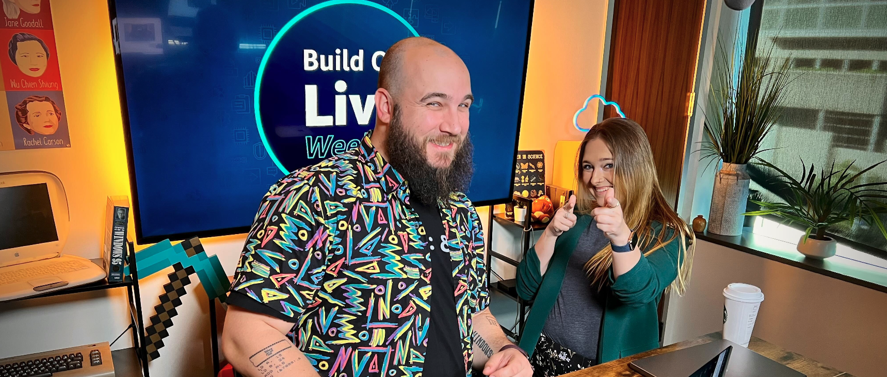

Welcome to episode 2 of Build On Weekly! 🥳 Today is all about Terraform and building stuff with it. Namely, in this episode, we have built a Minecraft server, running on EC2, with some Terraform Magic.

We will be posting here, on [BuildOn.aws](/livestreams/build-on-weekly), to **share show notes, links, socials, code, and any other things mentioned during the live stream** with you! 🚀



If you miss an episode, don't worry! We will upload recordings of all our episodes to this youtube [playlist](https://youtube.com/playlist?list=PLDqi6CuDzubwBQdL4N1tVUwWeNEtOG9vL)! Make sure to smash that like and subscribe button! 🥹

## Deployed Weekly

https://www.youtube.com/watch?v=zIEuCbwZWK8

Let's look at some news, blog posts, and interesting tidbits from the previous week.

**Links from the discussion:**

It is July 21st 2022, and today we have more news from **Infracost**, we are checking out a blog post on **Blazor WebAssembly**. AWS Open sourced **CloudScape**, Google came out with **Carbon** an experimental new language taking to replace C++, and teach yourself some **ML GPU programming**!

This was another edition of - Deployed weekly

**Links from the discussion:**

- You can now view the costs of your Terraform templates, straight from Visual Studio code with this Infracost plugin: [https://github.com/infracost/vscode-infracost](https://github.com/infracost/vscode-infracost)
- Looking to build Web applications with some dotnet? Well Blazor WebAssembly is maybe for you. Our colleague [Francois](https://twitter.com/fbouteruche), wrote a blog post on some first steps when it comes to using the [ASP.NET](http://ASP.NET) Core Blazor WebAssembly framework: [Medium Blog post](https://medium.com/i-love-my-local-farmer-engineering-blog/blazor-webassembly-applications-7cfece9609f6)
- If you are looking to build products with the same Design System we use here at AWS, check out CloudScape - an open source solution to building user experiences: [https://cloudscape.design/](https://cloudscape.design/)
- Carbon Language -  An experimental successor to C++: [GitHub repo](https://github.com/carbon-language/carbon-lang)
- Are you having fun with Machine Learning? Go and teach yourself beginner GPU programming with this wonderful notebook: [GitHub repo](https://github.com/srush/GPU-Puzzles)

## Weekly Builds - Infrastructure as Code, Terraform and Minecraft

https://youtu.be/5jAtZQMyB_c

Today, Jacquie and Darko discussed [Infrastructure as Code](/tags/infrastructure-as-code) (IaC), why should you care about it, how to approach it, and what does it take to get started.

Speaking of getting started, on this episode we took upon the challenge of building on a Minecraft server, running on EC2, with Terraform.

The goal was to create a simple EC2 virtual machine running on AWS, install and configure all the necessary pieces of software on it to run Minecraft.

On top of that we will use GNU screen to monitor the launch of Minecraft. And instead of using SSH, we will be using AWS Systems Manager - Session manager to log into the system.

Here is the code we ended up building:

```terraform
# Setting up the AWS Terraform provider
terraform {
  required_providers {
    aws = {
      source  = "hashicorp/aws"
      version = "~> 4.22"
    }
  }
}

provider "aws" {
  profile = "default"
  region  = "us-west-2"
}

# Just a variable with the URL to the Minecraft server JAR (this changes over time)
variable "mojang_server_url" {
  type    = string
  default = "https://launcher.mojang.com/v1/objects/e00c4052dac1d59a1188b2aa9d5a87113aaf1122/server.jar"
}

# Security - we need to allow a specific port to our EC2 instance
resource "aws_security_group" "minecraft" {
  ingress {
    description = "Minecraft port"
    from_port   = 25565
    to_port     = 25565
    protocol    = "tcp"
    cidr_blocks = ["0.0.0.0/0"]
  }
  egress {
    description = "Send Anywhere"
    from_port   = 0
    to_port     = 0
    protocol    = "-1"
    cidr_blocks = ["0.0.0.0/0"]
  }
  tags = {
    Name = "Minecraft Security Group"
  }
}

# EC2 Instance - THIS is where our Minecraft server runs
resource "aws_instance" "minecraft" {
  ami                         = "ami-098e42ae54c764c35"
  instance_type               = "t2.xlarge"
  vpc_security_group_ids      = [aws_security_group.minecraft.id]
  associate_public_ip_address = true

## This role is specific to my account, so make sure to attach an IAM role relevant to your setup.
  iam_instance_profile        = "SSMEC2Role"
  root_block_device {
    volume_size = 30
  }

## This is a bash script that will be executed during the first launch of the Virtual Machine, and it sets up all we need to run Minecraft
  user_data = <<-EOF
    #!/bin/bash
    sudo yum -y update
    sudo rpm --import https://yum.corretto.aws/corretto.key
    sudo curl -L -o /etc/yum.repos.d/corretto.repo https://yum.corretto.aws/corretto.repo
    sudo yum install -y java-17-amazon-corretto-devel.x86_64
    wget -O server.jar ${var.mojang_server_url}
    java -Xmx1024M -Xms1024M -jar server.jar nogui
    sed -i 's/eula=false/eula=true/' eula.txt
    screen -d -m java -Xmx1024M -Xms1024M -jar server.jar nogui
    EOF
  tags = {
    Name = "Minecraft Server"
  }
}

output "instance_ip_addr" {
  value = aws_instance.minecraft.public_ip
}
```

## Links from the discussion

- Infrastructure as Code: [Wiki page](https://en.wikipedia.org/wiki/Infrastructure_as_code)
- Terraform: [Terraform documentation](https://www.terraform.io/downloads)
- Github repo we based our build on: [GitHub repo](https://github.com/HarryNash/terraform-minecraft)
- Minecraft server download URL: [Where you can find the server URL](https://www.minecraft.net/en-us/download/server)
- AWS SSM - Session manager: [Docs page](https://docs.aws.amazon.com/systems-manager/latest/userguide/session-manager.html)
- GNU Screen: [Website](https://www.gnu.org/software/screen/)

**🐦 Reach out to the hosts and guests:**

Jacquie: [https://twitter.com/devopsjacquie](https://twitter.com/devopsjacquie)
Darko: [https://twitter.com/darkosubotica](https://twitter.com/darkosubotica)