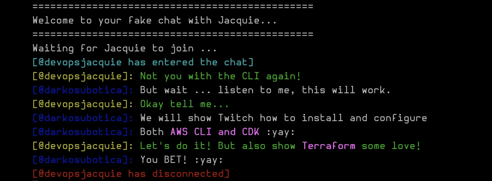

Welcome to episode 3 of Build On Weekly! 🥳 Today Jacquie and Darko dive into installing various CLI tools and Utilities for AWS. Tools like the AWS CLI and AWS CDK (Cloud Development Kit).

We will be posting here, on [Community.aws](/livestreams/build-on-weekly), to **share show notes, links, socials, code, and any other things mentioned during the live stream** with you! 🚀



If you miss an episode, don't worry! We will upload recordings of all our episodes to this youtube [playlist](https://youtube.com/playlist?list=PLDqi6CuDzubwBQdL4N1tVUwWeNEtOG9vL)! Make sure to smash that like and subscribe button! 🥹

## Deployed Weekly

https://www.youtube.com/watch?v=Oc1kMmvGytY

Today, on **Deployed Weekly**, we will cover a **Threat Modeling workshop**, discuss **IAM roles anywhere** and the newly released **Global tables for Amazon Neptune**. We will also check out a blog post on **tracking down NAT Gateway costs**, and wrap up with some **PowerTools for your Lambda functions**!

**Links from the discussion:**

- Community Blog Post, by [Geoffrey Wiseman](https://dev.to/geoffreywiseman) - On **tracking down NAT Costs**: [https://dev.to/aws-builders/nat-gateway-charges-from-ecs-service-restart-3p1c](https://dev.to/aws-builders/nat-gateway-charges-from-ecs-service-restart-3p1c)
- **IAM Roles anywhere:** [https://aws.amazon.com/about-aws/whats-new/2022/07/aws-identity-access-management-iam-roles-anywhere-workloads-outside-aws/](https://aws.amazon.com/about-aws/whats-new/2022/07/aws-identity-access-management-iam-roles-anywhere-workloads-outside-aws/)
- **Threat modeling workshop:** [https://catalog.workshops.aws/threatmodel/en-US](https://catalog.workshops.aws/threatmodel/en-US)
- **Amazon Neptune Global Database:** [https://aws.amazon.com/about-aws/whats-new/2022/07/amazon-neptune-global-database/](https://aws.amazon.com/about-aws/whats-new/2022/07/amazon-neptune-global-database/)
- **AWS Lambda Powertools for TypeScript is now GA:**[https://aws.amazon.com/blogs/compute/simplifying-serverless-best-practices-with-aws-lambda-powertools-for-typescript/](https://aws.amazon.com/blogs/compute/simplifying-serverless-best-practices-with-aws-lambda-powertools-for-typescript/)

## Weekly Builds - AWS CLI & CDK Up and Running

https://www.youtube.com/watch?v=F4snUom0mEY

Today on Weekly build, we install and configure the AWS CLI and AWS CDK (Cloud Development Kit) on Windows, Linux and Mac OS.

### AWS CLI:

*⚠️ Do NOTE: We are installing version 2.7.1 in this example. The version may be different by the time you read this!*

Here are the steps needed to install the [AWS CLI](https://docs.aws.amazon.com/cli/latest/userguide/getting-started-version.html) on:

- Linux
    - You must be able to extract or "unzip" the downloaded package. If your operating system doesn't have the built-in `unzip` command, use an equivalent.
    - The AWS CLI version 2 uses `glibc`, `groff`, and `less`. These are included by default in most major distributions of Linux.
    - We support the AWS CLI version 2 on 64-bit versions of recent distributions of CentOS, Fedora, Ubuntu, Amazon Linux 1, Amazon Linux 2 and Linux ARM.
    - Because AWS doesn't maintain third-party repositories, we can’t guarantee that they contain the latest version of the AWS CLI.
    ```bash
    curl "https://awscli.amazonaws.com/awscli-exe-linux-x86_64-2.7.1.zip" -o "awscliv2.zip"
    unzip awscliv2.zip
    sudo ./aws/install
    ```
    
- Mac
    - You know which release of the AWS CLI version 2 you'd like to install. For a list of versions, see the [AWS CLI version 2 changelog](https://github.com/aws/aws-cli/blob/v2/CHANGELOG.rst) on *GitHub*.
    - We support the AWS CLI version 2 on Apple-supported versions of 64-bit macOS.
    - Because AWS doesn't maintain third-party repositories, we can’t guarantee that they contain the latest version of the AWS CLI.
    
    ```bash
    curl "https://awscli.amazonaws.com/AWSCLIV2-2.7.1.pkg" -o "AWSCLIV2.pkg"
    sudo installer -pkg AWSCLIV2.pkg -target /
    ```
    
- Windows
    - You know which release of the AWS CLI version 2 you'd like to install. For a list of versions, see the [AWS CLI version 2 changelog](https://github.com/aws/aws-cli/blob/v2/CHANGELOG.rst) on *GitHub*.
    - A 64-bit version of Windows XP or later.
    - Admin rights to install software
    
    ```bash
    msiexec.exe /i https://awscli.amazonaws.com/AWSCLIV2-2.7.1.msi
    ```

## Links from the discussion

- AWS CLI: [https://docs.aws.amazon.com/cli/latest/userguide/getting-started-install.html](https://docs.aws.amazon.com/cli/latest/userguide/getting-started-install.html)
- AWS CDK: [https://docs.aws.amazon.com/cdk/v2/guide/getting_started.html](https://docs.aws.amazon.com/cdk/v2/guide/getting_started.html)
- AWS S3 Presign objects: [https://awscli.amazonaws.com/v2/documentation/api/latest/reference/s3/presign.html](https://awscli.amazonaws.com/v2/documentation/api/latest/reference/s3/presign.html)

**🐦 Reach out to the hosts and guests:**

Jacquie: [https://twitter.com/devopsjacquie](https://twitter.com/devopsjacquie)
Darko: [https://twitter.com/darkosubotica](https://twitter.com/darkosubotica)
