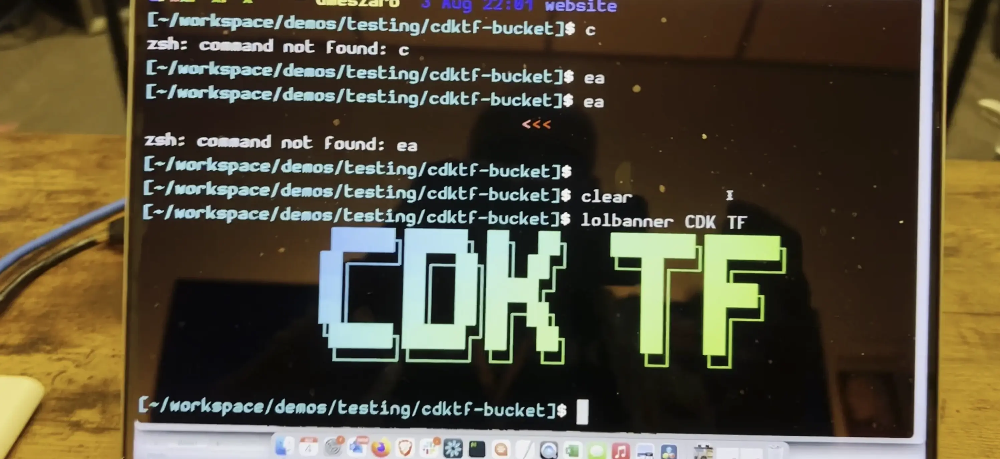

Welcome to episode 4, yes 4 it's already has been a month of Build On Weekly! 🥳

Unfortunately today you only get to listen to a bald man yell into the camera, as Jacquie is away. But he ([Darko](https://twitter.com/darkosubotica)), will be showing you how to some magical things with the latest amazing tool - **Cloud Development Kit (CDK) for Terraform.** Today is all about building the infrastructure for that static website of yours. All with the power of CDK and Terraform. 🪣

We will be posting here, on [Community.aws](/livestreams/build-on-weekly), to share **show notes, links, socials, code, and any other things mentioned** during the live stream with you! 🚀



## Deployed Weekly

https://www.youtube.com/watch?v=Lb7EjGErxSw

Today, on **Deployed Weekly**, we will cover **AWS Power Tools**, again, for all of you C# fans. **Terraform and CDK** have something to tell you. Sharing some code for **Site to Site VPN over Private IPs**. A cool **workshop** you can take next week, and a **World Championship** for all of you developers, and builders out there!

- **AWS PowerTools for dotnet is in alpha**: [https://github.com/awslabs/aws-lambda-powertools-dotnet](https://github.com/awslabs/aws-lambda-powertools-dotnet)
- **CDK for TF is now GA**: [https://www.hashicorp.com/blog/cdk-for-terraform-now-generally-available](https://www.hashicorp.com/blog/cdk-for-terraform-now-generally-available)
- **AWS Site to Site VPN Over Private IP, via Direct connect. All in Terraform**:
[](https://aws.amazon.com/blogs/networking-and-content-delivery/introducing-aws-site-to-site-vpn-private-ip-vpns/)[https://github.com/aws-samples/aws-site-to-site-vpn-private-ip-vpn](https://github.com/aws-samples/aws-site-to-site-vpn-private-ip-vpn)
- **Pulumi’s Introduction to Infrastructure as Code with Python** - **Workshop**: [https://www.pulumi.com/resources/introduction-to-infrastructure-as-code-with-python/](https://www.pulumi.com/resources/introduction-to-infrastructure-as-code-with-python/?utm_source=twitter&utm_medium=social&utm_campaign=workshops)
- **Game Day World championship**: [https://pages.awscloud.com/GLOBAL-gamedev-OE-AWS-GameDay-WorldChampionship-2022-reg-event.html](https://pages.awscloud.com/GLOBAL-gamedev-OE-AWS-GameDay-WorldChampionship-2022-reg-event.html)

## Static Website with CDK for Terraform

https://www.youtube.com/watch?v=50SG8gciJ70

Today we are checking out the newly released CDK (Cloud Development Kit) for Terraform. 🥳 And with it, we will be building a static website hosting system using Amazon S3 🪣

The goal is to setup an S3 bucket with all the required configurations to host a static website. This was Darko's first foray with CDK for Terraform, so cut him some slack.

What is CDK for Terraform? Well it's Cloud Development Kit for Terraform... Okay, but what does that mean? Well this means that you can write Terraform configurations in your choice of TypeScript, Python, C#, Java, or Go, and still benefit from the full ecosystem of HashiCorp Terraform providers and modules. Wonderful.

This means having the infrastructure for a static website on AWS, defined in these lines of code:

```typescript
import { Construct } from "constructs";
import * as path from "path";
import { sync as glob } from "glob";
import { lookup as mime } from "mime-types";
import { App, TerraformStack, TerraformOutput } from "cdktf";
import { AwsProvider, s3 } from "@cdktf/provider-aws"

class MyStack extends TerraformStack {
  constructor(scope: Construct, name: string) {
    super(scope, name);

    // AWS Provider
    new AwsProvider(this, 'AWS', {
      region: "us-west-2",
    });

    // Bucket
    const cobucket = new s3.S3Bucket(this, "cobus-website-bucket", {
      bucket: "cobus-website-bucket",
    });
    
    // Configure the bucket for a website
    new s3.S3BucketWebsiteConfiguration(this, "cobus-websiteconfig", {
      bucket: cobucket.bucket,
      indexDocument: {
        suffix: "index.html"
      },
      errorDocument: {
        key: "error.html"
      },
    });

    // Open up the bucket
    new s3.S3BucketPolicy(this, "cobus-policy", {
      bucket: cobucket.bucket,
      policy: JSON.stringify({
        Version: "2012-10-17",
        Id: "public-website-access",
        Statement: [
          {
            Sid: "PublicRead",
            Effect: "Allow",
            Principal: "*",
            Action: ["s3:GetObject"],
            Resource: [`${cobucket.arn}/*`, `${cobucket.arn}`],
          },
        ],
      }),
    });

    // Add files
    const absolutePath = path.resolve(__dirname, "website/");
    const files = glob("**/*.html", {
      cwd: path.resolve(__dirname, "website/"),
    });

    // file loop
    files.forEach((f) => {
      const filePath = path.join(absolutePath, f);

      new s3.S3Object(this, `${f}`, {
        bucket: cobucket.bucket,
        key: f,
        source: filePath,
        contentType: mime(path.extname(f)) || "text/html",
      });
    });

    // outputs
    new TerraformOutput(this, 'bucketname', {
      value: cobucket.bucket,
    });
  }
}

const app = new App();
new MyStack(app, "staticwebsite-with-cdktf");
app.synth();
```

💾 Check out the rest of the code Darko has written today, as you follow along with the video: [https://github.com/darko-mesaros/cdktf-s3-website](https://github.com/darko-mesaros/cdktf-s3-website)

## Links from the discussion

- CDK for Terraform is now generally available: [https://www.hashicorp.com/blog/cdk-for-terraform-now-generally-available](https://www.hashicorp.com/blog/cdk-for-terraform-now-generally-available)
- Terraform AWS Provider on Construct hub: [https://constructs.dev/packages/@cdktf/provider-aws/v/9.0.10/api/S3Bucket?lang=typescript&submodule=s3](https://constructs.dev/packages/@cdktf/provider-aws/v/9.0.10/api/S3Bucket?lang=typescript&submodule=s3)

**🐦 Reach out to the hosts and guests:**

Jacquie: [https://twitter.com/devopsjacquie](https://twitter.com/devopsjacquie)
Darko: [https://twitter.com/darkosubotica](https://twitter.com/darkosubotica)
