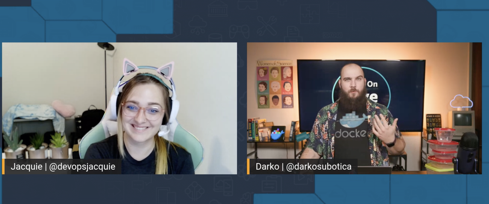

Welcome to episode 5 of Build On Weekly! 🥳

Today [Jacquie](https://twitter.com/devopsjacquie) and [Darko](https://twitter.com/darkosubotica), discuss a few things around Containers and Hybrid environments. That means running your applications On-Premises AND in the cloud. In today's episode watch Darko as he sweats trying to troubleshoot a real time demo. 😅

We will be posting here, on [BuildOn.aws](/livestreams/build-on-weekly), to share **show notes, links, socials, code, and any other things mentioned** during the live stream with you! 🚀

## Deployed Weekly

https://www.youtube.com/watch?v=YI1zxP9aKqc

Today on deployed weekly we take another peek at Lambda functions and .NET. What are the best strategies when running the two together. We talk about a interesting Open Source tool that helps you prototype and productionize (is that even a word?) ML Pipelines. Another wonderful CLI tool out there, for al the CLI and Tracing fans. A wrap up on the AWS Storage Day that happened the day before and finally an amazing interview/podcast over on Lex Friedman’s channel - with the best programmer in the world John Carmack.

**Links from the discussion:**

- Optimal strategy for running .NET code on Lambda functions by **Steve Bjorg:** [https://dev.to/lambdasharp/optimal-strategies-for-net-on-aws-lambda-45kg](https://dev.to/lambdasharp/optimal-strategies-for-net-on-aws-lambda-45kg)
- **Sematic**, an open-source development toolkit for AI/ML: [https://github.com/sematic-ai/sematic](https://github.com/sematic-ai/sematic)
- Do more stuff from the console with **xray-cli!**: [https://github.com/mhlabs/xray-cli](https://github.com/mhlabs/xray-cli)
- Yesterday - the 10th of August - was **AWS Storage Day!** 🥳 [https://aws.amazon.com/blogs/aws/welcome-to-aws-storage-day-2022/](https://aws.amazon.com/blogs/aws/welcome-to-aws-storage-day-2022/)
- Lex Friedman podcast with **John Carmack**: [https://www.youtube.com/watch?v=I845O57ZSy4](https://www.youtube.com/watch?v=I845O57ZSy4)

## Weekly Builds

https://www.youtube.com/watch?v=558ycpVpclA

Today we will be talking about a few things, you all should know about:

1. Containers and the reason we use them.
2. Hybrid environments.
3. Darko’s Macbook ECS cluster

### Containers

Just a quick word this. Containers, or more precisely Containerization is application-level virtualization. The reason for this is so that software can be packaged up in these containers and run in isolated “user spaces” called containers!

***But why?***

Because we want to be able to package the entire running environment of a piece of software into a single bundle and run it on many different platform. Be that the cloud or in that laptop right in front of you! *Magic*!

On today's episode Jacquie and Darko talk about containers, why you should use them, how to orchestrate them and what do they have to do with a Hybrid environment.

Later in the episode, check out how Darko struggles to add an external "server" to his AWS ECS (Elastic Container Service) [cluster](https://macluster.rup12.net/). Plenty of fun times were had while troubleshooting.

## Links from the discussion

- Nathan Peck’s blog post: [https://nathanpeck.com/ingress-to-ecs-anywhere-from-anywhere-using-inlets/](https://nathanpeck.com/ingress-to-ecs-anywhere-from-anywhere-using-inlets/)
- Darko’s cluster (if it is still running): [https://macluster.rup12.net/](https://macluster.rup12.net/)
- ECS Anywhere: [https://aws.amazon.com/ecs/anywhere/](https://aws.amazon.com/ecs/anywhere/)

**🐦 Reach out to the hosts and guests:**

Jacquie: [https://twitter.com/devopsjacquie](https://twitter.com/devopsjacquie)
Darko: [https://twitter.com/darkosubotica](https://twitter.com/darkosubotica)