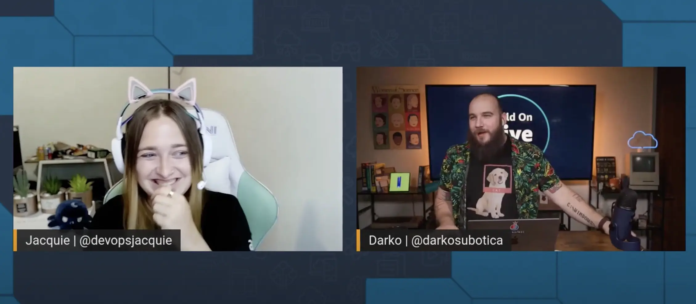

Welcome to episode 6 of Build On Weekly! 🥳

Today [Jacquie](https://twitter.com/devopsjacquie) shows all of us and [Darko](https://twitter.com/darkosubotica) how she configures her local development environment on her Macbook. On top of that she shows off some tips and tricks on how to automate said configuration for easy migrations between systems!

We will be posting here, on [BuildOn.aws](/livestreams/build-on-weekly), to share **show notes, links, socials, code, and any other things mentioned** during the live stream with you! 🚀

## Deployed Weekly

https://www.youtube.com/watch?v=8TE-VCaPp1E

Today on Deployed Weekly we kick off with a warm welcome to the 500 new Community Builders we welcomed globally before taking a look at Cloud Glance, a tool that helps you navigate multiple AWS Environments with ease. Next up is the first Amazon CodeWhisperer workshop we’ve encountered while we share some of our thoughts about tools that help you to generate code. We then highlight Amazon Cloudfront’s added HTTP/3 QUIC support. Finally, we shared a link to open roles here at AWS DevRel if you’d like to come work with like us!

**Links from the discussion:**

- [AWS Community Builders Program](https://aws.amazon.com/developer/community/community-builders/)
- [Cloud Glance](https://cloudglance.dev/)
- [Amazon Codewhisperer Workshop](https://github.com/aws-samples/amazon-codewhisperer-workshop)
- [AWS Cloudfront HTTP/3 QUIC Support](https://aws.amazon.com/about-aws/whats-new/2022/08/amazon-cloudfront-supports-http-3-quic/)
- [Come and work with Jacquie and Darko in DevRel](https://www.linkedin.com/pulse/open-roles-join-aws-devrel-felipe-lemaitre/
)

## Weekly Builds

https://www.youtube.com/watch?v=OrlBvPrHFXk

Today we go on an interactive live tour with Jacquie through her terminal and IDE setup and share tips to make your environment portable between your different mac laptops. Also some cool automation steps she took to make it very easy to migrate between different workstations.

Some things we discuss:

1. Set up scripts
2. Package management using Brew and Brewfiles
3. Favorite fonts and theme templates

## Links from the discussion

- [Jacquie’s Mac Setup Files](https://github.com/gogococo/mac-setup-files)
- [Using Brewfiles](https://medium.com/@satorusasozaki/automate-mac-os-x-configuration-by-using-brewfile-58a78ce5cc53)
- [Jacquie's favorite font](https://rubjo.github.io/victor-mono/)

**🐦 Reach out to the hosts and guests:**

Jacquie: [https://twitter.com/devopsjacquie](https://twitter.com/devopsjacquie)
Darko: [https://twitter.com/darkosubotica](https://twitter.com/darkosubotica)
