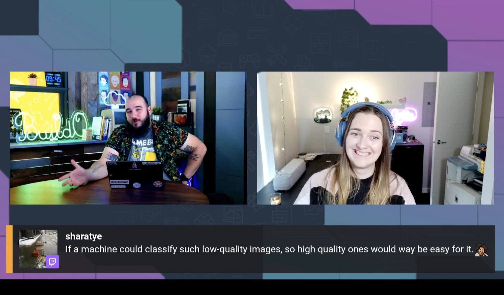

In today’s episode, Jacquie and Darko do the tried and tested “Hello World” of Machine Learning - trying to see if a thing is a Hot Dog 🌭 or Not a Hot Dog 🚫 🌭. Ultimately we were slightly better than a Coin Toss, but we had fun doing it.
Oh, and check out our code in the gists below, and see if you can make it better!

Excited to begin work with our first Machine Learning model we leveraged this [Tutorial that uses Tensorflow and Keras](https://github.com/christianversloot/machine-learning-articles/blob/main/tutorial-building-a-hot-dog-not-hot-dog-classifier-with-tensorflow-and-keras.md) and we downloaded our [Hot Dog Image data set from Kaggle](https://www.kaggle.com/datasets/dansbecker/hot-dog-not-hot-dog). We then put together our first version of the code which you can find [in this gist hotdog.py](https://gist.github.com/gogococo/726d9a04571255c471149f9864e57e83).

🤔 Our first model was only as accurate as a coin toss so we knew we needed some work. Who better to help us improve our model than another model... ChatGPT! We asked it to improve our code and it suggested using Data Augmentation, Fine-Tuning and more. These suggestions sounded great to us so of course we asked it to add the suggestions in to our code. We then received this [ChatGPT Improved Code](https://gist.github.com/gogococo/d97d91883e0439742df7d3af38ca06f2) which performed marginally better than a coin flip.

By the end of the stream we can confidently say we had fun while learning and you can check out the [Stream Recording here.](https://www.twitch.tv/videos/1792674049)

Our challenge to you, should you choose to accept? Improve the code, beat chatGPT and get a shout-out on our stream!

Check out the VOD from today's episode 👇:

https://www.twitch.tv/videos/1792674049

## Links from todays episode

- [Tutorial we used](https://github.com/christianversloot/machine-learning-articles/blob/main/tutorial-building-a-hot-dog-not-hot-dog-classifier-with-tensorflow-and-keras.md)
- [Hot Dog Image data set from Kaggle](https://www.kaggle.com/datasets/dansbecker/hot-dog-not-hot-dog)
- [Sagemaker Studio Lab](https://studiolab.sagemaker.aws/)
- [Original Code](https://gist.github.com/gogococo/726d9a04571255c471149f9864e57e83)
- [ChatGPT Improved Code](https://gist.github.com/gogococo/d97d91883e0439742df7d3af38ca06f2)
- [Stream Recording](https://www.twitch.tv/videos/1792674049)

**🐦 Reach out to the hosts and guests:**

Jacquie: [https://twitter.com/devopsjacquie](https://twitter.com/devopsjacquie)
Darko: [https://twitter.com/darkosubotica](https://twitter.com/darkosubotica)
