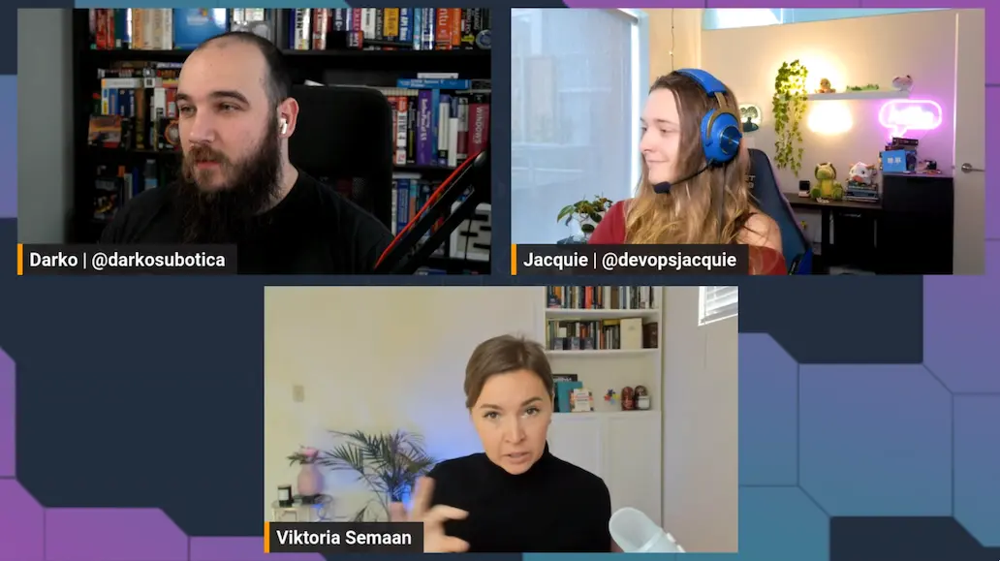

In today's episode Jacquie and Darko are joined by Viktoria. She brings us her experience with starting and playing around with Stable Diffusion on AWS. Generative AI is all the rage now, so Viktoria wanted to see how she can fiddle around with AI Image Generation, for the amazing price of Free 💰🖼️.

On this episode we go over the ways you can get already trained models from our friends over at [Hugging Face](https://huggingface.co), load them up in a development environment, and keep on inferencing. The development environment we used is [Amazon SageMaker Studio Lab](https://aws.amazon.com/sagemaker/studio-lab/), a free ML learning environment that gives you a bit of compute, a bit of storage and all the security. For the low, low price of FREE 😍.

Initially we tried to use the [Latent Diffusion](https://huggingface.co/spaces/multimodalart/latentdiffusion) pre-trained model to generate images of "a turtle in a car with a hat"...That did not quite work:
.

Later on we moved on to using [Stable Diffusion](https://huggingface.co/spaces/stabilityai/stable-diffusion), and the results were WAY better! 🐢🚗🤠 Check out the Stream VOD for the results! 👇

https://www.twitch.tv/videos/1798894267

## Links from today's episode

- [Conditional Image Generation](https://huggingface.co/docs/diffusers/using-diffusers/conditional_image_generation)
- [AgentGPT](https://github.com/reworkd/AgentGPT)
- [AutoGPT](https://github.com/Significant-Gravitas/Auto-GPT)
- [Hugging Face Docs](https://huggingface.co/docs)
- [Hugging Face Transformers](https://huggingface.co/docs/transformers/index)

**🐦 Reach out to the hosts and guests:**

Jacquie: [https://twitter.com/devopsjacquie](https://twitter.com/devopsjacquie)
Darko: [https://twitter.com/darkosubotica](https://twitter.com/darkosubotica)
