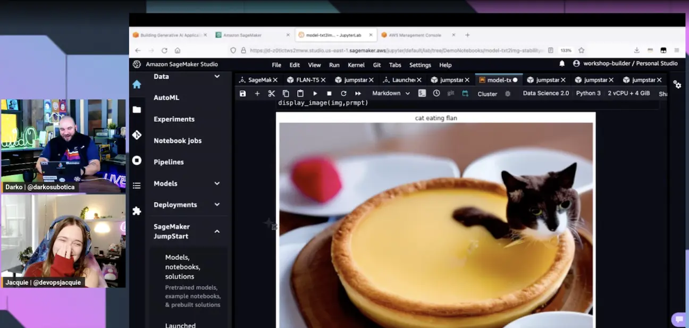
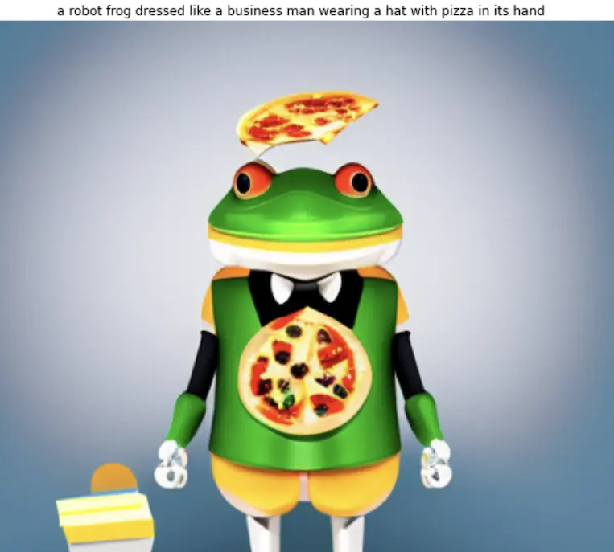
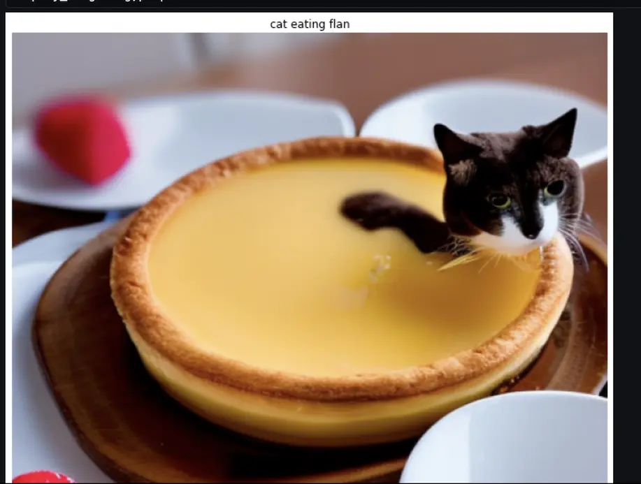
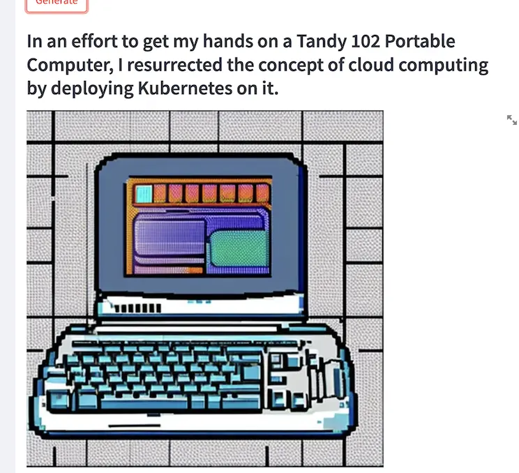
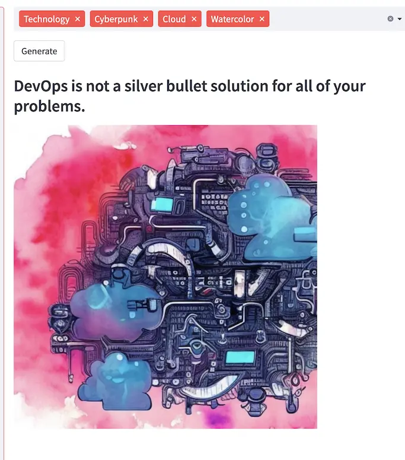

In today's episode Jacquie and Darko try out [Banjo](https://twitter.com/banjtheman)'s new hands on [workshop about Building Generative AI Applications with SageMaker Foundational Models](https://catalog.workshops.aws/building-gen-ai-apps-with-found-models/en-US). If you want to try it out at home, use the workshop link and give it a go. Warning: it's not free and costs ~$10.

In step 1 we explored the Stable Diffusion Notebook using prompts given to us from our favourite folks: Chat! Here were two of our favourite prompts and they're generated images.

**Example 1** - A Robot Frog Dressed like a business man wearing a hat with pizza in it's hand.

**Example 2** - Cat Eating Flan.

In step 2 we experimented with the FLAN T5 models from Hugging Face to do text to text generation. This mostly revolved around using prompts to create recipes and translating into other languages.

In step 3 we deployed it to Lambda and put it all together. After it was up and running we gave it two of our articles to generate taglines and images from:

**Example 3** - Darko's article [I deployed Kubernetes with a 1986 Tandy 102 Portable Computer](https://www.buildon.aws/posts/i-deployed-kubernetes-with-a-1986-tandy-102-portable-computer). Tagline: "In an effort to get my hands on a Tandy 102 Portable Computer, I resurrected the concept of cloud computing by deploying Kubernetes on it."

**Example 4** - Jacquie's article [What Is DevOps](https://www.buildon.aws/concepts/what-is-devops). Tagline: "DevOps is not a sivler bullet solution for all of your problems."

Check out the Stream VOD to watch us go through the workshop step by step as well as other results we didn't post here! 👇

https://www.twitch.tv/videos/1805386602

## Links from today's episode

- [Workshop - Building Generative AI Applications with SageMaker Foundational Models](https://catalog.workshops.aws/building-gen-ai-apps-with-found-models/en-US)
- [Pepperoni Hug Spot](https://www.youtube.com/watch?v=qSewd6Iaj6I)
- [BuildOn Article: I deployed Kubernetes with a 1986 Tandy 102 Portable Computer](https://www.buildon.aws/posts/i-deployed-kubernetes-with-a-1986-tandy-102-portable-computer).
- [BuildOn Article: What Is DevOps](https://www.buildon.aws/concepts/what-is-devops)

**🐦 Reach out to the hosts and guests:**

Jacquie: [https://twitter.com/devopsjacquie](https://twitter.com/devopsjacquie)
Darko: [https://twitter.com/darkosubotica](https://twitter.com/darkosubotica)
