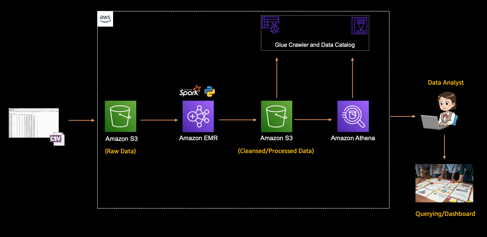

Today, Jacquie and Darko are going to follow a blog post by our colleague [Suman](https://www.linkedin.com/in/suman-d/), and go ahead and build an ETL Pipeline with Amazon EMR and Apache Spark. We gather, process/clean(launder) data, crawl it, and put it into a Data Catalog. So if you are learning on how to get started with Elastic Map Reduce (EMR) and PySpark, make sure to check out this live stream.

Also - do you know how much data 3M security tape holds? At 6250 bytes per inch, on 2000 inches of tape? The math is simple - not enough.

Check out the recording here:

https://www.twitch.tv/videos/1847253428

## Links from today's episode

- [Blog post from Suman](/tutorials/create-an-etl-pipeline-apache-spark)
- [Apache Spark](https://spark.apache.org/)

**🐦 Reach out to the hosts and guests:**

Jacquie: [https://twitter.com/devopsjacquie](https://twitter.com/devopsjacquie)

Darko: [https://twitter.com/darkosubotica](https://twitter.com/darkosubotica)
